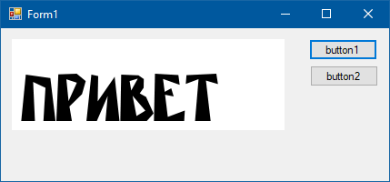

### Библиотека SharpFont

Библиотека SharpFont является обёрткой для широко известной FreeType.dll, умеющей рендерить TTF- и OTF-шрифты. GitHub: https://github.com/Robmaister/SharpFont, NuGet: https://www.nuget.org/packages/SharpFont/.

Поддерживается .NET 4.5. К сожалению, с помощью NuGet библиотека отказывается устанавливаться в Visual Studio 2017, поэтому приходится скачивать её вручную. Рядом с exe-файлом необходимо положить подходящий Вам файл freetype6.dll из NuGet-пакета https://www.nuget.org/packages/SharpFont.Dependencies/.

Простой пример рендеринга строки из шрифта, загруженного из файла. Естественно, в реальности рендеринг строки гораздо сложнее (из-за, например, кернинга), но для начальной демострации приёмов работы с библиотекой данного примера, надеюсь, хватит.



```csharp
using System;
using System.Drawing;
using System.Windows.Forms;
 
using SharpFont;
 
namespace WindowsFormsApp1
{
    public partial class Form1 : Form
    {
        public Form1()
        {
            InitializeComponent();
        }
 
        private void DrawText
            (
                string text,
                string fontPath,
                float size
            )
        {
            Bitmap bitmap = new Bitmap(300, 100);
            using (Graphics graphics = Graphics.FromImage(bitmap))
            using (Library library = new Library())
            using (Face face = new Face(library, fontPath))
            {
                graphics.Clear(Color.White);
                face.SetCharSize(0, size, 0, 96);
 
                float x = 10;
                foreach (char c in text)
                {
                    uint index = face.GetCharIndex(c);
                    face.LoadGlyph(index, LoadFlags.Default, LoadTarget.Normal);
                    face.Glyph.RenderGlyph(RenderMode.Normal);
                    FTBitmap gBitmap = face.Glyph.Bitmap;
                    using (Bitmap cBitmap = gBitmap.ToGdipBitmap(Color.Black))
                    {
                        float gWidth = (float) face.Glyph.Metrics.Width;
                        graphics.DrawImageUnscaled
                            (
                                cBitmap,
                                (int) x,
                                90 - cBitmap.Height
                            );
                        x += gWidth;
                    }
                }
            }
 
            pictureBox1.Image = bitmap;
        }
 
        private void button1_Click(object sender, EventArgs e)
        {
            DrawText("Привет", "Fonts/rublik.ttf", 42);
        }
 
        private void button2_Click(object sender, EventArgs e)
        {
            DrawText("Hello", "Fonts/Alegreya-Regular.otf", 42);
        }
    }
}
```
