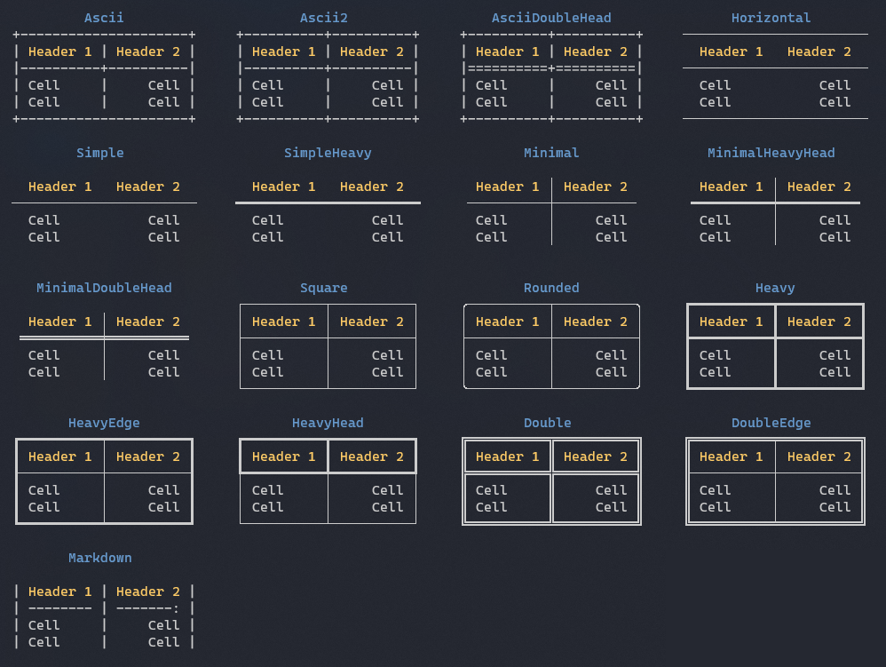
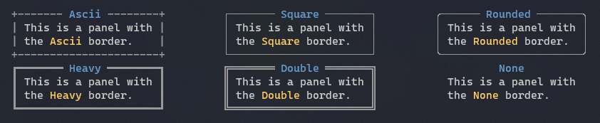

### Рамки таблиц и панелей

#### Рамки таблиц



```csharp
var table = new Table();
table.Border = TableBorder.SimpleHeavy;
```

#### Рамки панелей



```csharp
var panel = new Panel ("Hello World");
panel.Border = BoxBorder.Rounded;
```
