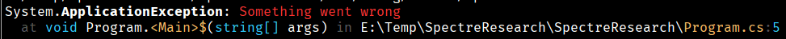
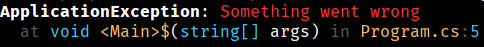
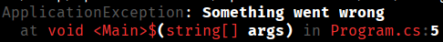

### Вывод консоль информации об исключении

```csharp
AnsiConsole.WriteException (exception);
```



```csharp
AnsiConsole.WriteException 
    (
        exception,
        ExceptionFormats.ShortenPaths
            | ExceptionFormats.ShortenTypes
            | ExceptionFormats.ShortenMethods
            | ExceptionFormats.ShowLinks
    );
```



```csharp
AnsiConsole.WriteException (exception, new ExceptionSettings
{
    Format = ExceptionFormats.ShortenEverything | ExceptionFormats.ShowLinks,
    Style = new ExceptionStyle
    {
        Exception = new Style().Foreground (Color.Grey),
        Message = new Style().Foreground (Color.White),
        NonEmphasized = new Style().Foreground (Color.Cornsilk1),
        Parenthesis = new Style().Foreground (Color.Cornsilk1),
        Method = new Style().Foreground (Color.Red),
        ParameterName = new Style().Foreground (Color.Cornsilk1),
        ParameterType = new Style().Foreground (Color.Red),
        Path = new Style().Foreground (Color.Red),
        LineNumber = new Style().Foreground (Color.Cornsilk1),
    }
});
```

