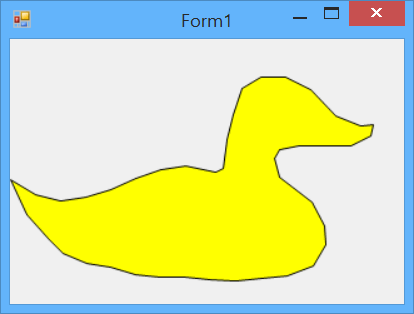

### Отрисовка SVG-графики

Добавить в своё приложение отрисовку SVG-картинок проще простого: делаем «Install-Package Svg» и добавляем в программу четыре строки (да, я посчитал!):

```csharp
using System.Windows.Forms;
using Svg;
 
public partial class Form1: Form
{
    private SvgDocument _svg;
 
    public Form1()
    {
        InitializeComponent();
        _svg = SvgDocument.Open("duck.svg");
    }
 
    private void Form1_Paint(object sender, PaintEventArgs e)
    {
        _svg.Draw(e.Graphics);
    }
}
```



По-моему, очень недурное соотношение «достигнутый результат / затраченные усилия».

