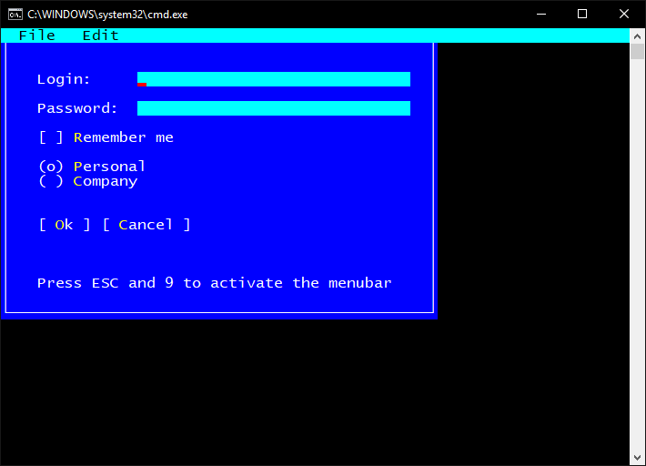

### Terminal.Gui

Terminal.Gui - библиотека, предназначенная для создания консольных приложений с использованием C#. Структура была разработана для упрощения написания приложений, которые будут работать на монохромных терминалах, а также современных цветных терминалов с поддержкой мыши. Эта библиотека работает в Windows, Linux и MacOS.

Автором библиотеки является Miguel de Icaza.

GitHub: https://github.com/migueldeicaza/gui.cs, NuGet: https://www.nuget.org/packages/Terminal.Gui

Поддерживает .NET Framework 4.6.1, .NET Standard 2.0 и Mono.

Пример приложения:

```csharp
using Terminal.Gui;

class Program
{
    static void Main()
    {
        Application.Init();
        var top = Application.Top;

        var rect = new Rect(0, 0, 48, 20);
        var win = new Window(rect, "My window");
        top.Add(win);

        var menu = new MenuBar(new[]
            {
                new MenuBarItem
                (
                    "_File", new[]
                    {
                        new MenuItem ("_New", "Creates new file", null),
                        new MenuItem ("_Close", "", null),
                        new MenuItem ("_Quit", "", () => { top.Running = false; })
                    }
                ),
                new MenuBarItem
                (
                    "_Edit", new[]
                    {
                        new MenuItem ("_Copy", "", null),
                        new MenuItem ("C_ut", "", null),
                        new MenuItem ("_Paste", "", null)
                    }
                )
            });
        top.Add(menu);

        win.Add
            (
                new Label(3, 2, "Login:"),
                new TextField(14, 2, 30, ""),
                new Label(3, 4, "Password:"),
                new TextField(14, 4, 30, "") { Secret = true },
                new CheckBox(3, 6, "Remember me"),
                new RadioGroup(3, 8, new[] { "_Personal", "_Company" }),
                new Button(3, 12, "Ok"),
                new Button(10, 12, "Cancel"),
                new Label(3, 16, "Press ESC and 9 to activate the menubar")
            );

        Application.Run();
    }
}
```

Вот как выглядит приложение:



Статья: http://sirwan.info/archive/2018/05/02/Developing-Console-based-UI-in-C/
