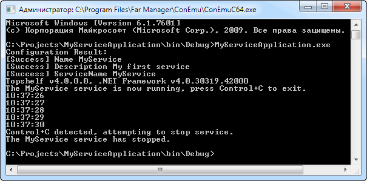
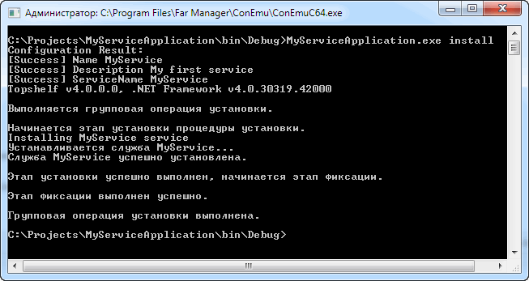
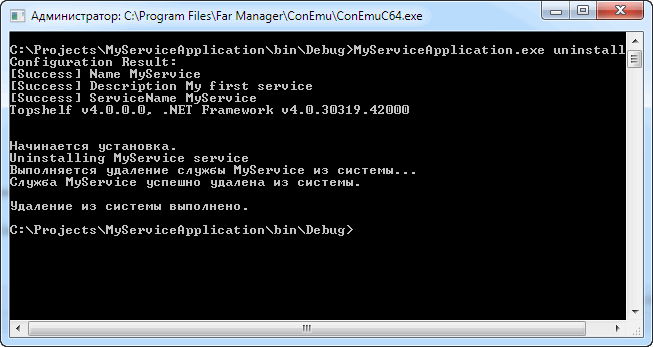
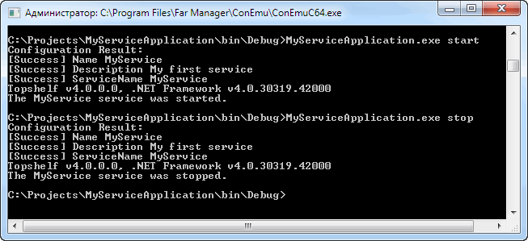

### Topshelf

В .NET Framework предусмотрена возможность создания приложений-сервисов, имеются соответствующие классы, но конечный результат не очень радует. Например, такие приложения труднее отлаживать, т. к. нельзя просто запустить сервис из-под отладчика, требуется сначала инсталлировать его, затем запустить с помощью net start и только после этого подключиться к нему отладчиком. К этому моменту, возможно, наше приложение уже рухнет. )

Специально для этого случая умные люди разработали Topshelf — фреймворк для сервисов, оформленных как обычные консольные приложения. С Topshelf упрощается не только отладка приложений, но и их регистрация в качестве сервисов (без трудной для рядового пользователя возни с InstallUtil).

Поддерживает .NET 3.5 и 4.X (в последних версиях только 4.5.2, что немного огорчает). Авторы утверждают, что созданные с помощью Topshelf сервисы работают и под Mono. Это радует.

GitHub: https://github.com/Topshelf/Topshelf, NuGet: https://www.nuget.org/packages/Topshelf/.

Пример простейшего сервиса (Topshelf 4):

```csharp
using System;
using System.Threading;
 
using Topshelf;
using Topshelf.HostConfigurators;
 
namespace MyServiceApplication
{
    class Program
    {
        static void Main()
        {
            // Конфигурация сервиса
            HostFactory.Run(configure =>
            {
                configure.ApplyCommandLine();
 
                HostConfigurator service = configure.Service<MyService>();
                service.SetDescription("My first service");
                service.SetDisplayName("MyService");
                service.SetServiceName("MyService");
 
                service.StartAutomaticallyDelayed();
                service.RunAsLocalService();
 
                // Необязательные действия перед и после установки
 
                service.BeforeInstall(() =>
                {
                    Console.WriteLine("Before install");
                });
 
                service.AfterInstall(() =>
                {
                    Console.WriteLine("After install");
                });
 
                // Необязательная настройка восстановления после сбоев
 
                service.EnableServiceRecovery (recovery =>
                {
                    recovery.RestartService(1);
                });
 
                service.OnException(exception =>
                {
                    Console.WriteLine
                        (
                            "Exception occured: {0}",
                            exception
                        );
                });
            });
        }
    }
 
    // Собственно сервис
    public class MyService : ServiceControl
    {
        private Timer _timer;
 
        public bool Start
            (
                HostControl hostControl
            )
        {
           // Таймер стартует немедленно и срабатывает раз в секунду
            _timer = new Timer(DoWork, null, 0, 1000);
 
            return true;
        }
 
        // Изображаем бурную деятельность
        public void DoWork
            (
                object state
            )
        {
            Console.WriteLine(DateTime.Now.ToLongTimeString());
        }
 
        public bool Stop
            (
                HostControl hostControl
            )
        {
            _timer.Dispose();
 
            return true;
        }
    }
}
```

Если запустить MyServiceApplication.exe из командной строки, оно ведёт себя как обычное консольное приложение, которое легко и удобно отлаживается в Visual Studio:



В командной строке Можно задать install, uninstall, start и stop:







Согласитесь, очень удобный фреймворк Topshelf!

#### Topshelf.NLog

Существуют замечательные расширения для Topshelf, первым из которых следует упомянуть Topshelf.Nlog. Оно позволяет подключить к своему сервису NLog-логирование буквально в одну строчку:
```csharp
service.UseNLog();
```
Теперь логирование внутри сервиса становится неприлично простым:
```csharp
public class MyService : ServiceControl
{
    private Timer _timer;
    private LogWriter _logWriter;
 
    public bool Start
        (
            HostControl hostControl
        )
    {
        _timer = new Timer(DoWork, null, 0, 1000);
        _logWriter = HostLogger.Get<MyService>();
        _logWriter.Info("Start");
 
        return true;
    }
 
    public void DoWork
        (
            object state
        )
    {
        _logWriter.Info("Do work");
        Console.WriteLine(DateTime.Now.ToLongTimeString());
    }
 
    public bool Stop
        (
            HostControl hostControl
        )
    {
        _logWriter.Info("Stop");
        _timer.Dispose();
 
        return true;
    }
}
```

#### Другие расширения

[Topshelf.Quartz](https://www.nuget.org/packages/Topshelf.Quartz/) позволяет добавить в свой сервис действия по расписанию (например, раз в сутки, в неделю).

[Topshelf.Nancy](https://www.nuget.org/packages/Topshelf.Nancy/) позволяет хостить в своём сервисе Web-сервисы безо всяких IIS или других веб-серверов.

[Topshelf.Linux](https://www.nuget.org/packages/Topshelf.Linux/) позволяет превратить свой Windows-сервис в линуксного демона.

[Topshelf.FileSystemWatcher](https://www.nuget.org/packages/Topshelf.FileSystemWatcher/) добавляет в сервис отслеживание изменений в определённых файлах (это позволяет, например, автоматически подхватывать новую конфигурацию сервиса).


