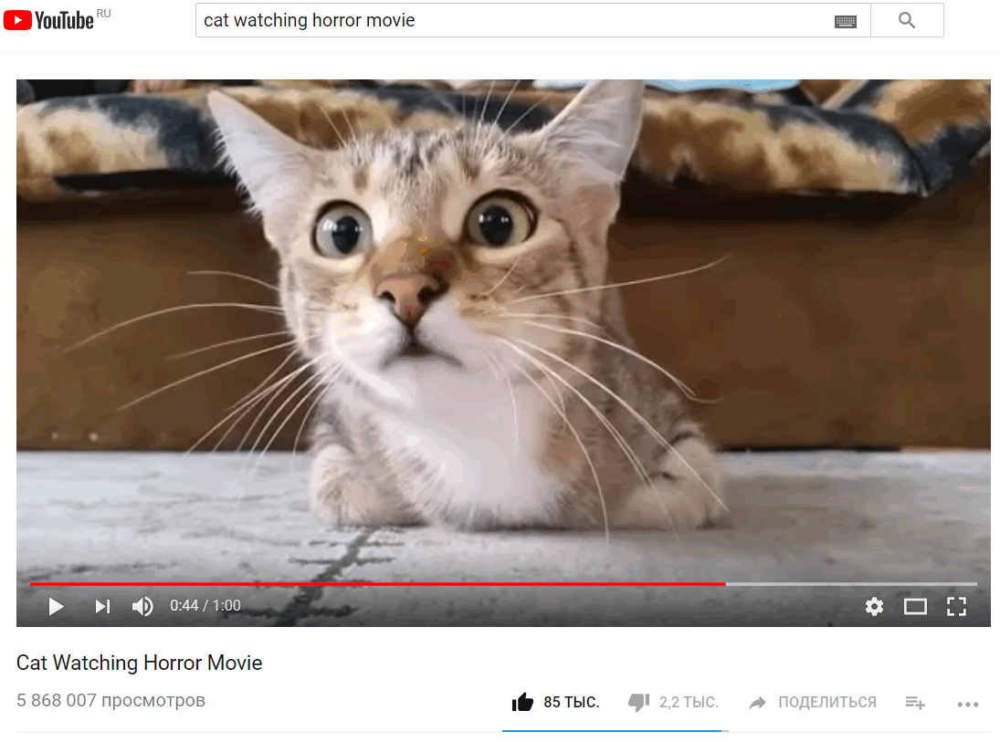

### YoutubeExtractor

Допустим, мы нашли на YouTube замечательный ролик про кота, смотрящего фильм ужасов



и хотим скачать его. Теперь мы можем сделать это программно с помощью замечательной библиотеки YoutubeExtractor.

GitHub: https://github.com/flagbug/YoutubeExtractor, NuGet: http://nuget.org/packages/YoutubeExtractor

Поддерживает:

* .NET Framework 3.5 and higher
* Windows Phone 8
* WinRT
* Xamarin.Android
* Xamarin.iOS

К сожалению, под Windows Phone 8, WinRT, Xamarin.Android and Xamarin.iOS поддерживается только извлечение URL.

Вот как это делается:

```csharp
using System.IO;
using System.Linq;

using YoutubeExtractor;

using static System.Console;

class Program
{
    static void Main()
    {
        // Cat Watching Horror Movie
        string movieUrl = "https://www.youtube.com/watch?v=_kgRFHaNo-Y";

        // Get the available video formats.
        // We'll work with them in the video and audio download examples
        VideoInfo[] videoInfos = DownloadUrlResolver.GetDownloadUrls(movieUrl)
            .ToArray();
        WriteLine($"Available formats: {videoInfos.Length}");
        foreach (VideoInfo info in videoInfos)
        {
            WriteLine(info);
        }
        WriteLine();

        // Select video format
        VideoInfo video = videoInfos.First
            (
                i => i.VideoType == VideoType.Mp4
                     && i.Resolution == 360
            );
        WriteLine($"Selected video: {video}");
        if (video.RequiresDecryption)
        {
            DownloadUrlResolver.DecryptDownloadUrl(video);
        }
        WriteLine();

        VideoDownloader downloader = new VideoDownloader
            (
                video,
                Path.Combine("D:/Downloads", video.Title + video.VideoExtension)
            );
        downloader.DownloadStarted += (sender, args) => WriteLine("Download started");
        downloader.DownloadProgressChanged += (sender, args) =>
            WriteLine($"Downloaded: {args.ProgressPercentage:N1}%");
        downloader.DownloadFinished += (sender, args) =>
            WriteLine("Download finished");

        downloader.Execute();
    }
}

```

Программа напечатает (часть вывода удалена):

```
Available formats: 15
Full Title: Cat Watching Horror Movie.webm, Type: WebM, Resolution: 360p
Full Title: Cat Watching Horror Movie.mp4, Type: Mp4, Resolution: 360p
Full Title: Cat Watching Horror Movie.3gp, Type: Mobile, Resolution: 240p
Full Title: Cat Watching Horror Movie.3gp, Type: Mobile, Resolution: 144p
Full Title: Cat Watching Horror Movie.mp4, Type: Mp4, Resolution: 360p
Full Title: Cat Watching Horror Movie.webm, Type: WebM, Resolution: 360p
Full Title: Cat Watching Horror Movie.mp4, Type: Mp4, Resolution: 240p
Full Title: Cat Watching Horror Movie.webm, Type: WebM, Resolution: 240p
Full Title: Cat Watching Horror Movie.mp4, Type: Mp4, Resolution: 144p
Full Title: Cat Watching Horror Movie.webm, Type: WebM, Resolution: 144p
Full Title: Cat Watching Horror Movie.mp4, Type: Mp4, Resolution: 0p
Full Title: Cat Watching Horror Movie.webm, Type: WebM, Resolution: 0p
Full Title: , Type: Unknown, Resolution: 0p
Full Title: , Type: Unknown, Resolution: 0p
Full Title: , Type: Unknown, Resolution: 0p

Selected video: Full Title: Cat Watching Horror Movie.mp4, Type: Mp4, Resolution: 360p

Download started
Downloaded: 0,0%
Downloaded: 0,1%
...
Downloaded: 99,9%
Downloaded: 100,0%
Download finished

```

Аналогично можно извлечь аудиотрек:

```csharp
/*
 * We want the first extractable video with the highest audio quality.
 */
VideoInfo video = videoInfos
    .Where(info => info.CanExtractAudio)
    .OrderByDescending(info => info.AudioBitrate)
    .First();
    
/*
 * If the video has a decrypted signature, decipher it
 */
if (video.RequiresDecryption)
{
    DownloadUrlResolver.DecryptDownloadUrl(video);
}

/*
 * Create the audio downloader.
 * The first argument is the video where the audio should be extracted from.
 * The second argument is the path to save the audio file.
 */
var audioDownloader = new AudioDownloader(video, Path.Combine("D:/Downloads", video.Title + video.AudioExtension));

// Register the progress events. We treat the download progress as 85% of the progress and the extraction progress only as 15% of the progress,
// because the download will take much longer than the audio extraction.
audioDownloader.DownloadProgressChanged += (sender, args) => Console.WriteLine(args.ProgressPercentage * 0.85);
audioDownloader.AudioExtractionProgressChanged += (sender, args) => Console.WriteLine(85 + args.ProgressPercentage * 0.15);

/*
 * Execute the audio downloader.
 * For GUI applications note, that this method runs synchronously.
 */
audioDownloader.Execute();
```

