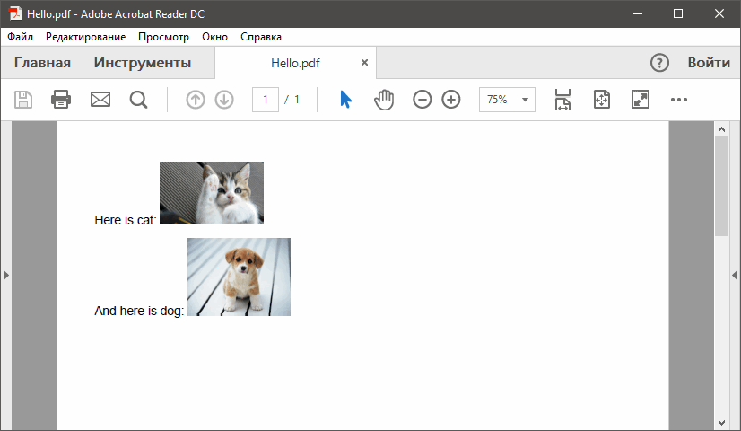
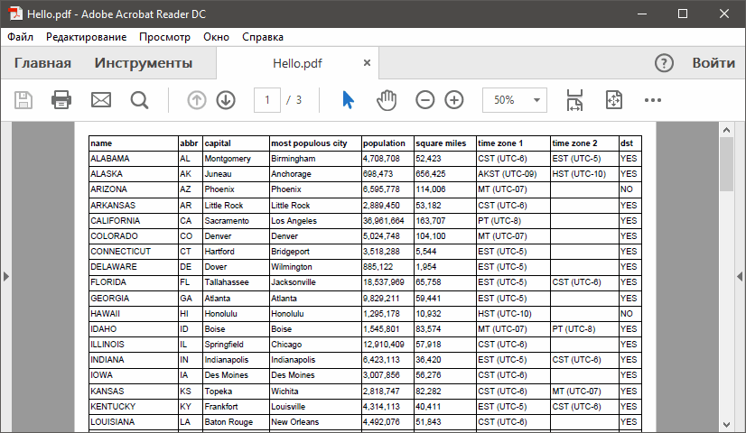
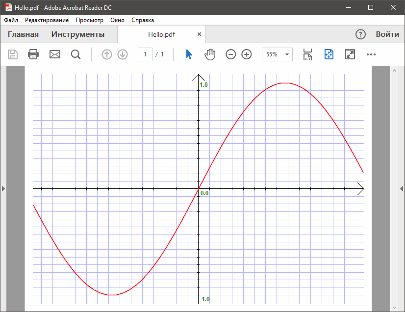

### iText

iText 7 (бывший iTextSharp) — полностью управляемый фреймворк для создания PDF-файлов. Имеется как бесплатная Community версия, так и коммерческая лицензция.

GitHub: https://github.com/itext, NuGet: https://www.nuget.org/packages/itext7/ (старая версия — https://www.nuget.org/packages/iTextSharp/), официальный сайт: http://itextpdf.com/.

Поддерживает .NET Framework 4.0 и .NET Standard 1.6.

Простейшая программа:

```csharp
using System;
using System.IO;

using iText.Kernel.Font;
using iText.Kernel.Pdf;
using iText.Layout;
using iText.Layout.Element;

class Program
{
    static void Main()
    {
        PdfWriter writer = new PdfWriter("Hello.pdf");
        PdfDocument pdf = new PdfDocument(writer);
        Document document = new Document(pdf);
        document.Add(new Paragraph("Hello, world!"));
        document.Close();
    }
}
```

Всё это работает через несколько слоёв абстракции.

1. Мы создаем экземпляр PdfWriter. PdfWriter - это объект, который может писать PDF-файл. Он мало знает о фактическом содержании документа PDF, который он пишет. PdfWriter не знает, что такое документ, он просто пишет разные части файлов и разные объекты, которые составляют действительный документ после завершения структуры файла. В этом случае мы передаем строковый, который содержит путь к файлу. Конструктор также принимает параметр Stream как параметр. Например: если мы хотим написать веб-приложение, мы могли бы написать HttpResponse.OutputStream; если бы мы хотели создать PDF-документ в памяти, мы могли бы использовать MemoryStream; и так далее.

2. PdfWriter знает, что писать, потому что он слушает PdfDocument. PdfDocument управляет содержимым, которое добавляется, распространяет этот контент на разные страницы и отслеживает, какая информация имеет отношение к этому контенту. В главе 7 мы обнаружим, что существуют различные разновидности классов PdfDocument, которые может слушать PdfWriter.

3. Как только мы создали PdfWriter и PdfDocument, мы закончили со всем низкоуровневым кодом, специфичным для PDF. Мы создаем документ, который принимает параметр PdfDocument как параметр. Теперь, когда у нас есть объект документа, мы можем забыть, что мы создаем PDF.

4. Мы создаем абзац, содержащий текст «Hello World», и добавляем этот абзац к объекту документа.

5. Мы закрываем документ. Наш PDF-файл создан.

Кириллические символы, к сожалению, так просто вывести не получится. Понадобятся дополнительные телодвижения. Пример таких телодвижений под Windows:

```csharp
using System;
using System.IO;

using iText.Kernel.Font;
using iText.Kernel.Pdf;
using iText.Layout;
using iText.Layout.Element;

class Program
{
    static void Main()
    {
        string arialPath = Path.Combine
            (
                Environment.GetFolderPath(Environment.SpecialFolder.Fonts),
                "arial.ttf"
            );
        PdfFontFactory.Register(arialPath);
        PdfFont arialFont = PdfFontFactory.CreateRegisteredFont("Arial", "CP1251");
        string timesPath = Path.Combine
            (
                Environment.GetFolderPath(Environment.SpecialFolder.Fonts),
                "times.ttf"
            );
        PdfFontFactory.Register(timesPath);
        PdfFont timesFont = PdfFontFactory.CreateRegisteredFont("Times New Roman", "CP1251");

        PdfWriter writer = new PdfWriter("Hello.pdf");
        PdfDocument pdf = new PdfDocument(writer);
        Document document = new Document(pdf);
        document.Add(new Paragraph("Привет, Arial!").SetFont(arialFont));
        document.Add(new Paragraph("Привет, Times New Roman!").SetFont(timesFont));
        document.Close();
    }
}
```

Создание списка:

```csharp
PdfWriter writer = new PdfWriter("Hello.pdf");
PdfDocument pdf = new PdfDocument(writer);
Document document = new Document(pdf);
document.Add(new Paragraph("iText is:"));
List list = new List()
    .SetSymbolIndent(12)
    .SetListSymbol("\u2022");
list.Add(new ListItem("Never gonna give you up"))
    .Add(new ListItem("Never gonna let you down"))
    .Add(new ListItem("Never gonna run around and desert you"))
    .Add(new ListItem("Never gonna make you cry"))
    .Add(new ListItem("Never gonna say goodbye"))
    .Add(new ListItem("Never gonna tell a lie and hurt you"));
document.Add(list);
document.Close();
```

Вставка картинок:

```csharp
using iText.IO.Image;
using iText.Kernel.Pdf;
using iText.Layout;
using iText.Layout.Element;

class Program
{
    static void Main()
    {
        PdfWriter writer = new PdfWriter("Hello.pdf");
        PdfDocument pdf = new PdfDocument(writer);
        Document document = new Document(pdf);
        Image cat = new Image(ImageDataFactory.Create("cat.jpg"))
            .ScaleToFit(100f, 100f);
        document.Add(new Paragraph("Here is cat: ").Add(cat));
        Image dog = new Image(ImageDataFactory.Create("dog.jpg"))
            .ScaleToFit(100f, 100f);
        document.Add(new Paragraph("And here is dog: ").Add(dog));
        document.Close();
    }
}
```

Вот что получается:



Теперь попробуем создать таблицу. Пусть у нас есть файл `unites_states.csv` следующего содержания:

```
name;abbr;capital;most populous city;population;square miles;time zone 1;time zone 2;dst
ALABAMA;AL;Montgomery;Birmingham;4,708,708;52,423;CST (UTC-6);EST (UTC-5);YES
ALASKA;AK;Juneau;Anchorage;698,473;656,425;AKST (UTC-09) ;HST (UTC-10) ;YES
ARIZONA;AZ;Phoenix;Phoenix;6,595,778;114,006;MT (UTC-07); ;NO
ARKANSAS;AR;Little Rock;Little Rock;2,889,450;53,182;CST (UTC-6); ;YES
CALIFORNIA;CA;Sacramento;Los Angeles;36,961,664;163,707;PT (UTC-8); ;YES
COLORADO;CO;Denver;Denver;5,024,748;104,100;MT (UTC-07); ;YES
...
```

Вот как строится таблица:

```csharp
using System;
using System.IO;

using iText.Kernel.Font;
using iText.Kernel.Geom;
using iText.Kernel.Pdf;
using iText.Layout;
using iText.Layout.Element;
using iText.Layout.Properties;

class Program
{
    public static void ProcessLine
        (
            Table table,
            string line,
            PdfFont font,
            bool isHeader
        )
    {
        string[] parts = line.Split(';');
        foreach (string part in parts)
        {
            Cell cell = new Cell().Add(new Paragraph(part).SetFont(font));
            if (isHeader)
            {
                table.AddHeaderCell(cell);
            }
            else
            {
                table.AddCell(cell);
            }
        }
    }

    static void Main()
    {
        PdfWriter writer = new PdfWriter("Hello.pdf");
        PdfDocument pdf = new PdfDocument(writer);
        Document document = new Document(pdf, PageSize.A4.Rotate());
        document.SetMargins(20, 20, 20, 20);
        PdfFont font = PdfFontFactory.CreateFont
            (
                iText.IO.Font.Constants.StandardFonts.HELVETICA
            );
        PdfFont bold = PdfFontFactory.CreateFont
            (
                iText.IO.Font.Constants.StandardFonts.HELVETICA_BOLD
            );
        Table table = new Table(new float[] { 4, 1, 3, 4, 3, 3, 3, 3, 1 });
        table.SetWidth(UnitValue.CreatePercentValue(100));
        TextReader reader = new StreamReader("united_states.csv");
        String line = reader.ReadLine();
        ProcessLine(table, line, bold, true);
        while ((line = reader.ReadLine()) != null)
        {
            ProcessLine(table, line, font, false);
        }
        reader.Close();
        document.Add(table);
        document.Close();
    }
}

```

Вот что получается:



#### Низкоуровневое рисование

Попробуем изобразить график синусоиды:

```csharp
using System;

using iText.Kernel.Colors;
using iText.Kernel.Font;
using iText.Kernel.Geom;
using iText.Kernel.Pdf;
using iText.Kernel.Pdf.Canvas;
using iText.Layout;

class Program
{
    static void Main()
    {
        PdfWriter writer = new PdfWriter("Hello.pdf");
        PdfDocument pdf = new PdfDocument(writer);
        Document document = new Document(pdf);
        PageSize pageSize = PageSize.A4.Rotate();
        PdfPage page = pdf.AddNewPage(pageSize);
        PdfCanvas canvas = new PdfCanvas(page);

        // определяем цвета
        DeviceRgb black = new DeviceRgb(0, 0, 0);
        DeviceRgb blue = new DeviceRgb(180, 180, 255);
        DeviceRgb red = new DeviceRgb(255, 0, 0);
        DeviceRgb green = new DeviceRgb(0, 127, 0);

        // высота и ширина холста (и его середина)
        float width = pageSize.GetWidth(), width2 = width / 2;
        float height = pageSize.GetHeight(), height2 = height / 2;

        // отступы от края страницы
        float marginX = 20, marginY = 20;

        // размер стрелки на оси
        float arrow = 15;

        // риски на осях и их размеры
        int nserif = 28; // общее количество рисок на одной оси
        float serif = 5, serif2 = serif / 2;
        float deltaX = (width - marginX * 4) / nserif;
        float deltaY = (height - marginY * 4) / nserif;

        // рисуем клетки
        canvas.SetStrokeColor(blue);
        float x = marginX * 2;
        for (int i = 0; i < nserif; i++)
        {
            canvas.MoveTo(x, marginY)
                .LineTo(x, height - marginY)
                .Stroke();
            x += deltaX;
        }

        float y = marginY * 2;
        for (int i = 0; i < nserif; i++)
        {
            canvas.MoveTo(marginX, y)
                .LineTo(width - marginX, y)
                .Stroke();
            y += deltaY;
        }

        canvas.SetStrokeColor(black);

        // рисуем горизонтальную линию по центру листа
        canvas.MoveTo(marginX, height2)
            .LineTo(width - marginX, height2)
            .Stroke();

        // и стрелку на конце линии
        canvas.MoveTo(width - marginX - arrow, height2 - arrow)
            .LineTo(width - marginX, height2)
            .LineTo(width - marginX - arrow, height2 + arrow)
            .Stroke();

        // рисуем вертикальную линию по центру листа
        canvas.MoveTo(width2, marginY)
            .LineTo(width2, height - marginY)
            .Stroke();

        // и стрелку на конце линии
        canvas.MoveTo(width2 - arrow, height - marginY - arrow)
            .LineTo(width2, height - marginY)
            .LineTo(width2 + arrow, height - marginY - arrow)
            .Stroke();

        // прорисовываем риски
        x = marginX * 2;
        for (int i = 0; i < nserif; i++)
        {
            canvas.MoveTo(x, height2 - serif2)
                .LineTo(x, height2 + serif2)
                .Stroke();
            x += deltaX;
        }

        y = marginY * 2;
        for (int i = 0; i < nserif; i++)
        {
            canvas.MoveTo(width2 - serif2, y)
                .LineTo(width2 + serif2, y)
                .Stroke();
            y += deltaY;
        }

        // рисуем график синусоиды
        bool first = true;
        canvas.SetStrokeColor(red).SetLineWidth(2);
        x = marginX;
        while (x < width - marginX)
        {
            double arg = (x - width2) / width * Math.PI * 2;
            double value = Math.Sin(arg);
            y = (int)(height2 + (height2 - marginY * 2) * value);
            if (first)
            {
                canvas.MoveTo(x, y);
            }
            else
            {
                canvas.LineTo(x, y);
            }
            x++;
            first = false;
        }
        canvas.Stroke();

        // рисуем подписи к оси Y
        string fontProgram = iText.IO.Font.Constants.StandardFonts.HELVETICA_BOLD;
        PdfFont font = PdfFontFactory.CreateFont(fontProgram);
        canvas.BeginText()
            .SetFontAndSize(font, 14)
            .SetFillColor(green)
            .MoveText(width2 + 5, height2 - 15)
            .ShowText("0.0")
            .EndText();

        canvas.BeginText()
            .SetFontAndSize(font, 14)
            .SetFillColor(green)
            .MoveText(width2 + 3, height - marginY - 30)
            .ShowText("-1.0")
            .EndText();

        canvas.BeginText()
            .SetFontAndSize(font, 14)
            .SetFillColor(green)
            .MoveText(width2 + 5, marginY + 5)
            .ShowText("1.0")
            .EndText();

        document.Close();
    }
}

```

Вот что получается в итоге:



#### Прочее

Разрыв страницы (последующий вывод будет со следующей страницы):

```csharp
document.Add(new AreaBreak(AreaBreakType.NEXT_PAGE));

```
