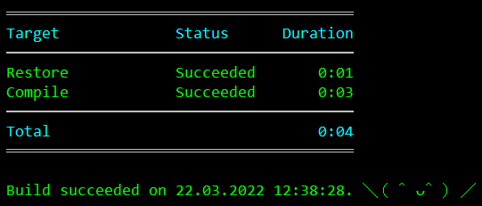

### Nuke

[Nuke](https://nuke.build/) — очередная попытка объехать MsBuild на очередной козе. Позиционируется как более удобная замена Cake/Fake/Psake/что там ещё.

Базовый сценарий довольно простой, и это радует. Пусть у нас есть некий проект

```shell
$ mkdir SampleApp
$ dotnet new sln
$ dotnet new console -o SampleApp
$ dotnet sln add SampleApp
```

Установка Nuke сводится к одной консольной команде

```shell
$ dotnet tool install Nuke.GlobalTool --global
```

Подключение Nuke к своему проекту — тоже в одну команду

```shell
$ nuke :setup
```

Утилита задаст несколько вопросов, на большинство из которых можно ответить просто `Enter`. Задача `nuke` - добавить в решение проект `_build.csproj`, который, собственно, и собирает остальные проекты в решении. Кроме прочего, утилита создаст файлы `build.cmd`, `build.ps1` и `build.sh`, запускающие сборку (при необходимости также могут установить .NET SDK). Запустив один из них, мы получим радостное сообщение



Это означает, что базовый сценарий использования Nuke мы успешно освоили. :)

Рассмотрим файл `Build.cs`

```c#
using System;
using System.Linq;
using Nuke.Common;
using Nuke.Common.CI;
using Nuke.Common.Execution;
using Nuke.Common.IO;
using Nuke.Common.ProjectModel;
using Nuke.Common.Tooling;
using Nuke.Common.Tools.DotNet;
using Nuke.Common.Utilities.Collections;
using static Nuke.Common.EnvironmentInfo;
using static Nuke.Common.IO.FileSystemTasks;
using static Nuke.Common.IO.PathConstruction;
using static Nuke.Common.Tools.DotNet.DotNetTasks;

[CheckBuildProjectConfigurations]
[ShutdownDotNetAfterServerBuild]
class Build : NukeBuild
{
/// Support plugins are available for:
///   - JetBrains ReSharper        https://nuke.build/resharper
///   - JetBrains Rider            https://nuke.build/rider
///   - Microsoft VisualStudio     https://nuke.build/visualstudio
///   - Microsoft VSCode           https://nuke.build/vscode

    public static int Main () => Execute<Build>(x => x.Compile);
 
    [Parameter("Configuration to build - Default is 'Debug' (local) or 'Release' (server)")]
    readonly Configuration Configuration = IsLocalBuild ? Configuration.Debug : Configuration.Release;
 
    [Solution] readonly Solution Solution;
 
    AbsolutePath SourceDirectory => RootDirectory / "source";
    AbsolutePath TestsDirectory => RootDirectory / "tests";
    AbsolutePath OutputDirectory => RootDirectory / "output";
 
    Target Clean => _ => _
        .Before(Restore)
        .Executes(() =>
        {
            SourceDirectory.GlobDirectories("**/bin", "**/obj").ForEach(DeleteDirectory);
            TestsDirectory.GlobDirectories("**/bin", "**/obj").ForEach(DeleteDirectory);
            EnsureCleanDirectory(OutputDirectory);
        });
 
    Target Restore => _ => _
        .Executes(() =>
        {
            DotNetRestore(s => s
                .SetProjectFile(Solution));
        });
 
    Target Compile => _ => _
        .DependsOn(Restore)
        .Executes(() =>
        {
            DotNetBuild(s => s
                .SetProjectFile(Solution)
                .SetConfiguration(Configuration)
                .EnableNoRestore());
        });

}
```

По-моему, всё прозрачно. Если бы я ответил «да» на вопрос «Собираетесь ли вы использовать Git?», то цель Compile выглядела бы так

```c#
Target Compile => _ => _
  .DependsOn(Restore)
  .Executes(() =>
    {
        DotNetBuild(s => s
            .SetProjectFile(Solution)
            .SetConfiguration(Configuration)
            .SetAssemblyVersion(GitVersion.AssemblySemVer)
            .SetFileVersion(GitVersion.AssemblySemFileVer)
            .SetInformationalVersion(GitVersion.InformationalVersion)
            .EnableNoRestore());
    });
```

Отсюда следует простой вывод: в нашей власти напихать в `Build.cs` столько дополнительного сервиса, сколько сумеем. Например, можно создать свои цели сборки (`Deploy`, к примеру) или проигрывать в колонках Имперский марш по мере успешного прохождения тестов. Всё в наших руках, как говорится. :)

Следующая важная вещь — параметры сборки. Достаточно просто пометить поле атрибутом `[Parameter]`, и можно передавать значение этого поля через командную строку. В данном случае — конфигурацию сборки `Debug` или `Release`. Механизм очень гибок — можно сделать параметр необходимым, и без него сборка не запустится. Также параметр можно делать необходимым только для конкретного `Target`.

Пример цели `Publish`

```c#
Target Publish => _ => _
    .Executes(() =>
    {
        var rids = new[] {"win-x64", "linux-x64"}; // RID'ы, для которых собираем приложение
        
        DotNetPublish(s => s // вызываем dotnet publish
            .SetAssemblyVersion(GitVersion.AssemblySemVer)
            .SetFileVersion(GitVersion.AssemblySemFileVer)
            .SetInformationalVersion(GitVersion.InformationalVersion)
            .SetProject(Solution.GetProject("Demo")) // для dotnet publish желательно указывать проект
            .SetPublishSingleFile(true) // собираем в один файл
            .SetSelfContained(true) // вместе с рантаймом
            .SetConfiguration(Configuration) // для определённой конфигурации
            .CombineWith(rids, (s, rid) => s // но нам нужны разные комбинации параметров
                .SetRuntime(rid) // устанавливаем RID
                .SetOutput(OutputDirectory/rid))); // делаем так, чтобы сборки с разными RID попали в разные папки
});
```

Сборка запускается с помощью скрипта

```shell
$ .\build.ps1 [targets] [arguments]
например
$ .\build.ps1 --target Compile --configuration Release
```
