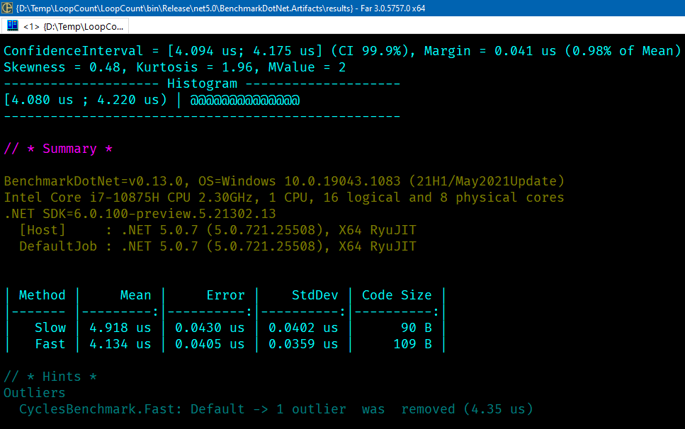

### Меньше элементов - медленнее работает

Оказывается, если уменьшить количество обрабатываемых элементов массива, метод может начать работать медленнее.



```c#
using BenchmarkDotNet.Attributes;
using BenchmarkDotNet.Running;
 
BenchmarkRunner.Run(typeof(CyclesBenchmark));
 
[DisassemblyDiagnoser]
public class CyclesBenchmark
{
    private const int ArrayLength = 10_000;
     
    private int[] _array;
 
    [GlobalSetup]
    public void Setup()
    {
        _array = new int[ArrayLength];
        for (var i = 0; i < ArrayLength; i++)
        {
            _array[i] = i;
        }
    }
     
    [Benchmark]
    public int Slow()
    {
        var a = _array;
        var c = new int[a.Length];
         
        for (var i = 0; i < c.Length - 1; i++)
        {
            c[i] = a[i];
        }
 
        return c[0];
    }
 
    [Benchmark]
    public int Fast()
    {
        var a = _array;
        var c = new int[a.Length];
         
        for (var i = 0; i < c.Length; i++)
        {
            c[i] = a[i];
        }
 
        return c[0];
    }
}
```
