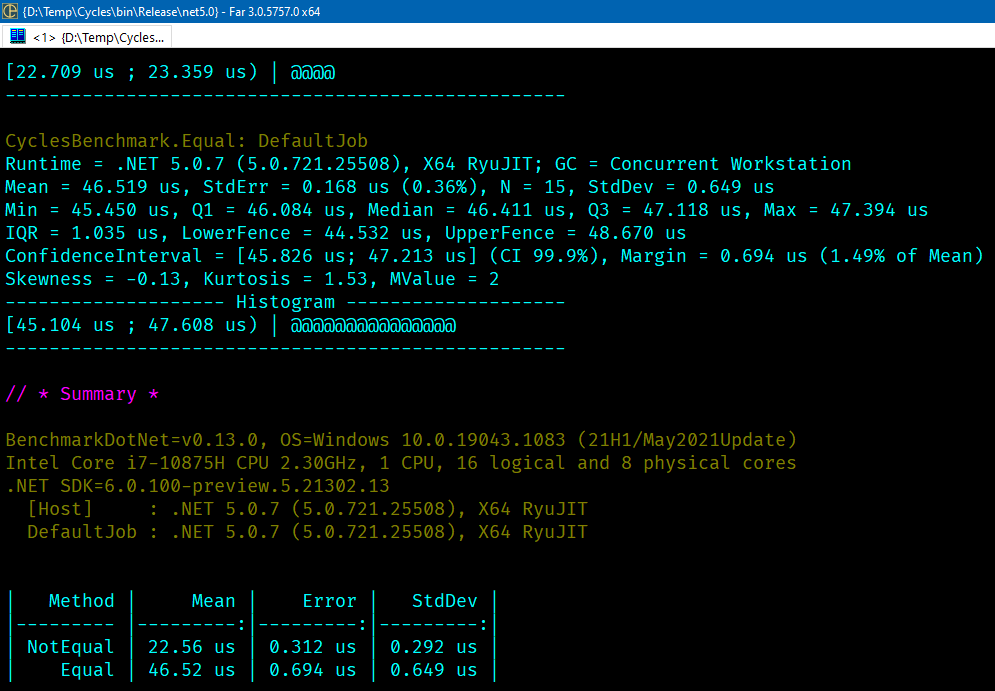

### Сравнения полны сюрпризов



```c#
using BenchmarkDotNet.Attributes;
using BenchmarkDotNet.Running;
 
BenchmarkRunner.Run(typeof(CyclesBenchmark));
 
public class CyclesBenchmark
{
    [Benchmark]
    public int NotEqual()
    {
        var sum = 0;
         
        for (var i = 0; i < 100_000; i++)
        {
            if (i != 0)
            {
                sum++;
            }
        }
 
        return sum;
    }
 
    [Benchmark]
    public int Equal()
    {
        var sum = 0;
 
        for (var i = 0; i < 100_000; i++)
        {
            if (i == 0)
            {
                sum++;
            }
        }
 
        return sum;
    }
}
```
