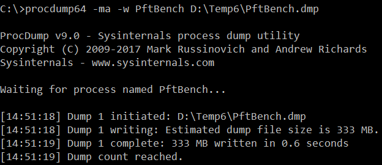

### Используем procdump для получения дампов

Допустим, мы написали некую программу и передали её заказчику. В процессе эксплуатации выяснилось, что программа делает что-то не так, например, зависает при открытии файла. На своей машине воспроизвести зависание не удаётся, а на машине заказчика — сколько угодно, виснет стабильно. Устанавливать Visual Studio на машину заказчика не выход, что делать?

Нас выручит бесплатная [утилита ProcDump](https://docs.microsoft.com/en-us/sysinternals/downloads/procdump) из комплекта SysInternals Suite.

1. Скачиваем утилиту, распаковываем её куда-нибудь. Запускаем проблемную программу, дожидаемся зависания (лучше использовать версию с отладочной информацией, хотя бы минимальной).

2. Запускаем procdump.

3. Получили файл дампа. Его размер зависит от множества факторов, в т. ч. от количества задействованной памяти. В моём случае он оказался 325 Мб. Упаковываем его, записываем на флешку, переносим на свою машину, где установлена Visual Studio.

4. Выполняем пункт меню «File -> Open -> File…»

5. Visual Studio показывает основную информацию о дампе и спрашивает, что мы собираемся делать.

6. Выбираем, например, «Debug with Mixed», видим «потроха» программы, включая трассировку стека и содержимое переменных.

