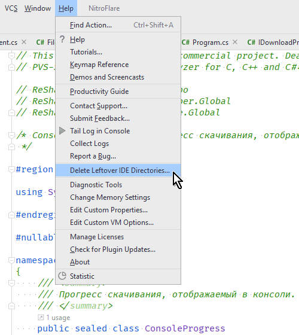
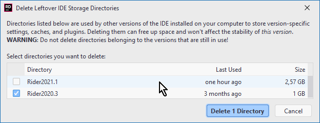
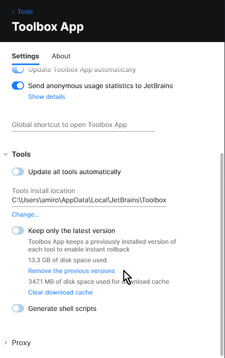

### Delete leftover IDE directories

В preview-версиях Rider 2021.2 (как и во всех остальных IDEA-based IDE) появилась полезная возможность удалить файлы, оставшиеся от предыдущих версий IDE.

Справедливости ради, примерно такого же эффекта можно добиться с помощью Toolbox Application:

Но я всегда приветствую, когда появляется возможность сделать что-нибудь разными способами. Где выбор — там свобода! 🙂
