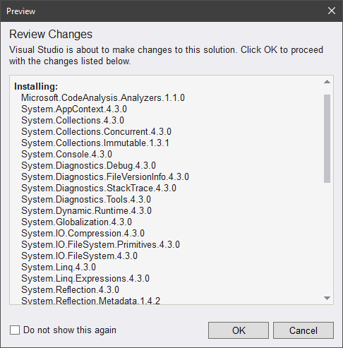
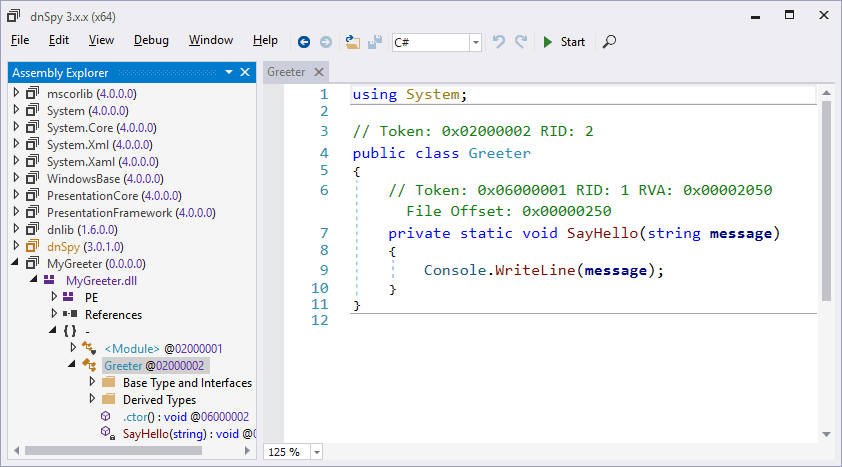

### Введение

Наконец-то Microsoft выпустила компилятор C#, написанный на C#: знакомьтесь, Roslyn: https://github.com/dotnet/roslyn. Доступен в NuGet как пакет Microsoft.Net.Compilers (собственно компилятор): https://www.nuget.org/packages/Microsoft.Net.Compilers (работает в .NET Framework начиная с версии 4.5) и как Microsoft.CodeAnalysis.Scripting (версия для скриптинга): https://www.nuget.org/packages/Microsoft.CodeAnalysis.Scripting/ (начиная с 4.6).

Что это нам даёт? Самое главное — мы можем встроить Roslyn в своё приложение и заниматься скриптингом в своё удовольствие:

```csharp
using Roslyn.Scripting.CSharp;

class Program
{
  static void Main(string[] args)
  {
    var engine = new ScriptEngine();
    engine.Execute(@"System.Console.WriteLine(""Hello Roslyn"");");
  }
}
```

Можно завести так называемые сессии:

```csharp
var engine = new ScriptEngine();
var session = Session.Create();
  
engine.Execute(@"var a = 42;", session);
engine.Execute(@"System.Console.WriteLine(a);", session);
```

Можно хостить свои объекты в скриптах:

```csharp
public class HostObject
{
    public int Value = 0;
}
 
var hostObject = new HostObject();
var engine = new ScriptEngine
  (
    new[] { hostObject.GetType().Assembly.Location }
  );
var session = Session.Create(hostObject);
 
engine.Execute(@"Value = 42;", session);
engine.Execute(@"System.Console.WriteLine(Value);", session);
Console.WriteLine(Value);
```

Вообще говоря, всё настолько разжёвано, что даже неприлично:

```csharp
object result = await CSharpScript.EvaluateAsync("1 + 2");
int result = await CSharpScript.EvaluateAsync<int>("1 + 2");
 
try
{
    Console.WriteLine(await CSharpScript.EvaluateAsync("2+2"));
}
catch (CompilationErrorException e)
{
    Console.WriteLine(string.Join(Environment.NewLine, e.Diagnostics));
}
 
var result = await CSharpScript.EvaluateAsync
(
    "System.Net.Dns.GetHostName()", 
     ScriptOptions.Default.WithReferences
       (
         typeof(System.Net.Dns).Assembly
       )
);
 
var result = await CSharpScript.EvaluateAsync
(
   "Sqrt(2)", 
   ScriptOptions.Default.WithImports("System.Math")
);
```

* * *

Как создать и записать на диск сборку с помощью Roslyn.

В NuGet находим пакет Microsoft.CodeAnalysis.CSharp, который, к сожалению, дружит с десктопным фреймворком, только начиная с версии 4.6 (т. к. рассчитан на .NET Standard 1.3). Кроме прочего, он тащит с собой чуть не весь этот самый .NET Standard (общий размер загружаемых пакетов 283 Мб).



```csharp
using System;
using System.IO;
using System.Linq;
 
using Microsoft.CodeAnalysis;
using Microsoft.CodeAnalysis.CSharp;
using Microsoft.CodeAnalysis.Emit;
 
class Program
{
    static void Main()
    {
        SyntaxTree syntaxTree = CSharpSyntaxTree.ParseText
            (
                @"
public class Greeter
{
    static void SayHello(string message)
    {
        System.Console.WriteLine(message);
    }
}
"
            );
 
        MetadataReference[] references =
        {
            MetadataReference
               .CreateFromFile(typeof(object).Assembly.Location),
            MetadataReference
               .CreateFromFile(typeof(Enumerable).Assembly.Location)
        };
        CSharpCompilation compilation = CSharpCompilation.Create
            (
                "MyGreeter",
                new []{syntaxTree},
                references,
                new CSharpCompilationOptions
                    (
                        OutputKind.DynamicallyLinkedLibrary
                    )
            );
        string fileName = "MyGreeter.dll";
        using (FileStream stream = File.Create(fileName))
        {
            EmitResult emitResult = compilation.Emit(stream);
            if (emitResult.Success)
            {
                Console.WriteLine("OK");
            }
            else
            {
                foreach (Diagnostic diagnostic in emitResult.Diagnostics)
                {
                    Console.WriteLine
                        (
                            "{0}: {1}",
                            diagnostic.Id,
                            diagnostic.GetMessage()
                        );
                }
            }
        }
    }
}
```

Посмотрим, что получилось:



Можно не сохранять сборку на диск, а держать её в памяти и выполнять код прямо оттуда:

```csharp
using (var stream = new MemoryStream())
{
    EmitResult result = compilation.Emit(stream);
    if (result.Success)
    {
        // Загружаем сборку, получаем тип и вызываем метод
        byte[] rawAssembly = stream.ToArray();
        Assembly assembly = Assembly.Load(rawAssembly);
        Type type = assembly.GetType("Greeter");
        type.InvokeMember
            (
                "SayHello",
                BindingFlags.NonPublic
                |BindingFlags.Static
                |BindingFlags.InvokeMethod,
                null,
                null,
                new [] {"Hello, world!"}
            );
    }
}
```
