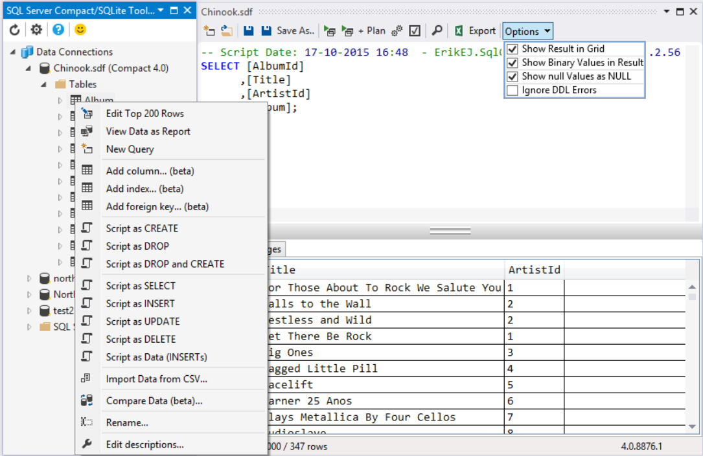

### Microsoft SQL Server Compact Edition

Небольшая, но вполне удобная бесплатная СУБД, которую программа может таскать с собой. Последняя версия: 4.0. Существует как 32-битная, так и 64-битная версия. База данных представляет собой один файл с расширением SDF, который может иметь размер до 4 Гб.

Собственно движок подключается к программе с помощью NuGet: https://www.nuget.org/packages/Microsoft.SqlServer.Compact/

Современная Sql Management Studio (начиная с 2008) отказывается работать с базами данных SQL CE. Для Visual Studio есть бесплатное расширение «SQL Server Compact/SQLite Toolbox», которое позволяет создавать базы данных SQL CE, редактировать таблицы, выполнять запросы, делать экспорт/импорт данных.



Подключение к базе данных:

```csharp
string databasePath = Path.Combine
    (
        Assembly.GetEntryAssembly().GetName().CodeBase,
        "data.sdf"
    );
int maxSize = 256; // максимальный размер базы, мегабайты
string connectionString = string.Format
    (
        "Data Source={0};Max Database Size={1}",
        databasePath,
        maxSize
    );
SqlCeConnection connection = new SqlCeConnection
    (
        connectionString
    );
connection.Open();

SqlCeCommand command = connection.CreateCommand();
command.CommandText = "select * from books";
SqlCeDataReader reader = command.ExecuteReader();

while (reader.Read())
{
    string title = reader.GetString
        (
            reader.GetOrdinal("title")
        );
    decimal price = reader.GetDecimal
        (
            reader.GetOrdinal("price")
        );
    Console.WriteLine
        (
            "Книга '{0}' по цене {1}",
            title,
            price
        );
}
connection.Close ();
```

Элементы строки подключения:

* Data Source=MyData.sdf;
* Encrypt Database=True;
* Password=myPassword;
* File Mode=Shared Read; или  File Mode=Exclusive; или  File Mode=Read Only;
* Persist Security Info=False;

BLToolkit совместим с SQL CE, нужно лишь подключить с помощью NuGet соответствующий провайдер: https://www.nuget.org/packages/BLToolkit.SqlCe/.

Создание базы данных программно:

```csharp
public static void CreateDatabase
    (
        string fileName
    )
{
    if (File.Exists(fileName))
    {
        File.Delete(fileName);
    }
 
    string connectionString = string.Format
        (
            "Data Source={0};",
            fileName
        );
    using (SqlCeEngine engine = new SqlCeEngine
        (
            connectionString
        ))
    {
        engine.CreateDatabase();
    }
}
```

В DDL доступны следующие команды: CREATE DATABASE, CREATE TABLE, ALTER TABLE, CREATE INDEX, DROP INDEX и DROP TABLE.

Синтаксис CREATE TABLE:

```sql
CREATE TABLE table_name 
   ( { < column_definition > | < table_constraint > } [ ,...n ] 
   ) 
 
< column_definition > ::= 
   { column_name data_type } 
   [ { DEFAULT constant_expression 
      | [ IDENTITY [ ( seed , increment ) ]
      ]
    } ] 
   [ ROWGUIDCOL ] 
   [ < column_constraint > [ ...n ] ]
 
< column_constraint > ::= 
   [ CONSTRAINT constraint_name ] 
   { [ NULL | NOT NULL ] 
      | [ PRIMARY KEY | UNIQUE ] 
      | REFERENCES ref_table [ ( ref_column ) ] 
      [ ON DELETE { CASCADE | NO ACTION } ] 
      [ ON UPDATE { CASCADE | NO ACTION } ] 
    }
 
< table_constraint > ::= 
   [ CONSTRAINT constraint_name ] 
   { [ { PRIMARY KEY | UNIQUE } 
      { ( column [ ,...n ] ) } 
      ]
   | FOREIGN KEY 
     ( column [ ,...n ] )
      REFERENCES ref_table [ ( ref_column [ ,...n ] ) ] 
      [ ON DELETE { CASCADE | NO ACTION } ]
      [ ON UPDATE { CASCADE | NO ACTION } ] 
   }
```

Синтаксис CREATE INDEX:

```sql
CREATE [UNIQUE] [NONCLUSTERED] INDEX index_name 
ON table_name (column_name [ASC|DESC][,…n])
WITH (STATISTICS_NORECOMPUTE = { ON | OFF })]
```

Типы данных:

| Тип | Описание |
|-----|----------|
| bigint  | Длинное целое: от –2\^63 (–9,223,372,036,854,775,808) до 2\^63–1 (9,223,372,036,854,775,807). Занимает 8 байт. |
| integer | Обычное целое: от –2\^31 (–2,147,483,648) до 2\^31–1 (2,147,483,647). Занимает 4 байта. |
| smallint | Короткое целое: от –32,768 до 32,767. Занимает 2 байта. |
| tinyint | Байт: от 0 до 255. |
| bit | Логическое значение: 0 или 1. Занимает 1 бит. |
| numeric (p, s)<br/>Синонимы:<br/>decimal (p,s)<br/>или dec (p,s) | Число с фиксированной точкой: от –10^38+1 до 10^38–1. Занимает 19 байт. |
| money | Денежный тип: от (–2\^63/10000) (–922,337,203,685,477.5808) до 2\^63–1 (922,337,203,685,477.5807). Точность: 1/10 тыс. Занимает 8 байт. |
| float | Число с плавающей точкой двойной точности: от –1.79E +308 до 1.79E+308. Занимает 8 байт. |
| real | Число с плавающей точкой одинарной точности: от –3.40E+38 до 3.40E+38. Занимает 4 байта. |
| datetime | Дата и время от 1 января 1753 года до 31 декабря 9999 года с точностью 3.33 миллисекунды. Занимает 8 байт: одно 4-байтовое целое означает число дней до или после 1 января 1900 года, другое хранит количество миллисекунд после полуночи. |
| national character(n)<br/>Синоним: nchar(n) | Текст фиксированной длины в кодировке Unicode. Не более 4000 символов. |
| national character varying(n)<br/> Синоним: nvarchar(n) | Текст переменной длины в кодировке Unicode. Не более 4000 символов. |
| ntext | Текст переменной длины в кодировке Unicode длиной до  (2\^30–2)/2 (536,870,911) символов. Примечание: ntext не поддерживается в строковых функциях. |
| nchar(n) | Fixed-length Unicode character data of n characters. n must be a value from 1 through 4,000. The storage size is two times n bytes. |
| binary(n) | Массив байт фиксированной длины. Максимум 8000 байт. |
| varbinary(n) |   Массив байт переменной длины. Максимум 8000 байт. |
| image | Массив байт переменной длины. Максимум  2\^30–1 (1,073,741,823) байт. |
| uniqueidentifier | Глобально уникальный идентификатор (GUID). Занимает 16 байт. |
| IDENTITY [(s, i)] | Свойство колонки с данными. Автоматический счётчик. |
| ROWGUIDCOL | Свойство колонки с данными. Применяется к колонке типа uniqueidentifier. |
| Timestamp/rowversion | Автоматически генерируемое двоичное значение. Занимает 8 байт. |
