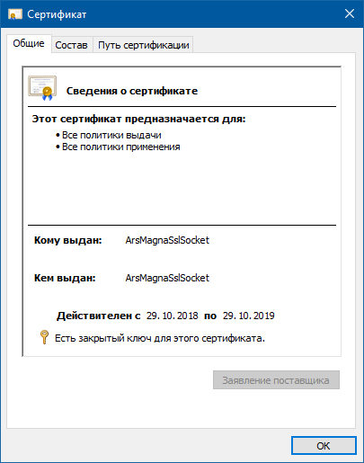

### TCP Client/Server с SslStream

Создаём самоподписанный сертификат (переводы строки добавлены для удобочитаемости):

```
"C:\Program Files (x86)\Microsoft SDKs\Windows\v7.1A\Bin\x64\makecert.exe" 
   -r -pe -n "CN=ArsMagnaSslSocket" -m 12 ArsMagnaSslSocket.cer
```

Добавляем этот сертификат в корневые, вот что получается:



Пишем пару простейших приложений: сервер, удостоверяемый данным сертификатом, 
и клиент, удостоверяющийся, что сервер имеет нужный сертификат.

#### Сервер

```csharp
using System;
using System.Net;
using System.Net.Sockets;
using System.Net.Security;
using System.Text;
using System.Security.Cryptography.X509Certificates;

internal class Program
{
  private static X509Certificate _certificate;

  public static X509Certificate GetCertificate(string name)
  {
    X509Store store = new X509Store(StoreName.Root);
    store.Open(OpenFlags.ReadOnly);
    foreach (X509Certificate2 certificate in store.Certificates)
    {
      if (certificate.Issuer == name
          && certificate.Subject == name)
      {
          return certificate;
      }
    }
       
    throw new Exception();
  }

  static void ProcessClient(TcpClient client)
  {
    SslStream sslStream = new SslStream(client.GetStream(), false);
    try
    {
      sslStream.AuthenticateAsServer(_certificate, true, false);
      byte[] buffer = new byte[4096];
      int readed = sslStream.Read(buffer, 0, buffer.Length);
      string message = Encoding.UTF8.GetString(buffer, 0, readed);
      Console.WriteLine(message);
      Console.WriteLine();
    }
    catch (Exception exception)
    {
      Console.WriteLine(exception);
    }

    sslStream.Close();
    client.Close();
  }

  public static void Main()
  {
    //_certificate = X509Certificate
    //  .CreateFromCertFile("ArsMagnaSslSocket.cer");
    _certificate = GetCertificate("CN=ArsMagnaSslSocket");

    TcpListener listener = new TcpListener(IPAddress.Any, 8080);
    listener.Start();
    while (true)
    {
      Console.WriteLine("Waiting for a client to connect...");
      TcpClient client = listener.AcceptTcpClient();
      ProcessClient(client);
    }
  }
}
```

#### Клиент

```csharp
using System;
using System.Net.Sockets;
using System.Net.Security;
using System.Text;
using System.Security.Cryptography.X509Certificates;

internal class Program
{
  private static X509Certificate _certificate;

  public static X509Certificate GetCertificate(string name)
  {
    X509Store store = new X509Store(StoreName.Root);
    store.Open(OpenFlags.ReadOnly);
    foreach (X509Certificate2 certificate in store.Certificates)
    {
      if (certificate.Issuer == name
          && certificate.Subject == name)
      {
          return certificate;
      }
    }
       
    throw new Exception();
  }
  
  public static bool ValidateServerCertificate
    (
      object sender,
      X509Certificate certificate,
      X509Chain chain,
      SslPolicyErrors sslPolicyErrors
    )
  {
    if (sslPolicyErrors == SslPolicyErrors.None)
    {
      return true;
    }

    Console.WriteLine("Certificate error: {0}", sslPolicyErrors);
    
    return false;
  }
  
  public static void Main()
  {
    //_certificate = X509Certificate
    //    .CreateFromCertFile("ArsMagnaSslSocket.cer");
    _certificate = GetCertificate("CN=ArsMagnaSslSocket");
    X509CertificateCollection collection 
        = new X509CertificateCollection { _certificate };
  
  try
    {
      TcpClient client = new TcpClient("localhost", 8080);
      Console.WriteLine("Client connected.");

      SslStream sslStream = new SslStream
          (
            client.GetStream(),
            false,
            ValidateServerCertificate,
            null
          );
      sslStream.AuthenticateAsClient
          (
            "ArsMagnaSslSocket",
            collection, 
            SslProtocols.Tls12, 
            false
          );
      string message = "Hello from client";
      byte[] buffer = Encoding.UTF8.GetBytes(message);
      sslStream.Write(buffer);
      sslStream.Flush();

      client.Close();
      Console.WriteLine("Client closed.");
    }
    catch (Exception exception)
    {
      Console.WriteLine(exception);
    }
  }
}
```