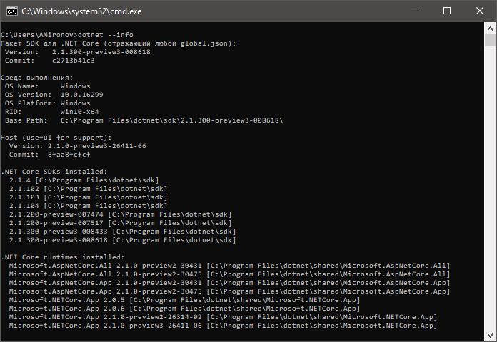

### Переключение между версиями .NET Core SDK

Бывает так, что на одной машине установлено сразу много .NET Core SDK:



Как указать, который из них должен применяться к нашему проекту? Очень просто: достаточно положить в папку, в которой будет располагаться csproj файл с именем global.json следующего содержания:

```javascript
{
   "sdk": { "version": "2.1.104" }
}
```

Рекомендуется это делать, пока папка пустая (перед вызовом dotnet new).

Подробнее см. [в блоге Скотта Хансельмана](https://www.hanselman.com/blog/ManagingDotnetCore20AndDotnetCore1xVersionedSDKsOnTheSameMachine.aspx).
