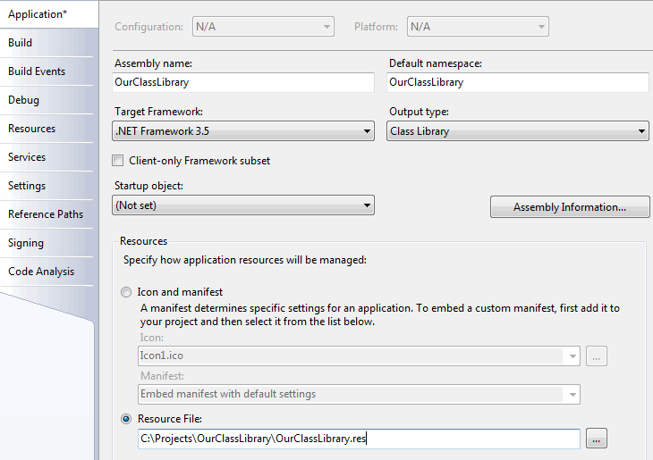

### Как встроить TLB в сборку

См. http://stackoverflow.com/questions/417803/how-to-embed-tlb-as-a-resource-file-into-net-assembly-dll и https://msdn.microsoft.com/en-us/library/ww9a897z(v=vs.90).aspx.

Пусть у нас есть своя библиотека классов (написанная на C#), хотя бы такого содержания:
```csharp
using System.Runtime.InteropServices;
 
namespace OurClassLibrary
{
    [ComVisible(true)]
    public class VeryComplexClass
    {
        public int Sum(int left, int right)
        {
            return left + right;
        }
    }
}
```

Мы скомпилировали её, получили OurClassLibrary.dll и теперь хотим сделать сборку доступной для C++ с помощью COM. Нам понадобится TLB, которую можно изготовить с помощью TlbExp.exe:

```
"C:\Program Files (x86)\Microsoft SDKs\Windows\v7.0A\Bin\TlbExp.exe" OurClassLibrary.dll
```

Если всё прошло успешно, рядом с DLL появится одноименная TLB.

Можно создать манифест для сборки:

```
"C:\Program Files (x86)\Microsoft SDKs\Windows\v7.1A\Bin\mt.exe" -managedassemblyname:OurClassLibrary.dll -nodependency -out:OurClassLibrary.manifest
```

Чтобы не таскать с собой два файла, мы поместим TLB и манифест внутрь DLL. Для этого сочиняем OurClassLibrary.rc следующего содержания:

```
1 TYPELIB "OurClassLibrary.rc"
1 24 "OurClassLibrary.manifest"
```

Компилируем его:

```
"C:\Program Files (x86)\Microsoft SDKs\Windows\v7.1A\Bin\RC.Exe" OurClassLibrary.rc
```

Рядом с .RC должен появиться одноимённый файл .RES. Осталось только включить его в состав проекта. Для этого идём в свойства проекта в Visual Studio и во вкладке Application устанавливаем наши ресурсы вместо стандартных:



Снова собираем проект, смотрим внутрь DLL любым просмотрщиком ресурсов и убеждаемся, что TLB успешно вкомпилирована в неё.

Естественно, при добавлении/удалении/редактировании членов классов в нашей сборке, мы должны снова повторять последовательность «TlbExp -&gt; RC -&gt; перекомпиляция».
