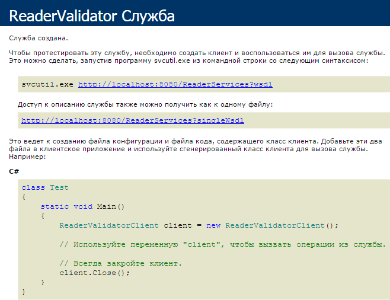

### WCF: начало

WCF – очередное обещание Microsoft сделать для нас (прикладных программистов) простой фреймворк для распределённых приложений. Поверим в очередной раз?

Чтобы понять, что это такое, напишем очередной «Hello, World», на сей раз с использованием WCF.

#### Общий код

Сначала создадим библиотеку классов, общих для клиента и сервера:

```csharp
using System;
using System.ServiceModel; // добавить ссылку на сборку!
 
namespace CommonClasses
{
    // Kind of a useful service 
    [ServiceContract]
    public interface IReaderValidator
    {
        // Validating reader name
        [OperationContract]
        bool ValidateReader (string readerName);
    }
 
    public static class SharedConfiguration
    {
        public static int PortNumber = 8080;
 
        public static string ServicePath = "ReaderServices";
 
        public static Uri ServiceUri
        {
            get
            {
                Uri result = new Uri
                    (
                        "http://localhost:"
                        + PortNumber
                        + "/"
                        + ServicePath
                    );
                return result;
            }
        }
    }
}
```

#### Сервер

Теперь – сервер (консольное приложение):

```csharp
using System;
using System.ServiceModel; // добавить ссылку на сборку!
using System.Text.RegularExpressions;
using System.Threading;
 
using CommonClasses; // добавить ссылку на сборку!
 
namespace ServerApplication
{
    // Service implementation
    public sealed class ReaderValidator
        : IReaderValidator
    {
        public bool ValidateReader(string readerName)
        {
            if (string.IsNullOrEmpty(readerName))
            {
                return false;
            }
 
            Regex regex = new Regex("^[A-Z][a-z]+ [A-Z][a-z]+$");
            bool result = regex.IsMatch(readerName);
 
            // For debug sake
            Console.WriteLine
                (
                    "Validating {0}: {1}", 
                    readerName, 
                    result
                );
 
            return result;
        }
    }
 
    class Program
    {
        static void Main()
        {
            // Give server some time to initialize
            Thread.Sleep(1000);
 
            try
            {
                Type serviceType = typeof (ReaderValidator);
                Uri serviceUri = SharedConfiguration.ServiceUri;
                ServiceHost serviceHost = new ServiceHost
                    (
                    serviceType,
                    serviceUri
                    );
                serviceHost.AddServiceEndpoint
                    (
                        typeof (IReaderValidator),
                        new BasicHttpBinding(),
                        string.Empty
                    );
                serviceHost.Open();
 
                Console.WriteLine("Press ENTER to stop");
                Console.ReadLine();
 
                serviceHost.Close();
            }
            catch (Exception exception)
            {
                Console.WriteLine(exception);
                Console.ReadLine();
            }
        }
    }
 
}
```

#### Клиент

И наконец – клиент (тоже консольное приложение):

```csharp
using System;
using System.ServiceModel; // добавить ссылку на сборку!
 
using CommonClasses; // добавить ссылку на сборку!
 
namespace ClientApplication
{
    class Program
    {
        static void Main()
        {
            ChannelFactory<IReaderValidator> factory
                = new ChannelFactory<IReaderValidator>
                    (
                        new BasicHttpBinding(),
                        new EndpointAddress
                            (
                                SharedConfiguration.ServiceUri
                            )
                    );
            IReaderValidator validator = factory.CreateChannel();
 
            string readerName = "Mironov Alexey";
            bool result = validator.ValidateReader(readerName);
            Console.WriteLine
                (
                    "{0}: {1}",
                    readerName,
                    result
                );
 
            factory.Close();
 
            Console.ReadLine();
        }
    }
}
```

Как видим, ничего особо сложного в «Hello, World» нет. Вообще говоря, можно было обойтись без сборки CommonClasses и определения интерфейса, но правила хорошего тона диктуют именно такой подход.

#### Использование конфигурационных файлов

Можно хранить конфигурацию сервера в app.config:

```xml
<?xml version="1.0" encoding="utf-8" ?>
<configuration>
  <system.serviceModel>
    <services>
      <service name="ServerApplication.ReaderValidator">
        <host>
          <baseAddresses>
            <add baseAddress="http://localhost:8080/ReaderServices"/>
          </baseAddresses>
        </host>
       <endpoint address=""
         binding="basicHttpBinding"
         contract="CommonClasses.IReaderValidator" />
      </service>
    </services>
  </system.serviceModel>
</configuration>
```

Тогда создание хоста выглядело бы гораздо проще:

```csharp
Type serviceType = typeof(ReaderValidator);
ServiceHost serviceHost = new ServiceHost(serviceType);
serviceHost.Open();
```

### MEX

Можно добавить так называемую точку обмена метаданными (Metadata EXchange, MEX), которая позволяет клиенту динамически обнаруживать неизвестные ему службы:

```csharp
// Здесь всё как раньше
Type serviceType = typeof (ReaderValidator);
Uri serviceUri = SharedConfiguration.ServiceUri;
ServiceHost serviceHost = new ServiceHost
   (
      serviceType,
      serviceUri
   );
 
serviceHost.AddServiceEndpoint
   (
      typeof (IReaderValidator),
      new BasicHttpBinding(),
      string.Empty
   );
 
// Создаём и подключаем MEX
ServiceMetadataBehavior behavior = new ServiceMetadataBehavior
   {
      HttpGetEnabled = true
   };
serviceHost.Description.Behaviors.Add(behavior);
serviceHost.AddServiceEndpoint
   (
      typeof(IMetadataExchange),
      MetadataExchangeBindings.CreateMexHttpBinding(),
      "mex"
   );
 
// Дальше снова как обычно
serviceHost.Open();
```

MEX можно сконфигурировать и в app.config:

```xml
<?xml version="1.0" encoding="utf-8" ?>
<configuration>
  <system.serviceModel>
    <behaviors>
      <serviceBehaviors>
        <behavior>
          <serviceMetadata httpGetEnabled="true"/>
        </behavior>
      </serviceBehaviors>
    </behaviors>
    <services>
      <service name="ServerApplication.ReaderManager">
        <host>
          <baseAddresses>
            <add
              baseAddress="http://localhost:8080/ReaderServices"/>
          </baseAddresses>
        </host>
        <endpoint
          address=""
          binding="basicHttpBinding"
          contract="CommonClasses.IReaderManager"/>
      </service>
    </services>
  </system.serviceModel>
</configuration>
```

Тогда в коде ничего делать будет не надо, MEX появится «магически».

#### SvcUtil.exe

В результате мы с помощью браузера или другого клиента можем посмотреть, какие службы зарегистрированы в данной оконечной точке, а при помощи утилиты svcutil или Visual Studio можем сгенерировать обёртку для клиента:



SvcUtil.exe водится, например, здесь:

```
C:\Program Files (x86)\Microsoft SDKs\Windows\v7.0A\Bin\SvcUtil.exe
```

Сгенерированный ею класс-обёртка выглядит так:

```csharp
[System.CodeDom.Compiler.GeneratedCodeAttribute("System.ServiceModel", "3.0.0.0")]
[System.ServiceModel.ServiceContractAttribute(ConfigurationName="IReaderValidator")]
public interface IReaderValidator
{
    [System.ServiceModel.OperationContractAttribute(Action="http://tempuri.org/IReaderValidator/ValidateReader", 
    ReplyAction="http://tempuri.org/IReaderValidator/ValidateReaderResponse")]
    bool ValidateReader(string readerName);
}
 
[System.CodeDom.Compiler.GeneratedCodeAttribute("System.ServiceModel", "3.0.0.0")]
public interface IReaderValidatorChannel : IReaderValidator, System.ServiceModel.IClientChannel
{
}
 
[System.Diagnostics.DebuggerStepThroughAttribute()]
[System.CodeDom.Compiler.GeneratedCodeAttribute("System.ServiceModel", "3.0.0.0")]
public partial class ReaderValidatorClient : System.ServiceModel.ClientBase<IReaderValidator>, IReaderValidator
{
    public ReaderValidatorClient()
    {
    }
     
    public ReaderValidatorClient(string endpointConfigurationName) : 
            base(endpointConfigurationName)
    {
    }
     
    public ReaderValidatorClient(string endpointConfigurationName, string remoteAddress) : 
            base(endpointConfigurationName, remoteAddress)
    {
    }
     
    public ReaderValidatorClient(string endpointConfigurationName, 
            System.ServiceModel.EndpointAddress remoteAddress) : 
            base(endpointConfigurationName, remoteAddress)
    {
    }
     
    public ReaderValidatorClient(System.ServiceModel.Channels.Binding binding, 
            System.ServiceModel.EndpointAddress remoteAddress) : 
            base(binding, remoteAddress)
    {
    }
     
    public bool ValidateReader(string readerName)
    {
        return base.Channel.ValidateReader(readerName);
    }
}
```

#### TCP-привязка

Вместо HTTP можно использовать TCP-привязку (по умолчанию, работает на 808 порту). К её достоинствам можно отнести отсутствие необходимости в регистрации с помощью netsh. В конфигурации сервера нужно поменять буквально пару слов:

```xml
<?xml version="1.0" encoding="utf-8" ?>
<configuration>
  <system.serviceModel>
    <services>
      <service name="ServerApplication.ReaderValidator">
        <host>
          <baseAddresses>
            <add
              baseAddress="net.tcp://localhost/ReaderServices"/>
          </baseAddresses>
        </host>
        <endpoint
          address=""
          binding="netTcpBinding"
          contract="CommonClasses.IReaderValidator"/>
      </service>
    </services>
  </system.serviceModel>
</configuration>
```

В клиенте тоже немного изменений:

```csharp
ChannelFactory<IReaderValidator> factory = new ChannelFactory<IReaderValidator>
    (
        new NetTcpBinding(),
        new EndpointAddress("net.tcp://localhost/ReaderServices")
    );
IReaderValidator validator = factory.CreateChannel();
// Далее как обычно
```

#### .NET 4.0

С выходом .NET 4.0 появилась возможность немного упростить конфигурирование серверного приложения:

```csharp
// Вместо
serviceHost.AddServiceEndpoint
   (
       typeof (IReaderValidator),
       new BasicHttpBinding(),
       string.Empty
   );

// можно написать

serviceHost.AddDefaultEndpoints ();

// и .NET сам разберётся сколько и каких оконечных точек нужно создать.
```

#### Регистрация URL

При запуске программы, хостящей внутри себя WCF-сервис, может возникнуть ошибка «AddressAccessDeniedException: HTTP could not register URL http://+:8080/MyUri Your process does not have access rights to this namespace.» Как бороться с этой бедой, описано здесь: https://msdn.microsoft.com/en-us/library/ms733768.aspx. Если кратко, то под Windows 7/8/так далее нужно выполнить команды

```
netsh http add urlacl url=http://+:8080/MyUri user=DOMAIN\user
netsh http add iplisten ipaddress=0.0.0.0:8080
```

или не использовать HttpBinding (обойтись, например, NetTcpBinding).

Другой способ – заставить WCF использовать полные имена хостов вместо сравнения по шаблонам (wildcards). В коде это выглядит так:

```csharp
BasicHttpBinding binding = new BasicHttpBinding();
binding.HostNameComparisonMode = HostNameComparisonMode.Exact;
```

В конфигурации соответственно

```xml
<configuration>
  <system.serviceModel>
    <bindings>
      <basicHttpBinding>
        <binding name="Binding1"
                 hostNameComparisonMode ="Exact">
          <security mode="None" />
        </binding>
      </basicHttpBinding>
    </bindings>
  </system.serviceModel>
</configuration>
```
