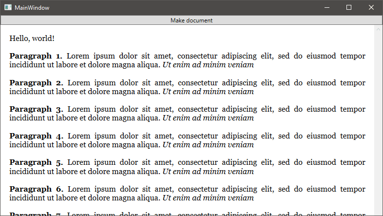

### Документы

Радует то, что документы с довольно сложным иерархическим содержимым в WPF генерируются довольно легко. Докажем это примером.

Сначала сделаем следующее главное окно:

```xml
<StackPanel>
    <Button Name="MakeButton"
            Click="MakeButton_OnClick">Make document</Button>
    <FlowDocumentScrollViewer Name="Viewer"></FlowDocumentScrollViewer>
</StackPanel>
```

и простой обработчик события Click:

```csharp
private void MakeButton_OnClick(object sender, RoutedEventArgs e)
{
    FlowDocument document = new FlowDocument();
    var blocks = document.Blocks;
    blocks.Add(new Paragraph(new Run("Hello, world!")));
    for (int i = 0; i < 10; i++)
    {
        var paragraph = new Paragraph
            (
                new Bold(new Run("Paragraph " + (i+1) + ". "))
            );
        paragraph.Inlines.Add("Lorem ipsum dolor sit amet, ");
        paragraph.Inlines.Add("consectetur adipiscing elit, ");
        paragraph.Inlines.Add("sed do eiusmod tempor incididunt ");
        paragraph.Inlines.Add("ut labore et dolore magna aliqua. ");
        paragraph.Inlines.Add(new Italic(new Run("Ut enim ad minim veniam")));
        blocks.Add(paragraph);
    }
    Viewer.Document = document;
}
```

Вот что получается:


