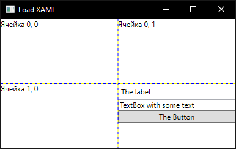

### Динамическая загрузка XAML

Допустим, нам нужно часть пользовательского интерфейса загрузить динамически, например, из файла, подобного следующему:

```xml
<StackPanel
    xmlns="http://schemas.microsoft.com/winfx/2006/xaml/presentation">
    <Label>The label</Label>
    <TextBox>TextBox with some text</TextBox>
    <Button>The Button</Button>
</StackPanel>
```

Загружать будем в ячейку грида:

```xml
<Window x:Class="WpfApp3.MainWindow"
        xmlns="http://schemas.microsoft.com/winfx/2006/xaml/presentation"
        xmlns:x="http://schemas.microsoft.com/winfx/2006/xaml"
        xmlns:d="http://schemas.microsoft.com/expression/blend/2008"
        xmlns:mc="http://schemas.openxmlformats.org/markup-compatibility/2006"
        xmlns:local="clr-namespace:WpfApp1"
        mc:Ignorable="d"
        Title="Load XAML" Height="250" Width="400">
    <Grid x:Name="LayoutGrid" ShowGridLines="True">
        <Grid.RowDefinitions>
            <RowDefinition/>
            <RowDefinition/>
        </Grid.RowDefinitions>
        <Grid.ColumnDefinitions>
            <ColumnDefinition />
            <ColumnDefinition />
        </Grid.ColumnDefinitions>
        <TextBlock>Ячейка 0, 0</TextBlock>
        <TextBlock Grid.Column="1" Grid.Row="0">Ячейка 0, 1</TextBlock>
        <TextBlock Grid.Column="0" Grid.Row="1">Ячейка 1, 0</TextBlock>
        <!-- Сюда будет помещен загруженный XAML -->
    </Grid>
</Window>
```

Загружается очень просто:

```csharp
using System.IO;
using System.Windows;
using System.Windows.Controls;
using System.Windows.Markup;

namespace WpfApp1
{
    public partial class MainWindow
        : Window
    {
        public MainWindow()
        {
            InitializeComponent();

            UIElement loaded;
            using (FileStream stream = new FileStream
                (
                    path: "Content1.xaml",
                    mode: FileMode.Open
                ))
            {
                loaded = (UIElement) XamlReader.Load(stream);
            }
            LayoutGrid.Children.Add(loaded);
            Grid.SetColumn(loaded, 1);
            Grid.SetRow(loaded, 1);
        }
    }
}
```



Здесь использован статический синхронный метод Load, однако, есть ещё и экземплярный асинхронный метод LoadAsync. Кроме того, есть статический метод Parse, принимающий строку.
