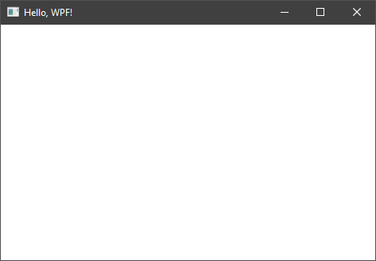

### Минимальное приложение WPF

```csharp
using System;
using System.Windows;

namespace WpfApp1
{
    class Program
    {
        [STAThread]
        static void Main()
        {
            Window win = new Window
            {
                Title = "Hello, WPF!"
            };
            win.Show();

            Application app = new Application();
            app.Run();
        }
    }
}
```


