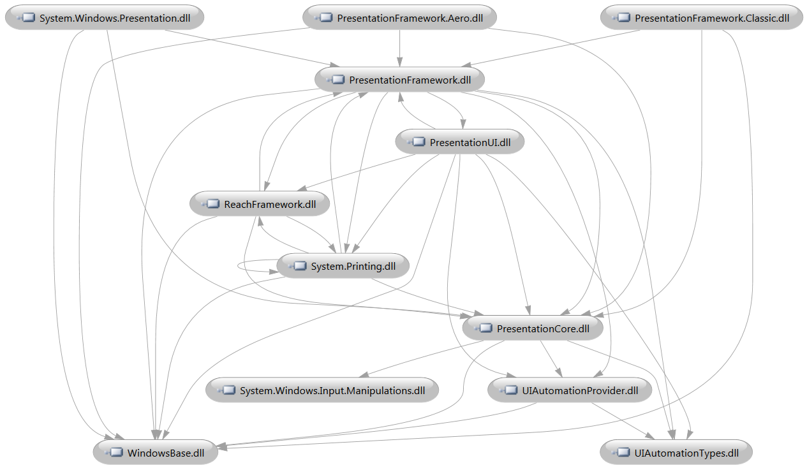
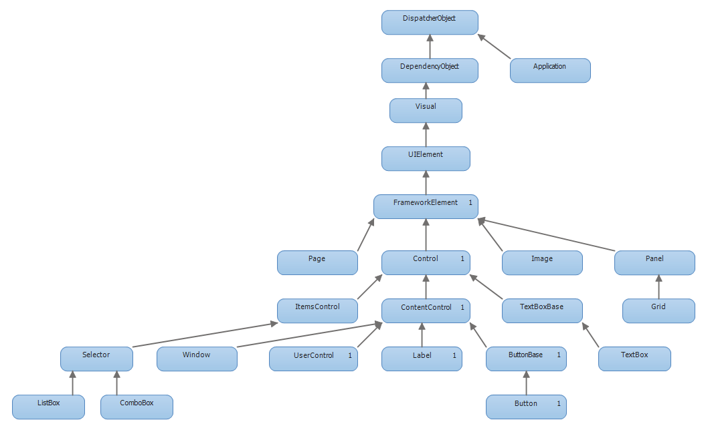
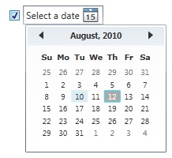
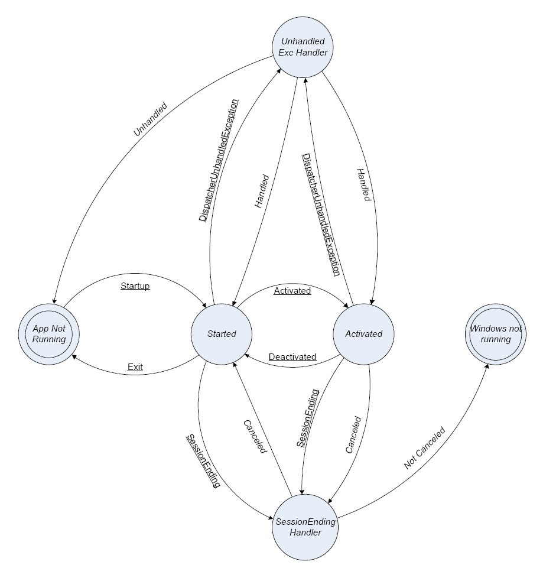

### Rendering Tiers

WPF applications automatically examine graphics card capabilities at runtime and assigns a rendering tier value, indicating what functions can be performed by the graphics card.

* Tier 0 – No hardware acceleration, all rendering done using software
* Tier 1 – Some hardware acceleration available.  DirectX version >= 9.0.  Hardware acceleration for:
  * Radial gradients
  * 3D lighting calculations
  * Text rendering
  * 3D anti-aliasing
* Tier 2- Most features use hardware acceleration.  DirectX version >= 9.0

To determine the current rendering tier:

```csharp
int renTier = (RenderCapability.Tier >> 16);
MessageBox.Show(string.Format("Tier = {0}", renTier));
```


### Property-Based Animation

Animation is one of the core features of WPF.  Unlike older frameworks, like Windows Forms, you don’t implement animation using timers and rendering the animation frame by frame.  Instead, WPF uses property-based animation, where you animate graphical elements by declaratively specifying how one of its properties should change, over time.

You can implement animation by writing code or by specifying the desired animated effect declaratively, in XAML.  You can also use the tools in Blend 4 to create WPF animations.

As an example, here’s a snippet of XAML that defines a button that will change it’s Height and Width properties, forever expanding and contracting:

```xml
<Button Content="Click Me" Height="25" HorizontalAlignment="Left" 
  Margin="25,25,0,0" Name="button1" VerticalAlignment="Top" Width="100" >
    <Button.Triggers>
        <EventTrigger RoutedEvent="Button.Loaded">
            <BeginStoryboard>
                <Storyboard>
                    <DoubleAnimation
                        Storyboard.TargetName="button1"
                        Storyboard.TargetProperty="Width"
                        From="100" To="105" Duration="0:0:0.3"
                        AutoReverse="True" RepeatBehavior="Forever"/>
                    <DoubleAnimation
                        Storyboard.TargetName="button1"
                        Storyboard.TargetProperty="Height"
                        From="25" To="30" Duration="0:0:0.5"
                        AutoReverse="True" RepeatBehavior="Forever"/>
                </Storyboard>
            </BeginStoryboard>
        </EventTrigger>
    </Button.Triggers>
</Button>
```

### Audio and Video

WPF makes it very easy to play audio or video content in your application.  You can play any media type supported by Windows Media Player including audio formats like WAV and MP3 or video formats like AVI, WMV, and MPG.

You play audio and video by including a media UI element directly in your XAML.  This allows rendering and playing video on a wide variety of user controls.  Here’s an example of a video playing on the surface of a Button.

```xml
<Button Height="258" HorizontalAlignment="Left" Margin="26,21,0,0"
  Name="button1" VerticalAlignment="Top" Width="436" >
    <Button.Content>
       <MediaElement
         Source="C:\Users\Public\Videos\Sample Videos\Wildlife.wmv"
         Stretch="Fill"/>
    </Button.Content>
</Button>
```

### Page-Based Navigation

WPF applications can be structured as a collection of pages, with built-in navigation between pages.  This is different from the more traditional (Win Forms) document-based model, where the application displays a main window and dialogs that pop up.

To create a page-based application, you use a Page object as the top-level container in your application, instead of Window.

```xml
<Page x:Class="WpfApplication7.Page1"
      xmlns="http://schemas.microsoft.com/winfx/2006/xaml/presentation"
      xmlns:x="http://schemas.microsoft.com/winfx/2006/xaml"
      xmlns:mc="http://schemas.openxmlformats.org/markup-compatibility/2006"
      xmlns:d="http://schemas.microsoft.com/expression/blend/2008"
      mc:Ignorable="d"  d:DesignHeight="300" d:DesignWidth="300"
      Title="Page1">
    <Grid>
        <Label Content="This is a page, not a window." Height="28"
          HorizontalAlignment="Left" Margin="52,75,0,0" Name="label1"
          VerticalAlignment="Top" />
    </Grid>
</Page>
```

To make this page the main object loaded when the application starts, set the StartupUri attribute of your main Application:

```xml
<Application x:Class="WpfApplication7.App"
             xmlns="http://schemas.microsoft.com/winfx/2006/xaml/presentation"
             xmlns:x="http://schemas.microsoft.com/winfx/2006/xaml"
             StartupUri="Page1.xaml">
</Application>
```

### Silverlight and WPF Differences

Silverlight’s original name was WPF/E (WPF/Everywhere), underscoring the fact that Silverlight follows the same programming model as WPF and uses many of the same controls, but is based on a client library that is downloaded from the browser and targeted to run on a wider variety of platforms.

Core differences between WPF and Silverlight:

* WPF runs only on Windows platforms
* WPF expects .NET Framework to already be present on client
* Silverlight can use a subset of all WPF controls
* Silverlight uses a subset of the full .NET Framework and the CLR

Features present in WPF but not in Silverlight:

* Flow document support
* Dynamic resources
* Merged dictionaries
* Resetting a style to a new FrameworkElement
* Style inheritance
* Implicit styles with TargetType attribute
* Triggers for Styles, ControlTemplates, DataTemplates.
* Larger number of data binding features
* Routed commands
* Declaratively associate controls and commands
* Inherit from UIElement
* Custom markup extensions
* Runtime-accessible visual and logical trees
* Controls: AccessText, BulletChrome, ButtonChrome, ContextMenu, Decorator, DocumentPageView, DocumentViewer, GridViewColumnHeader, GridViewRowPresenter, GroupBox, GroupItem, InkCanvas, Menu, MenuItem, PageContent, Ribbon, Separator, StatusBar, TickBar, ToolBar, Track, UniformGrid

Features present in Silverlight but not in WPF:

* Deep Zoom
* Controls: AutoCompleteBox, DataPager, DescriptionViewer, HyperlinkButton, MultiScaleImage, NumericUpDown, ValidationSummary


### System.Windows Namespace

Most user-interface related classes that a WPF application will use are located in the System.Windows namespace or one of its subordinate namespaces.

Some of the classes present in System.Windows:

* Application – Encapsulated a WPF application
* Clipboard – Transfer data to/from clipboard
* ContentElement – Base class for contents elements, for flow-style presentation
* DataObject – Transfering data
* DataTemplate – Visual structure of a data object
* DependencyObject – Object that participates in dependency property system
* DependencyProperty – Properties that support data binding, inheritance, etc.
* EventManager – Event-related utility methods
* FrameworkElement – Extends UIElement & provides support for logical tree, et al
* MessageBox – Displays a message box
* ResourceDictionary – Dictionary that contains WPF resources
* RoutedEvent – Routed event
* Style – Sharing of properties/resources between instances
* UIElement – Base class for graphical elements
* UIElement3D – Base class for 3D elements
* Window – Window in user interface


### Standalone and Browser-Hosted Applications

You can use WPF to create either standalone applications that run on Windows, or browser-hosted applications, which run in a browser window.  Browser-hosted applications are also known as XBAPs (XAML Browser Applications).

You publish an XBAP by hosting it on a web server.  The application is then downloaded and installed on demand, when a user first browses to a page that hosts the XBAP.  The user interface is displayed in your browser window.

XBAPs can be run in either Internet Explorer or Firefox.  They run in a partial trust, sandboxed environment.

### WPF Units

In Windows Forms, control sizes are specified using pixels.  In WPF,  sizes are specified using WPF Units.

1 WPF unit = 1/96 inch.  This means at 96 dpi (typical), 1 WPF Unit = 1 pixel.

But this means that at 120 dpi, 1 WPF unit = 1.25 pixels.  (120/96)

Because everything in a WPF GUI using WPF units for sizing, all controls are properly resized based on the system DPI.  The reason for this is so that they can appear to be the same physical size on a device that happens to have a higher pixel density (DPI).  A 96 unit button will be 1″ wide on a 96 dpi device and 1″ wide on a 120 dpi device (because it’s scaled up to 120 pixels).

This same scaling could be done in Windows Forms using a form’s AutoScaleMode property.  But in WPF, it’s automatic.

The full formula:

```
pixels = (WPF Units) * (DPI / 96)
```

### WPF Architecture

The diagram belows shows the dependencies between the main WPF DLLs.



Here’s a quick overview of the DLLs listed in this diagram:

* **System.Windows.Presentation.dll** – Contains some types related to add-ins
* **PresentationFramework.Aero.dll** – Implements Aero theme for WPF controls
* **PresentationFramework.Classic.dll** – Implements Classic theme for WPF controls
* **PresentationFramework.dll** – Contains most of the main WPF controls, as well as support for data binding
* **PresentationUI.dll** – Contains some resources related to themes & some support classes for System.Windows.Documents
* **ReachFramework.dll** – Contains types related to printing and XPS documents
* **System.Printing.dll** – Contains main types related to printing
* **PresentationCore.dll** – Lower level types for visual rendering like UIElement. Also DragDrop support.
* **System.Windows.Input.Manipulations.dll** – Implementation of input manipulators
* **UIAutomationProvider.dll** – Support for UI Automation (for accessibility)
* **WindowsBase.dll** – Lower-level types like DependencyObject and DependencyProperty
* **UIAutomationTypes.dll** – Basic types related to UI Automation

### Class Hierarchy

When working with various classes and controls in WPF, it’s helpful to know the parent-child relationships between the classes.  The .NET Framework makes heavy use of inheritance, which means that many of the properties and methods of a control or class derive from another class higher up in the hierarchy.

Here is a view of the class hierarchy for a subset of the most common classes in WPF. (Click on the image to see it full sized).



### DispatcherObject

The DispatcherObject class represents an object associated with a Dispatcher.  A dispatcher handles a queue of requests to do work on a particular thread.  It has the ability to invoke methods on its associated thread.

DispatcherObject is a base class for objects that keep track of the Dispatcher associated with the thread that they were created on.

WPF controls inherit from DispatcherObject because they need their methods called from the thread on which they were created.

DispatcherObject has two methods that help with ensuring that a control’s methods are called from the proper thread.

* **CheckAccess** – Check whether the current thread can call methods on the control
* **VerifyAccess** – If no access, throw InvalidOperationException

If a control determines that the current thread doesn’t have access, it can use its Dispatcher property (also in DispatcherObject) to call a method on the correct thread.

### Dependency Properties

DependencyObject is the base class for classes that support dependency properties.

A dependency property in WPF is similar to a standard CLR property, but more powerful.  Dependency properties:

* Obtain their values from one of a number of different sources
* Support inheritance of property values
* Support notification, when a property value changes

If a class derives from DependencyObject, that class can then register its own dependency properties and call methods to get/set the values of its dependency properties.

### Visual Class

Visual is the base class for all classes that represent objects that can be rendered to a WPF window or page.  It provides support for hit testing, clipping and coordinate transforms, as well as for rendering itself to a window or page.  It also models the object’s participation in a WPF visual tree, through its VisualParent property and GetVisualChild method.

The Visual class can also be used a starting point for implementing new (lightweight) WPF controls.

### UIElement Class

The UIElement class inherits from Visual and adds support for basic user interaction behavior, including:

* Layout behavior
  * Parent/child relationship
  * Measure/Arrange passes
* Responding to user Input
  * Input events from devices like keyboard/mouse
  * Command bindings
* Manage Focus
* Raise (and respond to) routed Events
  * Events bubble (up) or tunnel (down) element tree

Note the acronym formed, which helps in thinking about UIElement – [“LIFE begins at UIElement“](http://wpfdisciples.wordpress.com/2008/10/09/frameworkelement-vs-frameworkcontentelement/).

### FrameworkElement

The FrameworkElement class inherits from UIElement and is in turn the parent class for all controls in WPF.

FrameworkElement builds on UIElement and adds the following functionality:

* Layout – implements a layout model by implementing properties like HorizontalAlignment, MinWidth and Margin
* Support of animation through BeginStoryboard method
* Data binding
* Data templates for binding
* Styles

FrameworkElement is also the main base class for objects that will be added to a logical tree (a hierarchy of visual objects that comprise your user interface).

### Control Class

The Control class inherits from FrameworkElement and is the base class for all controls that a user interacts with.  Examples of controls include: TextBox, Label, ListBox, ComboBox and Button.  Container elements like Panel and Grid are not controls.

The Control class extends FrameworkElement by adding functionality to:

Change the control’s visual appearance through the use of templates
Support visual elements like fonts, borders and a background color

### ContentControl

Content controls are a category of controls that can hold a single nested element, which represents its content.  Since the nested element can be anything, controls that derive from ContentControl can store a variety of different types of content.

Content controls have a Content property, which points to the single element that they contain.  The element is often an UIElement, but can be any .NET object.

Here’s an example, with CheckBox using a DatePicker as its content.

```xml
<CheckBox Height="31" HorizontalAlignment="Center" Name="checkBox1"
  VerticalAlignment="Center">
    <DatePicker Name="datePicker1"  />
</CheckBox>
```



Note that because the Window class is a content control, a Window may have only one child element.

You can effectively include a collection of controls in a content control by including as its content a single container object that in turn contains other elements.  (E.g. A Button could contain a StackPanel, which would then contain other elements).

### ItemsControl

ItemsControl is another WPF class that inherits from Control and serves as a base class for other controls.  Controls that inherit from ItemsControl display a collection of items.

Controls that derive from ItemsControl typically get a list of items to display using data binding, binding to an object that implements IEnumerable.

Controls that inherit directly or indirectly from ItemsControl include: Menu, ContextMenu, ComboBox, ListBox, ListView, TabControl, DataGrid, StatusBar, ToolBar and TreeView.

### Five Types of WPF Applications

You can develop five main types of WPF applications:

* **Standalone Applications** – Standard windowed client application, runs on Windows
* **XAML Browser Applications (XBAPs)** – Page-based application that runs in browser
* **Custom Control Libraries** – Library containing custom controls that derive from Control, packaged as DLL
* **User Control Libraries** – Library containing custom controls that derive from UserControl, packaged as DLL
* **Class Libraries** – Library containing general classes usable in other projects, packaged as DLL

### The Application Class

Application is a class that represents a WPF application running as a standalone client application in Windows.  Each running application contains at most a single instance of Application.

WPF applications created using the Visual Studio 2013 New Project wizard will contain the definition of the Application object in the App.xaml file.

```xml
<Application x:Class="WpfApplication9.App"
     xmlns="http://schemas.microsoft.com/winfx/2006/xaml/presentation"
     xmlns:x="http://schemas.microsoft.com/winfx/2006/xaml"
     StartupUri="MainWindow.xaml">
   <Application.Resources>
 
   </Application.Resources>
</Application>
```

The Application object is responsible for:

* **Managing application lifetime** (e.g. responding to startup/shutdown events)
* **Window**, property and resource management
* **Command-line processing**
* **Navigation**

### The Window Class

The Window class represents a window in WPF.  It derives from ContentControl, which means that it can contain a single nested element that represents its content.  It inherits directly from Control and indirectly from FrameworkElement, UIElement, Visual, DependencyObject, and DispatcherObject.

A window consists visually of a client area (the inside of the window) and non-client area (title bar, frame and minimize/maximize/close buttons).  It represents the main (outer) visual element that a user interacts with for a WPF standalone application.

You can manage a window’s lifetime through methods like Activate, Close, Hide and Show and events like Activated, Closed, Closing, and Deactivated.

### Application Lifetime

The diagram below shows a simplified view of the lifetime of a WPF application, as defined by the events that the Application class fires.  (The events are underlined).



The main events fired from Application include:

* **Startup** – Application is starting up.
* **Exit** – Fired when an application is shutting down.  Shutdown can’t be canceled.
* **Activated** – Fired when an application gets focus, i.e. becomes the foreground application
* **Deactivated** – Fired when application loses focus, i.e. is no longer the foreground application
* **DispatcherUnhandledException** – Fired when an exception is thrown, but not yet handled.  You can choose to handle the exception or not
* **SessionEnding** – Fired when Windows is being shut down–due to either logoff or Windows shutdown.  You can cancel the shutdown sequence.

You can add custom code for any of these events by just overriding the OnEventName method in your Application-derived class, e.g. OnStartup.

### Window Events at Startup and Shutdown

At application startup, the Window events that are fired (in order) for the main window are:

* **Initialized** – Main window is being created
* **IsVisibleChanged** – IsVisible property set to true
* **SizeChanged** – Size property set to size of window
* **LayoutUpdated** – Window layout changes
* **SourceInitialized** – Window is attached to Win32 window handle
* **Activated** – Window becomes foreground window
* **PreviewGotKeyboardFocus** – Window getting focus
* **IsKeyboardFocusWithinChanged** – IsKeyboardFocusWithin property set to true
* **IsKeyboardFocusedChanged** – IsKeyboardFocused property set to true
* **GotKeyboardFocus** – Window now has keyboard focus
* **LayoutUpdated** – Window layout changes
* **Loaded** – Window is now laid out, fully rendered
* **ContentRendered** – All window content has been rendered

At application shutdown, the Window events fired (in order) are:

* **Closing** – Window is going to close
* **IsVisibleChanged** – IsVisible property set to false
* **Deactivated** – Window becomes background window
* **IsKeyboardFocusWithinChanged** – IsKeyboardFocusWithin property set to false
* **IsKeyboardFocusedChanged** – IsKeyboardFocused property set to false
* **LostKeyboardFocus** – Window no longer has keyboard focus
* **Closed** – Window is closing

### WPF Application Entry Point

For a WPF standalone application that is generated in Visual Studio 2010 using the New Project wizard, the entry point for the application is the Main function, defined in App.g.cs (generated code).  In the default project, this is the public static void App.Main method.

In general, a .NET application will use as its entry point (first function called) any method named Main that has public/static access modifiers–no matter what class Main is located in.

If your application has more than one class with a public static Main method, you’ll need to specify the entry point in the project properties dialog.  In the Startup object dropdown, select the class that contains the Main method that should be called on startup.

### What Happens in WPF Main() Function

When creating a new WPF standalone application using the New Project wizard in Visual Studio 2013, Visual Studio automatically creates a class that derives from System.Windows.Application, as well as a static Main() function that will be the first function called when the application is started.

Here’s how the main application object is defined:

```csharp
public partial class App : Application
```

During the Main method, the application is started up by:

* Creating a new instance of the Application object
* Calling Application.InitializeComponent to constitute the application from App.xaml
* Calling Application.Run to start the application

```csharp
public static void Main()
{
    WpfApplication.App app = new WpfApplication.App();
    app.InitializeComponent();
    app.Run();
}
```

### Application is a Singleton

The System.Application class is a singleton, which means that you can create at most one instance of Application (within a single AppDomain).  If you try creating a second instance of Application, you’ll get an InvalidOperationException.

You can access the current Application object through the static property Application.Current.  (Or use property of the derived class, e.g. App.Current).

### Two Ways to Create WPF Controls

When working with WPF, you can always create controls in one of two basic ways:

* Create the control programmatically, from within your code (e.g. C#)
* Create the control declaratively, in XAML

As an example, here are two different ways to create a main window for a WPF application.

To create a main window in code, you would add code the the Application object’s event handler for the Startup event.  You would typically create the window object and then call its Show method.

```csharp
private void Application_Startup(object sender, StartupEventArgs e)
{
    MainWindow win = new MainWindow();
    win.Show();
}
```

More typically, you’d specify the application’s main window in XAML by specifying a value for the application’s StartupUri attribute.  For the default project created by the New Project wizard, you’d do this in App.xaml:

```xml
<Application x:Class="WpfApplication.App"
    xmlns="http://schemas.microsoft.com/winfx/2006/xaml/presentation"
    xmlns:x="http://schemas.microsoft.com/winfx/2006/xaml"
    StartupUri="MainWindow.xaml">
    <Application.Resources>
    </Application.Resources>
</Application>
```
