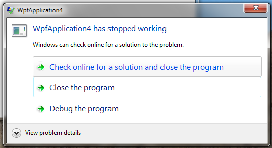

### Rendering Tiers

WPF applications automatically examine graphics card capabilities at runtime and assigns a rendering tier value, indicating what functions can be performed by the graphics card.

* Tier 0 – No hardware acceleration, all rendering done using software
* Tier 1 – Some hardware acceleration available.  DirectX version >= 9.0.  Hardware acceleration for:
  * Radial gradients
  * 3D lighting calculations
  * Text rendering
  * 3D anti-aliasing
* Tier 2- Most features use hardware acceleration.  DirectX version >= 9.0

To determine the current rendering tier:

```csharp
int renTier = (RenderCapability.Tier >> 16);
MessageBox.Show(string.Format("Tier = {0}", renTier));
```


### Property-Based Animation

Animation is one of the core features of WPF.  Unlike older frameworks, like Windows Forms, you don’t implement animation using timers and rendering the animation frame by frame.  Instead, WPF uses property-based animation, where you animate graphical elements by declaratively specifying how one of its properties should change, over time.

You can implement animation by writing code or by specifying the desired animated effect declaratively, in XAML.  You can also use the tools in Blend 4 to create WPF animations.

As an example, here’s a snippet of XAML that defines a button that will change it’s Height and Width properties, forever expanding and contracting:

```xml
<Button Content="Click Me" Height="25" HorizontalAlignment="Left" 
  Margin="25,25,0,0" Name="button1" VerticalAlignment="Top" Width="100" >
    <Button.Triggers>
        <EventTrigger RoutedEvent="Button.Loaded">
            <BeginStoryboard>
                <Storyboard>
                    <DoubleAnimation
                        Storyboard.TargetName="button1"
                        Storyboard.TargetProperty="Width"
                        From="100" To="105" Duration="0:0:0.3"
                        AutoReverse="True" RepeatBehavior="Forever"/>
                    <DoubleAnimation
                        Storyboard.TargetName="button1"
                        Storyboard.TargetProperty="Height"
                        From="25" To="30" Duration="0:0:0.5"
                        AutoReverse="True" RepeatBehavior="Forever"/>
                </Storyboard>
            </BeginStoryboard>
        </EventTrigger>
    </Button.Triggers>
</Button>
```

### Audio and Video

WPF makes it very easy to play audio or video content in your application.  You can play any media type supported by Windows Media Player including audio formats like WAV and MP3 or video formats like AVI, WMV, and MPG.

You play audio and video by including a media UI element directly in your XAML.  This allows rendering and playing video on a wide variety of user controls.  Here’s an example of a video playing on the surface of a Button.

```xml
<Button Height="258" HorizontalAlignment="Left" Margin="26,21,0,0"
  Name="button1" VerticalAlignment="Top" Width="436" >
    <Button.Content>
       <MediaElement
         Source="C:\Users\Public\Videos\Sample Videos\Wildlife.wmv"
         Stretch="Fill"/>
    </Button.Content>
</Button>
```

### Page-Based Navigation

WPF applications can be structured as a collection of pages, with built-in navigation between pages.  This is different from the more traditional (Win Forms) document-based model, where the application displays a main window and dialogs that pop up.

To create a page-based application, you use a Page object as the top-level container in your application, instead of Window.

```xml
<Page x:Class="WpfApplication7.Page1"
      xmlns="http://schemas.microsoft.com/winfx/2006/xaml/presentation"
      xmlns:x="http://schemas.microsoft.com/winfx/2006/xaml"
      xmlns:mc="http://schemas.openxmlformats.org/markup-compatibility/2006"
      xmlns:d="http://schemas.microsoft.com/expression/blend/2008"
      mc:Ignorable="d"  d:DesignHeight="300" d:DesignWidth="300"
      Title="Page1">
    <Grid>
        <Label Content="This is a page, not a window." Height="28"
          HorizontalAlignment="Left" Margin="52,75,0,0" Name="label1"
          VerticalAlignment="Top" />
    </Grid>
</Page>
```

To make this page the main object loaded when the application starts, set the StartupUri attribute of your main Application:

```xml
<Application x:Class="WpfApplication7.App"
             xmlns="http://schemas.microsoft.com/winfx/2006/xaml/presentation"
             xmlns:x="http://schemas.microsoft.com/winfx/2006/xaml"
             StartupUri="Page1.xaml">
</Application>
```

### Silverlight and WPF Differences

Silverlight’s original name was WPF/E (WPF/Everywhere), underscoring the fact that Silverlight follows the same programming model as WPF and uses many of the same controls, but is based on a client library that is downloaded from the browser and targeted to run on a wider variety of platforms.

Core differences between WPF and Silverlight:

* WPF runs only on Windows platforms
* WPF expects .NET Framework to already be present on client
* Silverlight can use a subset of all WPF controls
* Silverlight uses a subset of the full .NET Framework and the CLR

Features present in WPF but not in Silverlight:

* Flow document support
* Dynamic resources
* Merged dictionaries
* Resetting a style to a new FrameworkElement
* Style inheritance
* Implicit styles with TargetType attribute
* Triggers for Styles, ControlTemplates, DataTemplates.
* Larger number of data binding features
* Routed commands
* Declaratively associate controls and commands
* Inherit from UIElement
* Custom markup extensions
* Runtime-accessible visual and logical trees
* Controls: AccessText, BulletChrome, ButtonChrome, ContextMenu, Decorator, DocumentPageView, DocumentViewer, GridViewColumnHeader, GridViewRowPresenter, GroupBox, GroupItem, InkCanvas, Menu, MenuItem, PageContent, Ribbon, Separator, StatusBar, TickBar, ToolBar, Track, UniformGrid

Features present in Silverlight but not in WPF:

* Deep Zoom
* Controls: AutoCompleteBox, DataPager, DescriptionViewer, HyperlinkButton, MultiScaleImage, NumericUpDown, ValidationSummary


### System.Windows Namespace

Most user-interface related classes that a WPF application will use are located in the System.Windows namespace or one of its subordinate namespaces.

Some of the classes present in System.Windows:

* Application – Encapsulated a WPF application
* Clipboard – Transfer data to/from clipboard
* ContentElement – Base class for contents elements, for flow-style presentation
* DataObject – Transfering data
* DataTemplate – Visual structure of a data object
* DependencyObject – Object that participates in dependency property system
* DependencyProperty – Properties that support data binding, inheritance, etc.
* EventManager – Event-related utility methods
* FrameworkElement – Extends UIElement & provides support for logical tree, et al
* MessageBox – Displays a message box
* ResourceDictionary – Dictionary that contains WPF resources
* RoutedEvent – Routed event
* Style – Sharing of properties/resources between instances
* UIElement – Base class for graphical elements
* UIElement3D – Base class for 3D elements
* Window – Window in user interface


### Standalone and Browser-Hosted Applications

You can use WPF to create either standalone applications that run on Windows, or browser-hosted applications, which run in a browser window.  Browser-hosted applications are also known as XBAPs (XAML Browser Applications).

You publish an XBAP by hosting it on a web server.  The application is then downloaded and installed on demand, when a user first browses to a page that hosts the XBAP.  The user interface is displayed in your browser window.

XBAPs can be run in either Internet Explorer or Firefox.  They run in a partial trust, sandboxed environment.

### WPF Units

In Windows Forms, control sizes are specified using pixels.  In WPF,  sizes are specified using WPF Units.

1 WPF unit = 1/96 inch.  This means at 96 dpi (typical), 1 WPF Unit = 1 pixel.

But this means that at 120 dpi, 1 WPF unit = 1.25 pixels.  (120/96)

Because everything in a WPF GUI using WPF units for sizing, all controls are properly resized based on the system DPI.  The reason for this is so that they can appear to be the same physical size on a device that happens to have a higher pixel density (DPI).  A 96 unit button will be 1″ wide on a 96 dpi device and 1″ wide on a 120 dpi device (because it’s scaled up to 120 pixels).

This same scaling could be done in Windows Forms using a form’s AutoScaleMode property.  But in WPF, it’s automatic.

The full formula:

```
pixels = (WPF Units) * (DPI / 96)
```

### WPF Architecture

The diagram belows shows the dependencies between the main WPF DLLs.


Here’s a quick overview of the DLLs listed in this diagram:

* **System.Windows.Presentation.dll** – Contains some types related to add-ins
* **PresentationFramework.Aero.dll** – Implements Aero theme for WPF controls
* **PresentationFramework.Classic.dll** – Implements Classic theme for WPF controls
* **PresentationFramework.dll** – Contains most of the main WPF controls, as well as support for data binding
* **PresentationUI.dll** – Contains some resources related to themes & some support classes for System.Windows.Documents
* **ReachFramework.dll** – Contains types related to printing and XPS documents
* **System.Printing.dll** – Contains main types related to printing
* **PresentationCore.dll** – Lower level types for visual rendering like UIElement. Also DragDrop support.
* **System.Windows.Input.Manipulations.dll** – Implementation of input manipulators
* **UIAutomationProvider.dll** – Support for UI Automation (for accessibility)
* **WindowsBase.dll** – Lower-level types like DependencyObject and DependencyProperty
* **UIAutomationTypes.dll** – Basic types related to UI Automation

### Class Hierarchy

When working with various classes and controls in WPF, it’s helpful to know the parent-child relationships between the classes.  The .NET Framework makes heavy use of inheritance, which means that many of the properties and methods of a control or class derive from another class higher up in the hierarchy.

Here is a view of the class hierarchy for a subset of the most common classes in WPF. (Click on the image to see it full sized).


### DispatcherObject

The DispatcherObject class represents an object associated with a Dispatcher.  A dispatcher handles a queue of requests to do work on a particular thread.  It has the ability to invoke methods on its associated thread.

DispatcherObject is a base class for objects that keep track of the Dispatcher associated with the thread that they were created on.

WPF controls inherit from DispatcherObject because they need their methods called from the thread on which they were created.

DispatcherObject has two methods that help with ensuring that a control’s methods are called from the proper thread.

* **CheckAccess** – Check whether the current thread can call methods on the control
* **VerifyAccess** – If no access, throw InvalidOperationException

If a control determines that the current thread doesn’t have access, it can use its Dispatcher property (also in DispatcherObject) to call a method on the correct thread.

### Dependency Properties

DependencyObject is the base class for classes that support dependency properties.

A dependency property in WPF is similar to a standard CLR property, but more powerful.  Dependency properties:

* Obtain their values from one of a number of different sources
* Support inheritance of property values
* Support notification, when a property value changes

If a class derives from DependencyObject, that class can then register its own dependency properties and call methods to get/set the values of its dependency properties.

### Visual Class

Visual is the base class for all classes that represent objects that can be rendered to a WPF window or page.  It provides support for hit testing, clipping and coordinate transforms, as well as for rendering itself to a window or page.  It also models the object’s participation in a WPF visual tree, through its VisualParent property and GetVisualChild method.

The Visual class can also be used a starting point for implementing new (lightweight) WPF controls.

### UIElement Class

The UIElement class inherits from Visual and adds support for basic user interaction behavior, including:

* Layout behavior
  * Parent/child relationship
  * Measure/Arrange passes
* Responding to user Input
  * Input events from devices like keyboard/mouse
  * Command bindings
* Manage Focus
* Raise (and respond to) routed Events
  * Events bubble (up) or tunnel (down) element tree

Note the acronym formed, which helps in thinking about UIElement – [“LIFE begins at UIElement“](http://wpfdisciples.wordpress.com/2008/10/09/frameworkelement-vs-frameworkcontentelement/).

### FrameworkElement

The FrameworkElement class inherits from UIElement and is in turn the parent class for all controls in WPF.

FrameworkElement builds on UIElement and adds the following functionality:

* Layout – implements a layout model by implementing properties like HorizontalAlignment, MinWidth and Margin
* Support of animation through BeginStoryboard method
* Data binding
* Data templates for binding
* Styles

FrameworkElement is also the main base class for objects that will be added to a logical tree (a hierarchy of visual objects that comprise your user interface).

### Control Class

The Control class inherits from FrameworkElement and is the base class for all controls that a user interacts with.  Examples of controls include: TextBox, Label, ListBox, ComboBox and Button.  Container elements like Panel and Grid are not controls.

The Control class extends FrameworkElement by adding functionality to:

Change the control’s visual appearance through the use of templates
Support visual elements like fonts, borders and a background color

### ContentControl

Content controls are a category of controls that can hold a single nested element, which represents its content.  Since the nested element can be anything, controls that derive from ContentControl can store a variety of different types of content.

Content controls have a Content property, which points to the single element that they contain.  The element is often an UIElement, but can be any .NET object.

Here’s an example, with CheckBox using a DatePicker as its content.

```xml
<CheckBox Height="31" HorizontalAlignment="Center" Name="checkBox1"
  VerticalAlignment="Center">
    <DatePicker Name="datePicker1"  />
</CheckBox>
```


Note that because the Window class is a content control, a Window may have only one child element.

You can effectively include a collection of controls in a content control by including as its content a single container object that in turn contains other elements.  (E.g. A Button could contain a StackPanel, which would then contain other elements).

### ItemsControl

ItemsControl is another WPF class that inherits from Control and serves as a base class for other controls.  Controls that inherit from ItemsControl display a collection of items.

Controls that derive from ItemsControl typically get a list of items to display using data binding, binding to an object that implements IEnumerable.

Controls that inherit directly or indirectly from ItemsControl include: Menu, ContextMenu, ComboBox, ListBox, ListView, TabControl, DataGrid, StatusBar, ToolBar and TreeView.

### Five Types of WPF Applications

You can develop five main types of WPF applications:

* **Standalone Applications** – Standard windowed client application, runs on Windows
* **XAML Browser Applications (XBAPs)** – Page-based application that runs in browser
* **Custom Control Libraries** – Library containing custom controls that derive from Control, packaged as DLL
* **User Control Libraries** – Library containing custom controls that derive from UserControl, packaged as DLL
* **Class Libraries** – Library containing general classes usable in other projects, packaged as DLL

### The Application Class

Application is a class that represents a WPF application running as a standalone client application in Windows.  Each running application contains at most a single instance of Application.

WPF applications created using the Visual Studio 2013 New Project wizard will contain the definition of the Application object in the App.xaml file.

```xml
<Application x:Class="WpfApplication9.App"
     xmlns="http://schemas.microsoft.com/winfx/2006/xaml/presentation"
     xmlns:x="http://schemas.microsoft.com/winfx/2006/xaml"
     StartupUri="MainWindow.xaml">
   <Application.Resources>
 
   </Application.Resources>
</Application>
```

The Application object is responsible for:

* **Managing application lifetime** (e.g. responding to startup/shutdown events)
* **Window**, property and resource management
* **Command-line processing**
* **Navigation**

### The Window Class

The Window class represents a window in WPF.  It derives from ContentControl, which means that it can contain a single nested element that represents its content.  It inherits directly from Control and indirectly from FrameworkElement, UIElement, Visual, DependencyObject, and DispatcherObject.

A window consists visually of a client area (the inside of the window) and non-client area (title bar, frame and minimize/maximize/close buttons).  It represents the main (outer) visual element that a user interacts with for a WPF standalone application.

You can manage a window’s lifetime through methods like Activate, Close, Hide and Show and events like Activated, Closed, Closing, and Deactivated.

### Application Lifetime

The diagram below shows a simplified view of the lifetime of a WPF application, as defined by the events that the Application class fires.  (The events are underlined).


The main events fired from Application include:

* **Startup** – Application is starting up.
* **Exit** – Fired when an application is shutting down.  Shutdown can’t be canceled.
* **Activated** – Fired when an application gets focus, i.e. becomes the foreground application
* **Deactivated** – Fired when application loses focus, i.e. is no longer the foreground application
* **DispatcherUnhandledException** – Fired when an exception is thrown, but not yet handled.  You can choose to handle the exception or not
* **SessionEnding** – Fired when Windows is being shut down–due to either logoff or Windows shutdown.  You can cancel the shutdown sequence.

You can add custom code for any of these events by just overriding the OnEventName method in your Application-derived class, e.g. OnStartup.

### Window Events at Startup and Shutdown

At application startup, the Window events that are fired (in order) for the main window are:

* **Initialized** – Main window is being created
* **IsVisibleChanged** – IsVisible property set to true
* **SizeChanged** – Size property set to size of window
* **LayoutUpdated** – Window layout changes
* **SourceInitialized** – Window is attached to Win32 window handle
* **Activated** – Window becomes foreground window
* **PreviewGotKeyboardFocus** – Window getting focus
* **IsKeyboardFocusWithinChanged** – IsKeyboardFocusWithin property set to true
* **IsKeyboardFocusedChanged** – IsKeyboardFocused property set to true
* **GotKeyboardFocus** – Window now has keyboard focus
* **LayoutUpdated** – Window layout changes
* **Loaded** – Window is now laid out, fully rendered
* **ContentRendered** – All window content has been rendered

At application shutdown, the Window events fired (in order) are:

* **Closing** – Window is going to close
* **IsVisibleChanged** – IsVisible property set to false
* **Deactivated** – Window becomes background window
* **IsKeyboardFocusWithinChanged** – IsKeyboardFocusWithin property set to false
* **IsKeyboardFocusedChanged** – IsKeyboardFocused property set to false
* **LostKeyboardFocus** – Window no longer has keyboard focus
* **Closed** – Window is closing

### WPF Application Entry Point

For a WPF standalone application that is generated in Visual Studio 2010 using the New Project wizard, the entry point for the application is the Main function, defined in App.g.cs (generated code).  In the default project, this is the public static void App.Main method.

In general, a .NET application will use as its entry point (first function called) any method named Main that has public/static access modifiers–no matter what class Main is located in.

If your application has more than one class with a public static Main method, you’ll need to specify the entry point in the project properties dialog.  In the Startup object dropdown, select the class that contains the Main method that should be called on startup.

### What Happens in WPF Main() Function

When creating a new WPF standalone application using the New Project wizard in Visual Studio 2013, Visual Studio automatically creates a class that derives from System.Windows.Application, as well as a static Main() function that will be the first function called when the application is started.

Here’s how the main application object is defined:

```csharp
public partial class App : Application
```

During the Main method, the application is started up by:

* Creating a new instance of the Application object
* Calling Application.InitializeComponent to constitute the application from App.xaml
* Calling Application.Run to start the application

```csharp
public static void Main()
{
    WpfApplication.App app = new WpfApplication.App();
    app.InitializeComponent();
    app.Run();
}
```

### Application is a Singleton

The System.Application class is a singleton, which means that you can create at most one instance of Application (within a single AppDomain).  If you try creating a second instance of Application, you’ll get an InvalidOperationException.

You can access the current Application object through the static property Application.Current.  (Or use property of the derived class, e.g. App.Current).

### Two Ways to Create WPF Controls

When working with WPF, you can always create controls in one of two basic ways:

* Create the control programmatically, from within your code (e.g. C#)
* Create the control declaratively, in XAML

As an example, here are two different ways to create a main window for a WPF application.

To create a main window in code, you would add code the the Application object’s event handler for the Startup event.  You would typically create the window object and then call its Show method.

```csharp
private void Application_Startup(object sender, StartupEventArgs e)
{
    MainWindow win = new MainWindow();
    win.Show();
}
```

More typically, you’d specify the application’s main window in XAML by specifying a value for the application’s StartupUri attribute.  For the default project created by the New Project wizard, you’d do this in App.xaml:

```xml
<Application x:Class="WpfApplication.App"
    xmlns="http://schemas.microsoft.com/winfx/2006/xaml/presentation"
    xmlns:x="http://schemas.microsoft.com/winfx/2006/xaml"
    StartupUri="MainWindow.xaml">
    <Application.Resources>
    </Application.Resources>
</Application>
```

### Processing Command Line Arguments in a WPF Application

You can process command line arguments passed in to a WPF application by reading the arguments in the event handler for the application’s Startup event.

Command line arguments can be found in StartupEventArgs.Args.  Args is an array of string objects containing the arguments passed in on the command line.

```csharp
private void Application_Startup(object sender, StartupEventArgs e)
{
    foreach (string s in e.Args)
    {
        MessageBox.Show(string.Format("Arg: {0}", s));
    }
}
```

You could also just override the OnStartup method, rather than adding a handler for the Startup event.

### Detecting When the Windows Session is Ending

In WPF, you can detect when a user is ending their Windows session by handling the Application.SessionEnding event.  This occurs when the user is logging out of Windows or shutting down the machine.

In your event handler, you have the ability to cancel the termination of the Windows session by setting SessionEndingCancelEventArgs.Cancel to true.

```csharp
private void Application_SessionEnding(object sender, SessionEndingCancelEventArgs e)
{
   MessageBoxResult res = MessageBox.Show("Exiting Windows will terminate this app.  Are you sure?", "End Session", MessageBoxButton.YesNo);
   if (res == MessageBoxResult.No)
   {
       e.Cancel = true;
   }
}
```

Note that this event fires when Windows is exiting, but not when the application is closed in the normal manner.

Update (Jan-2011): It’s probably cleaner to just override the OnSessionEnding method in your Application-derived class, rather than adding an event handler.

### Handling an Application’s Exit Event

You can add code to the Application.Exit event handler to perform miscellaneous tasks that need doing at application shutdown/exit.

```xml
<Application x:Class="WpfApplication4.App"
             xmlns="http://schemas.microsoft.com/winfx/2006/xaml/presentation"
             xmlns:x="http://schemas.microsoft.com/winfx/2006/xaml"
             StartupUri="MainWindow.xaml"
             Exit="Application_Exit">
</Application>
```

```csharp
private void Application_Exit(object sender, ExitEventArgs e)
{
    // Perform tasks at application exit
}
```

The Exit event is fired when the application is shutting down or the Windows session is ending.  It is fired after the SessionEnding event.  You cannot cancel the Exit event.

### Unhandled Exceptions

When an exception gets thrown in a WPF application and not handled anywhere in the code, an unhandled exception occurs and the application is forced to exit.  This will result in a window similar to the following:



When this happens, the application exits suddenly, the user has no chance to save any uncompleted work and the user gets no additional information.  In short, the application crashes.

You can handle exceptions that would otherwise be unhandled by handling the Application.DispatcherUnhandledException event.  In the example below, we display a better error message and set the Handled property, to avoid shutting down the application.

```csharp
private void Application_DispatcherUnhandledException(object sender, System.Windows.Threading.DispatcherUnhandledExceptionEventArgs e)
{
    string friendlyMsg = string.Format("SO sorry that something went wrong.  The error was: [{0}]", e.Exception.Message);
    string caption = "Error";
    MessageBox.Show(friendlyMsg, caption, MessageBoxButton.OK, MessageBoxImage.Error);
 
    // Signal that we handled things--prevents Application from exiting
    e.Handled = true;
}
```

This results in a better error:


### Application-Scoped Properties

The Application class includes a property named Properties that is an IDictionary of properties, stored as keyword/value pairs.  You can use this dictionary to store any properties that should have application scope.

Property values can be read from or written to the Properties dictionary from any thread, in a thread-safe manner.

```csharp
private void Application_Startup(object sender, StartupEventArgs e)
{
    this.Properties.Add("Debug", false);
    this.Properties.Add("Logger", null);
 
    // Set properties based on command line parameters
    foreach (string a in e.Args)
    {
        if (a.ToLower() == "/debug")
            this.Properties["Debug"] = true;
        else if (a.ToLower() == "/logging")
            this.Properties["Logger"] = new MyAppLogger("Logfile.txt");
    }
}
```

Each entry in the dictionary is of type System.Collections.DictionaryEntry, so it has a Key property (type object) and a Value property (type object).  This means that you can use objects of any type as either keys or values.  You’ll most often use strings as keys and various objects as values.

### Resources

In WPF and Silverlight, the term resource generally refers to .NET objects or values that are to be used in multiple places.  Resources are a basic mechanism for reuse in Silverlight and WPF.

Resources are stored in resource dictionaries–collections of resource objects indexed by their keys (typically string-valued keys).

Resources generally represent objects like: styles, templates, brushes and colors.  They can also represent storyboards, transforms, or 3D matrices.


### Defining and Using Application-Scoped Resources

WPF resources can be associated with the main Application object, if you want them available throughout the application.

You can define application-scoped resources in the main Application XAML file (App.xaml).  In the example below, we define a green brush.

```xml
<Application x:Class="WpfApplication.App"
             xmlns="http://schemas.microsoft.com/winfx/2006/xaml/presentation"
             xmlns:x="http://schemas.microsoft.com/winfx/2006/xaml"
             StartupUri="MainWindow.xaml" Startup="Application_Startup" >
    <Application.Resources>
        <SolidColorBrush x:Key="greenBrush"  Color="Green"/>
    </Application.Resources>
</Application>
```

To use this resource, you use a XAML extension to reference a static resource.  In the example below, we set the background color of a button in our main window to the green brush that we defined above.

```xml
<Window x:Class="WpfApplication.MainWindow"
        xmlns="http://schemas.microsoft.com/winfx/2006/xaml/presentation"
        xmlns:x="http://schemas.microsoft.com/winfx/2006/xaml"
        Title="MainWindow" Height="224" Width="334">
    <Grid>
        <Button Content="Button" Background="{StaticResource greenBrush}"
                Height="23" HorizontalAlignment="Left" Margin="60,57,0,0" Name="button1" VerticalAlignment="Top" Width="75" Click="button1_Click" />
    </Grid>
</Window>
```

### Accessing Application-Scoped Resources from Code

You can access application-scoped resources from code by using the Application.Resources property.  The property points to a ResourceDictionary that contains a collection of DictionaryEntry objects.

For resources defined in XAML, the key of each entry is a string and the value is an object of the associated resource type.

For example, for the SolidColorBrush resource shown below:

```xml
<Application.Resources>
    <SolidColorBrush x:Key="greenBrush"  Color="Green"/>
</Application.Resources>
``

The dictionary entry’s Key is the string “greenBrush” and the Value is a SolidColorBrush object with the Color property set to green.

```csharp
SolidColorBrush br = (SolidColorBrush)Application.Current.Resources["greenBrush"];
```

### An Application’s Main Window

A WPF application that creates at least one window will always have a main window.  The Application.MainWindow property is reference to what is considered to be the application’s main window.  By default, the main window is the first one created, but you can change the value of MainWindow in code or in markup (XAML).

### Application.ShutdownMode

The WPF Application class has a ShutdownMode property that indicates when an application should terminate, based on which windows are closed.

By default, the value of this property is ShutdownMode.OnLastWindowClose.  This indicates that the application will terminate after you’ve closed all of its windows.

You can also set the property to ShutdownMode.OnMainWindowClose.  When you do this, your application will terminate as soon as you close its main window, which will automatically close any other open windows that the application created.

### XAML Vocabularies

A XAML vocabulary is a standard indicating the list of allowed objects and the rules for including those objects in XAML.  The vocabulary indicates how the XAML file should be interpreted.

WPF defines a XAML vocabulary using a XAML schema for each possible application.  A XAML schema is a precise definition of the allowed XAML syntax.  You can find the specification relevant to WPF at:

* [XAML Object Mapping Specification 2009](http://download.microsoft.com/download/0/a/6/0a6f7755-9af5-448b-907d-13985accf53e/%5BMS-XAML-2009%5D.pdf) (89 pages)
* [WPF XAML Vocabulary Specification 2010](http://download.microsoft.com/download/0/a/6/0a6f7755-9af5-448b-907d-13985accf53e/%5BMS-WPFXV-2010%5D.pdf) (699 pages)

There is also a XAML vocabulary for Silverlight, which can be found at:

Silverlight XAML Vocabulary Specification 2010 (241 pages)
[Update 22-Oct-2010: WPF in Visual Studio 2010 supports only XAML 2006, rather than XAML 2009 which is linked to above].

### XAML Elements Map to Instances of .NET Types

As with XML, an element in XAML is a chunk of XAML that is enclased by angle brackets (`<, >`).  The element may consist of both a start tag and and end tag  (e.g. `<Button></Button>`) or an empty-element tag (e.g. `<Button/>`).

The text in the start tag, immediately following the left angle bracket (`<`) is known as the element name.

In XAML, this element name is the name of a .NET type and the XML element is known as an object element.

A object element in XAML represents an instance of a .NET class.  At run-time, a new instance of a .NET type will be created for each object element found in a .xaml file.

For example, the follow XAML fragment defines three object elements of type Button.

```xml
<Button Content="Top" Height="23" Name="button1" Width="75" />
<Button Content="Middle" Height="23" Name="button2" Width="75" />
<Button Content="Bottom" Height="23" Name="button3" Width="75" />
```

At run-time, three instances of the Button type will be created when this XAML fragment is loaded.

### XAML Attributes Map to Property Values

In the same way that XAML elements map to instances of .NET types, XAML attributes map to properties of those types.

In the example below, we create a new instance of a Button and then specify values for the following properties: Content, Height, Width, Name and Background.

```xml
<Button Content="Press Me" Height="23" Name="button2" Width="75" Background="#FFE3E316" />
```

Note that we set each property by specifying a string, despite the Button object’s properties having different types:

* Content – object
* Height – double
* Width – double
* Name – string
* Background – System.Windows.Media.Brush

When the XAML file is processed, the string values will be converted to the appropriate types.

### Nesting XAML Elements Expresses Containment

Nesting elements is a fundamental part of XML syntax.  In XAML, nested elements typically expresses containment:

the .NET object corresponding to the child element is contained in the .NET object corresponding to the parent element.

Here’s an example.  The XAML fragment below defines a StackPanel control that contains two Button controls.

```xml
<StackPanel Height="100" Name="stackPanel1" Width="200">
    <Button Content="Button" Height="23" Name="button1" Width="75" />
    <Button Content="Button" Height="23" Name="button2" Width="75" />
</StackPanel>
```

The structure of the XAML elements (Button as child of StackPanel) mirrors the structure of the actual controls in the user interface (the buttons are children of the StackPanel).

### Internet Explorer Can Interpret XAML Directly

XAML is not code to be executed, but a definition of a user interface that can be parsed by a tool that understands it.  You can load a .xaml file directly into Internet Explorer and it will render the user interface elements defined by the XAML.

For example, consider the following XAML fragment.

```xml
<StackPanel xmlns="http://schemas.microsoft.com/winfx/2006/xaml/presentation" >
    <Button Content="Click Me" Height="23" Width="75"/>
</StackPanel>
```

You can save this fragment to a .xaml file and load it into Internet Explorer.  The browser will then interpret the XAML and render the user interface that it describes:


### XAML Files Have A Single Root Element

Each XAML file has exactly one root element, the outermost XAML element.  In WPF, the root element is typically one of:

* `<Page>` – A page of content that can be hosted in a browser (System.Windows.Controls.Page)
* `<Window>` – A WPF window (System.Windows.Window)
* `<Application>` – A WPF application (System.Windows.Application)
* `<ResourceDictionary>` – A collection of resources (System.Windows.ResourceDictionary)
* `<UserControl>` – A user-defined control (System.Windows.Controls.UserControl)

Root elements also typically include attributes that indicate the namespace(s) used to interpret the content of the XAML file.

### XAML Namespaces

In XAML, a namespace is a collection of names, identified by a URI reference, which are used in XAML documents as element types and attribute names.  (See W3C definition of namespace).

In addition to being just a collection of allowed element and attribute names, a XAML namespace maps this set of names to the corresponding .NET classes in one or more .NET namespaces.

A namespace is uniquely identified by a URI that is typically included as an attribute in the root element in a XAML file, using the xmlns attribute.  The root element must include at least one xmlns attribute.  This attribute defines the namespace that contains definitions of elements and attributes in the XAML file.

The default namespace used in WPF is http://schemas.microsoft.com/winfx/2006/xaml/presentation.

```xml
<Window x:Class="WpfApplication1.MainWindow"
             xmlns="http://schemas.microsoft.com/winfx/2006/xaml/presentation"
             xmlns:x="http://schemas.microsoft.com/winfx/2006/xaml"
             Title="MainWindow" Height="350" Width="525">
```

See also – [XAML Namespaces and Namespace Mapping for WPF XAML](http://msdn.microsoft.com/en-us/library/ms747086.aspx)

### Property Element Syntax

The simplest way to set property values in XAML is by using attributes.

```xml
<Button Content="Click Me" Height="23" Width="75" Background="Red" />
```

Because the Button.Background property is of type Brush, the string “Red” is actually used to create a new instance of a SolidColorBrush (subtype of Brush), with its Color property set to an RGB value of FF,00,00 (entirely red).

You can also set a property value using property element syntax.  This syntax allows setting a property value using an embedded XAML element of the form TypeName.PropertyName.

You typically use property element syntax for property values that can’t be expressed as strings.

Using the property element syntax, we can set the button’s background to a red brush as follows:

```xml
<Button Name="btnClick" Content="Click Me" Height="23" Width="75" Click="Button_Click">
    <Button.Background>
        <SolidColorBrush Color="Red"/>
    </Button.Background>
  </Button>
```

### Sometimes You Must Use Property Element Syntax

In many cases, you can set a property value in XAML using a string value, even though the property being set is a more complex object.  (E.g. Setting Background property to new instance of SolidColorBrush just by indicating color of brush as a string).

But there are cases when the property that you want to set cannot be set using a simple string.  In these cases, you must use the property element syntax.

As an example, you can have a context menu pop up when a button is right-clicked by setting the button’s ContextMenu property.  A context menu can not be described using only a string value, so you must use property element syntax:

```xml
<Button Name="btnClick" Content="Click Me" Height="23" Width="75">
    <Button.ContextMenu>
        <ContextMenu>
            <MenuItem Header="Open"/>
            <MenuItem Header="Save"/>
        </ContextMenu>
    </Button.ContextMenu>
</Button>
```

### Two Types of Elements in XAML

In XML, elements are the things surrounded by angle brackets, < >.  In XAML, there are two types of elements.

An object element declares an instance of a type.

```xml
<Button Name="btnClick" Content="Click Me" Height="23" Width="75"/>
```

A property element specifies the value of a property.  (Button.Background is the property element in this example).

```xml
<Button.Background>
    <SolidColorBrush Color="RosyBrown"/>
</Button.Background>
```

### XAML Collection Syntax

When setting  a property value in XAML for a property that represents some sort of collection, you can directly specify the children of the collection as a series of elements.

For example, to create some entries in a ListBox, you can do the following:

```xml
<ListBox Height="100" HorizontalAlignment="Left" Margin="64,66,0,0"
  Name="listBox1" VerticalAlignment="Top" Width="120">
    <ListBox.Items>
        <ListBoxItem Content="Oak"/>
        <ListBoxItem Content="Red Pine"/>
        <ListBoxItem Content="Larch"/>
    </ListBox.Items>
</ListBox>
```

The ListBox.Items property is of type ItemCollection, so you might expect to see the tag `<ItemCollection>` under the property element `<ListBox.Items>`.  But because the Items property is a collection, you can just list the child elements of the collection directly.

### Setting the Value of a Content Property By Setting Child Element

You can set the value of a property using an XAML attribute.  Consider setting the Text property of a TextBox using an attribute:

```xml
<TextBox Height="23" Width="120" Text="Eat Muesli!"/>
```

You can also set the same property value using property element syntax:

```xml
<TextBox Height="23" Width="120">
    <TextBox.Text>
        Eat Muesli!
    </TextBox.Text>
</TextBox>
```

There is an even simpler way to specify the value of the Text property.  Because the TextBox class has identified its Text property as a content property, the value of the Text property can be specified directly as the single child of the TextBox XAML element:

```xml
<TextBox Height="23" Width="120">
    Eat Muesli!
</TextBox>
```

### Content Properties for Common WPF Types

Here is a list of the content properties for some common WPF types.  You can set values for these properties in XAML using one or more child elements directly, rather than having to use the property element syntax.

E.g. Because Text is the content property for a TextBox, you can specify a value for Text as a child element of the TextBox element:

```xml
<TextBox Height="23" Width="120">
    Some text...
</TextBox>
```

Here is the list of some common WPF types and their content properties:

* Button – Content
* CheckBox – Content
* ComboBox – Items
* Grid – Children
* GridView – Columns
* GroupBox – Content
* Label – Content
* ListBox – Items
* ListView – Items
* Page – Content
* Panel – Children
* StackPanel – Children
* TextBox – Text
* TreeView – Items
* Window – Content

For a more complete list, see [Building A List of Types That Have Content Properties](http://stuff.seans.com/2010/09/28/building-a-list-of-types-that-have-content-properties/).


### Content Properties and Collection Syntax Express UIElement Containment

Using both a content property and the collection syntax is quite common in XAML and often expresses containment of a collection of UIElement objects in a parent container.

For example, the StackPanel is a parent control, containing a number of child controls:

```xml
<StackPanel>
    <Label Content="A label" Height="28" />
    <Button Content="Click Me" Height="23" />
</StackPanel>
```

In this example, containment is expressed by listing the child controls contained in the StackPanel as child elements in XAML.

This containment shorthand is possible for two reasons:

* StackPanel‘s content property is Children, an UIElementCollection
* We can specify the members of the UIElementCollection using collection syntax, by listing its members

All containers that inherit from System.Windows.Controls.Panel have Children as their content property–including Grid, StackPanel, Canvas, WrapPanel, etc.

### XAML Is Case Sensitive

XAML is case sensitive because the corresponding .NET objects, as well as their properties and event names, are also case sensitive.

The XAML below is fine (will compile):

```xml
<Button Content="Click Me" Height="23" Width="75" Click="button1_Click" />
```

Changing the case of Button results in a compilation error:

```xml
<BUTTON Content="Click Me" Height="23" Width="75" Click="button1_Click" />
```

### How XAML Handles Whitespace

In general, embedded spaces and line feeds in a XAML file are ignored.  You can normally include spaces or line feeds between consecutive items.  Here are some guidelines:

* You must have at least one space preceding each XAML attribute
* You must not have any whitespace following the open angle bracket ‘<‘ in an element tag
* You must not have any whitespace between the ‘/’ and ‘>’ characters in a self-closing element
* Whereever a namespace prefix is used, with the ‘:’ character, you must not have whitespace on either side of the ‘:’
* When a property value is expressed as text within quotation marks and it represents textual content, embedded whitespaces and line feeds are preserved.  (E.g. Embedded line feed in a button label)
* When text is used as a value for a content property, i.e. not in quotation marks
  * All leading and trailing whitespace is removed  (i.e. the string starts with the first non-whitespace character)
  * Internal whitespace is converted to a single space

### Collection Syntax for Read-Only Vs. Read-Write Properties

When using the XAML collection syntax for a collection-based property that is read/write, the inclusion of an object element representing the collection object is optional.

E.g. Because FrameworkElement.Resources is read/write, we can list a series of resources using either of the following forms.

```xml
<!-- Create new ResourceDictionary, assign to Resources property -->
<Window.Resources>
    <ResourceDictionary>
        <SolidColorBrush x:Key="redBrush" Color="Red"/>
        <SolidColorBrush x:Key="indigoBrush" Color="Indigo"/>
    </ResourceDictionary>
</Window.Resources>
 
<!-- Omit ResourceDictionary, use collection syntax, new resources added to existing collection -->
<Window.Resources>
    <SolidColorBrush x:Key="redBrush" Color="Red"/>
    <SolidColorBrush x:Key="indigoBrush" Color="Indigo"/>
</Window.Resources>
```

However, for read-only collection properties, because you can’t create a new instance of the collection and assign it to the property, you must use the collection syntax, omitting the object element for the collection.

```xml
<StackPanel.Children>
     <!-- Children property is read-only, so we can't include UIElementCollection element here -->
     <Button Content="Button" Height="25" Width="50" />
<ComboBox Height="23" Width="120" />
 </StackPanel.Children>
```

### Store Reusable Objects in a Resource Dictionary

Assume that you want to set the background color for two buttons to the same color.  You could specify a SolidColorBrush for each button’s Background property :

```xml
<Button Name="btnOne" Content="Dum" Height="23" Width="75" Click="Button_Click">
    <Button.Background>
        <SolidColorBrush Color="AliceBlue"/>
    </Button.Background>
</Button>
<Button Name="btnTwo" Content="Dee" Height="23" Width="75" >
    <Button.Background>
        <SolidColorBrush Color="AliceBlue"/>
    </Button.Background>
</Button>
```

In doing this, you created two different brushes.  But you could have been more efficient by creating a single brush, storing it in the resource dictionary of the parent window and then referencing the common brush when specifying the buttons’ Background property :

```xml
<Window.Resources>
    <SolidColorBrush x:Key="aliceBrush" Color="AliceBlue"/>
</Window.Resources>
<StackPanel Name="spContainer">
    <Button Name="btnOne" Background="{StaticResource aliceBrush}" Content="Dum" Height="23" Width="75" Click="Button_Click" />
    <Button Name="btnTwo" Background="{StaticResource aliceBrush}" Content="Dee" Height="23" Width="75" />
</StackPanel>
```

We created the common brush in the window’s resource dictionary–specified by the Resources property–and then referred to it in each Button using the StaticResource markup extension and a key.

### Two Main Namespaces Used in Every WPF XAML File

You’ll find the same two namespaces listed at the top of every .xaml file in a WPF project:

```
xmlns="http://schemas.microsoft.com/winfx/2006/xaml/presentation"
xmlns:x="http://schemas.microsoft.com/winfx/2006/xaml"
```

These namespaces correspond to two XAML vocabularies that define elements allowed in a WPF-based XAML file.

Although a URI is used to specify each namespace, they do not correspond to an actual web site.  The URI format is used to help ensure uniqueness across all organizations.

More information on these two namespaces :

* http://schemas.microsoft.com/winfx/2006/xaml/presentation
  * Includes all WPF classes that you’ll use in your application, including all controls
  * All XAML elements can be included in .xaml file without a prefix
  * Vocabulary with full definition of allowed elements – [WPF XAML Vocabulary Specification 2010](http://download.microsoft.com/download/0/a/6/0a6f7755-9af5-448b-907d-13985accf53e/%5BMS-WPFXV-2010%5D.pdf)
* http://schemas.microsoft.com/winfx/2006/xaml
  * Includes XAML elements available to all XAML files and used to help in processing other XAML elements
  * Elements from this namespace must be prefixed with “x:”
  * Vocabulary available at – [XAML Object Mapping Specification 2009](http://download.microsoft.com/download/0/a/6/0a6f7755-9af5-448b-907d-13985accf53e/%5BMS-XAML-2009%5D.pdf) (see sec 5.2)

### Type Converters

In XAML, you often set a property value by specifying a single string value.  However, when setting the value of a property that is not a System.String, the specified string must be converted into the proper type.  This is done automatically by the XAML parser using a type converter.

For example, in the example below, we set the background color of a button by specifying the string “Azure”.

```xml
<Button Content="Click Me" Background="Azure" Height="25" Width="50" />
```

Because the Button.Background property is of type System.Windows.Media.Brush, the parser must convert the string “Azure” to a Brush object.

The XAML parser will attempt to convert the value if either:

* The property in question has a TypeConverter attribute
* The class that implements the property’s type has a TypeConverter attribute

For the Button.Background property, the value is converted from a string to a SolidColorBrush by the System.Windows.Media.BrushConverter class.

### Markup Extensions

When property values are specified in XAML, the property can get its value in one of three different ways:

* Property assigned a literal string value
* Property assigned a value by a type converter, converted from a literal string
* Property assigned based on a markup extension

A markup extension is special syntax that dictates where a property should get its value.  Markup extensions are specified using braces–{, }.

```xml
<!-- Background property set using type converter -->
<Button Background="Red" Content="Dum" Height="23" Width="75" />
<!-- Background property set using the StaticResource markup extension -->
<Button Background="{StaticResource blueBrush}" Content="Dee" Height="23" Width="75" />
```

The most common markup extensions that you’ll encounter in WPF include:

* **StaticResource** – set property to object in resource dictionary
* **DynamicResource** – set property to resource, loading at run-time
* **Binding** – set property using data binding
* **TemplateBinding** – placeholder in a template, value comes from the object using the template

### Specifying Markup Extensions Using Property Element Syntax

Markup extensions are typically expressed directly as property values using braces–{, }. (Property attribute syntax).

```xml
<Button Name="btnOne" Background="{StaticResource aliceBrush}"
  Content="Dum" Height="23" Width="75" />
```

But a markup extension can also be expressed using property element syntax.  The XAML fragment below is equivalent to the one listed above.

```xml
<Button Name="btnOne" Content="Dum" Height="23" Width="75">
    <Button.Background>
        <StaticResource ResourceKey="aliceBrush"/>
    </Button.Background>
</Button>
```

### Naming Elements

If you use drag and drop in Visual Studio 2010 to create new elements and include them in the underlying XAML file, each element is automatically given a name:

```xml
<Button Content="Button" Height="23" Name="button1" Width="75" />
<Button Content="Button" Height="23" Name="button2" Width="75" />
```

But setting this Name property is optional.  If you remove the Name properties, the elements will still get created and displayed properly.

Naming elements in XAML is required when you want to reference those elements in your code-behind.  For example, with the named buttons above, we can then write the following C# code:

```csharp
button1.Content = "Button 1";
button2.Content = "This is button 2";
```

The name is used in code as a reference to the corresponding object created by the XAML parser.

### x:Name vs. Name

You’ll typically see a Name property on XAML elements.  This property can be used in your code-behind, as a reference to the object being created.

```xml
<Button Content="Button" Height="23" Name="button1" Width="75" Click="button1_Click" />
<Button Content="Button" Height="23" Name="button2" Width="75" />
```

But you might also see x:Name being used (attribute syntax) in XAML.

```xml
<Viewport3D Name="viewport1">
    <ModelVisual3D x:Name="visual1">
    </ModelVisual3D>
</Viewport3D>
```

The Name property can be used with elements that inherit a Name property from their base class (e.g. FrameworkElement).  But for classes that don’t define a Name property or inherit from a class that does, you must use the x:Name property if you want to reference the object from your code-behind.

In general, Name and x:Name are interchangeable.  The former is an actual property on the class and the latter is a directive that comes from the default x: namespace and is used by the XAML parser.


### Common XAML Namespace Attributes

The XAML namespace is referenced in all XAML files used in WPF.  This namespace provides some basic elements used when parsing XAML.

The XAML namespace uses the x: prefix by default in WPF XAML files.

Here are the most common directives from the XAML namespace that can be used as attributes in your XAML:

* **x:Class** – Defines the name of the class in code-behind that provides implementation for the element.
* **x:Key** – Uniquely identifies an element in a resource dictionary.  The value must be a unique string in the dictionary.
* **x:Name** – Provides a unique name for the element so that it can be referenced from code-behind
* **x:Null** – Sets a property value to null
* **x:Shared** – Allows users of an element in a resource dictionary to avoid sharing the same instance of the resource
* **x:Static** – Allows setting a property value to a static property, a constant, or an enumerated value.

[See also](http://msdn.microsoft.com/en-us/library/ms753327.aspx)

### Attached Properties

In XAML, attribute syntax is normally used to set the value of a property on an object.  But through the use of attached properties, you can set a value for a property that comes from another object.

Attached property syntax follows the form TypeName.PropertyName, where the type named is the type where the property is defined.

In the example below, we have two Button controls contained in a grid.  To indicate their position in the grid, we specify Grid.Row and Grid.Column properties for each.  The buttons don’t have Row and Column properties and neither does the Grid .  But the Grid does have Row and Column as attached properties–meaning that it can apply the properties to other objects, indicating where those objects should appear in the grid.

```xml
<Grid>
    <Button Grid.Row="1" Grid.Column="0" Content="Dee" Height="23" Name="button1" Width="75" />
    <Button Grid.Row="1" Grid.Column="1" Content="Dum" Height="23" Name="button2" Width="75" />
</Grid>
```

### How Attached Properties Work in WPF

Attached properties in XAML allow attaching a property value to an object that is of a different type than the type where the property is defined.  (E.g. Grid.Row property can be set for a Button).

When the XAML parser encounters an attached property, it calls a static method on the class where the property is defined.  So setting a value for Grid.Row on a Button is equivalent to:

```csharp
Grid.SetRow(myButton, 1);
```

In WPF, attached properties are often implemented using dependency properties.  The object on which the property is being set (e.g. Button) inherits from DependencyObject, which means that it can store a collection of dependency properties.

When dependency properties are used for storing the values of attached properties, the static setter method in turn just calls the SetValue method on the object passed in to it.  So the method listed above would be implemented as:

```csharp
myButton.SetValue(Grid.RowProperty, 1);
```

### Creating Custom Objects in XAML

In XAML, you normally create elements that come from the standard WPF and XAML namespaces.  But you can also create objects that are instances of your own custom classes, or standard .NET classes in other namespaces.

You start by including a new namespace attribute, to indicate the namespace and assembly where your class can be found.  In the following example, we set up the m: prefix as pointing to the namespace MyStuff, which is in the assembly MyStuffLib.dll.

```xml
xmlns:m="clr-namespace:MyStuff;assembly=MyStuffLib"
```

Now we can instantiate objects from the MyStuff namespace.  Assuming that MyStuff includes a Movie class, we could create an instance of a Movie in a window’s resource dictionary:

```xml
<Window.Resources>
    <m:Movie x:Key="movie1" Title="Dances With Wolves" Director="Kevin Costner"/>
</Window.Resources>
```

One reason for doing this would be so that we could then use data binding to bind one or more controls to the custom object.

### Loose XAML Files

A loose XAML file is a file containing XAML that has no associated code-behind and is not compiled into an application.  A loose XAML file can be loaded into Internet Explorer, where the user interface will be rendered.

Some rules about loose XAML files:

* The top-level element cannot be a Window, but could be a Page or other GUI element (e.g. StackPanel).
* The top-level element must have any required namespaces defined
* The top-level element cannot have a x:Class attribute
* No elements in the file can have event handlers

The only browser supported is Internet Explorer (Firefox can render loose XAML with WPF plug-in)

### What Visual Studio Does with Your XAML

Given that XAML is just a declarative representation of the objects used by your WPF application, the objects need to be instantiated at runtime.

Here’s the process (e.g. for MainWindow.xaml):

* While you work in designer, VS2010 automatically generates partial class (e.g. MainWindow.g.i.cs), including:
  * Reference variables for named elements in XAML  (e.g. myButton)
  * Code to instantiate XAML objects at runtime
* When you build the project
  * All code (yours and VS2010-generated) is compiled
  * XAML is compiled into BAML (binary), stored in .baml file
  * All BAML files combined into single .g.resources file (e.g. MyApp.g.resources)
  * Executable is built, embedding the .g.resources file as a resource
* At runtime
  * Window constructor calls InitializeComponent
  * InitializeComponent (in generated code) calls Application.LoadComponent, passing URI identifying XAML
  * LoadComponent loads binary XAML from embedded resource, creates all objects
  * As BAML is read, window’s IComponentConnector.Connect method is called, which hooks up local object references to the created objects and attaches event handlers

### Using XamlReader to Load a Loose XAML File

When you use Visual Studio to create the main Window, App and Page XAML files that make up a WPF application, code is automatically generated to cause the XAML (BAML) files to be read at runtime.

You can also use the XamlReader class to read loose XAML files–ones that have not be converted to BAML and stored as a resource in your application.

The static XamlReader.Load method will read a XAML file, instantiate all objects defined in the file, and return a reference to the top-level (root) element from the file.  (XamlReader is in the System.Windows.Markup namespace).

Assuming that you have a XAML filed named Stuff.xaml and it has a root element that is a StackPanel, you could load the file as follows:

```csharp
StackPanel sp1;
using (FileStream fs = new FileStream("Stuff.xaml", FileMode.Open))
{
    sp1 = (StackPanel)XamlReader.Load(fs);
}
```

### XAML 2009

.NET 4.0 introduced an update to the supported XAML vocabulary–the latest version supported is now XAML 2009.  WPF and Silverlight do not yet support XAML 2009 (.NET 4 / Visual Studio 2010), but still support XAML 2006.

With respect to Visual Studio 2010, therefore, the features introduced in XAML 2009 can only be used in loose XAML files.

XAML 2009 introduces the following new features, beyond what was present in XAML 2006:

* **x:Arguments** allows calling non-default constructor (one with parameters)
* **x:FactoryMethod** allows calling a static method to construct an object rather than using a constructor
* **x:Reference** markup extension makes it easier to set a property value to point to an instance of another object
* **x:TypeArguments** allows use of generics
* Built-in support in x: namespace for standard CLR primitive data types (e.g. string, int, float, etc).  Avoids adding a separate XML namespace.

See also: [XAML 2009 Language Features](http://msdn.microsoft.com/en-us/library/ee792007.aspx#xaml_2009_support_in_wpf_and_visual_studio)

### Using FindName to Find Named Children of a Control

When you create a XAML file for WPF in the normal Visual Studio environment, any control for which you provide a Name property will automatically get a backing variable defined that will let you reference the instance of that control directly from your code-behind.

But there are times when you don’t already have a reference variable pointing to a particular control, but only to the root element that exists at the top of the XAML file.  Instead of trying to navigate all the way down from the root element to the child that you’re looking for, you can use the FindName method.

In the example below, our root element is a Window and we want to get a reference to a child Label control that exists as a descendent of the window instance.

```csharp
Label myLabel = (Label)this.FindName("label1");
```

We pass in the name of the control, which we set in the XAML with the Name property.

### Viewing BAML as XAML

BAML is simply a compiled binary version of a XAML fragment.  The XAML elements are converted into equivalent binary objects.  This means that translating back from BAML to XAML is straightforward.

The simplest way to view a particular .baml file as XAML is to use the .NET Reflector tool.  After you download the tool, download the BamlViewer add-in for Reflector.  You’ll have to install the add-in (View | Add-Ins | Add).

Once installed, you just open the executable that contains the BAML, stored as a resource.  Then open the BAML Viewer from the Tools menu.


The BAML Viewer window will open and you can then navigate to the .baml that you want to examine (found embedded as a resource).  When you select the .baml file in the upper pane, the equivalent XAML will be displayed in the lower pane.


### Set Property Value to Point to Another Object

There are times when you’d like to set a property value on one element to point to an instance of another element and do this in XAML, rather than in code.

An example of this is the CommandTarget property, which is used to indicate the control that should be the target of the command being initiated from a control.

For example, if you have a Button that executes a Paste command and you want the contents pasted in a TextBox, you’d set the button’s CommandTarget property to point to the TextBox.

This is done in XAML using the Binding markup extension, setting its ElementName property to point to the desired control.

```xml
<Button Content="Paste" Command="ApplicationCommands.Paste"
    CommandTarget="{Binding ElementName=myTextBox}" />
<TextBox Name="myTextBox"/>
```

XAML 2009 allows using the x:Reference markup extension, but this is not supported in compiled XAML in WPF.

```xml
<Button Content="Paste" Command="ApplicationCommands.Paste"
    CommandTarget="{x:Reference myTextBox}" />
<TextBox Name="myTextBox"/>
```

### Markup Extensions in the XAML Namespace

Some markup extensions are part of the extensions to XAML added for WPF (e.g. StaticResource).  But some markup extensions are part of the XAML vocabulary itself, typically prefixed with `x:`. They are listed below:

* **x:Array** – Allows including an array of objects in XAML
* **x:Null** – A null value
* **x:Reference** – A reference to another element defined in XAML  (XAML 2009)
* **x:Static** – References a static element in code, e.g. value of a static property
* **x:Type** – Specifies a .NET type

### The Logical Tree

In WPF, the logical tree is the hierarchy of elements that make up your user interface.  If your user interface is defined in XAML, the logical tree is the set of elements from the XAML, organized into a tree based on their parent/child relationships.

The logical tree can also be thought of as a model that describes the relationships between objects at runtime.  Knowing the logical tree can be helpful in understanding:

* Resource lookup
* Property inheritance
* Event routing

As an example, the logical tree for the following XAML:

```xml
<Window x:Class="WpfApplication4.MainWindow"
     xmlns="http://schemas.microsoft.com/winfx/2006/xaml/presentation"
    xmlns:x="http://schemas.microsoft.com/winfx/2006/xaml"
    Title="A window.." Height="350" Width="525">
    <StackPanel>
        <Button Content="Click Me" Height="23" HorizontalAlignment="Left"
         Width="75" Click="button1_Click" />
        <TextBox />
        <ListBox>
            <ListBoxItem Content="Barley"/>
            <ListBoxItem Content="Oats"/>
        </ListBox>
    </StackPanel>
</Window>
```

looks like this:


