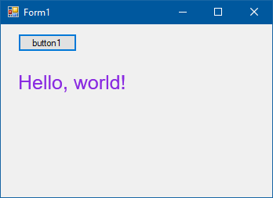
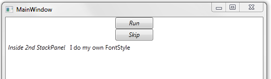
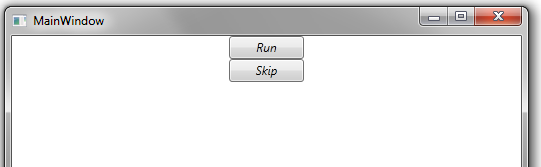

#### Как загрузить меню (целиком или частично) из ресурсов

В App.xaml:

```xml
<Application.Resources>
     <Menu x:Key="MainMenu" IsMainMenu="True">
         <MenuItem Header="_File">
             <MenuItem Header="_New" />
             <MenuItem Header="_Open..." />
             <MenuItem Header="_Save" />
             <MenuItem Header="_Save as..." />
             <MenuItem Header="Close" />
             <Separator />
             <MenuItem Header="E_xit" />
         </MenuItem>
         <MenuItem Header="_Edit">
             <MenuItem Header="_Cut"/>
             <MenuItem Header="C_opy"/>
             <MenuItem Header="_Paste"/>
         </MenuItem>
     </Menu>
</Application.Resources>

```

В MainWindow.xaml:

```xml
<DockPanel>
    <ContentControl DockPanel.Dock="Top" Content="{StaticResource MainMenu}" />
    <TextBox>Жили у бабуси два веселых гуся</TextBox>
</DockPanel>
```


#### Как использовать отрисовку шрифтов из WPF в WinForms:



```csharp
using System;
using System.Collections.Generic;
using System.ComponentModel;
using System.Data;
using System.Drawing;
using System.Drawing.Imaging;
using System.Globalization;
using System.Linq;
using System.Text;
using System.Threading.Tasks;
using System.Windows.Forms;
using System.Windows.Media;
using System.Windows.Media.TextFormatting;
using Color = System.Windows.Media.Color;
using PixelFormat = System.Drawing.Imaging.PixelFormat;

namespace WindowsFormsApp1
{
    public partial class Form1 : Form
    {
        public Form1()
        {
            InitializeComponent();
        }

        private void button1_Click(object sender, EventArgs e)
        {
            Typeface typeface = new Typeface("Arial");
            SolidColorBrush brush = new SolidColorBrush(Colors.BlueViolet);
            CultureInfo culture = CultureInfo.CurrentCulture;
            var direction = System.Windows.FlowDirection.LeftToRight;
            FormattedText formatted = new FormattedText("Hello, world!",
                culture, direction, typeface, 25, brush);
            formatted.MaxTextWidth = 200;
            formatted.MaxTextHeight = 100;
            DrawingVisual visual = new DrawingVisual();
            var origin = new System.Windows.Point(0, 0);
            using (DrawingContext context = visual.RenderOpen())
            {
                context.DrawText(formatted, origin);
            }

            var rtb = new System.Windows.Media.Imaging.RenderTargetBitmap
                (
                    1000, 1000, 96, 96, PixelFormats.Pbgra32
                );
            rtb.Render(visual);
            Bitmap bitmap = new Bitmap(1000, 1000, PixelFormat.Format32bppPArgb);
            BitmapData data = bitmap.LockBits
                (
                    new Rectangle(0, 0, bitmap.Width, bitmap.Height),
                    ImageLockMode.WriteOnly,
                    bitmap.PixelFormat
                );
            rtb.CopyPixels
                (
                    new System.Windows.Int32Rect(0, 0, 1000, 1000),
                    data.Scan0,
                    data.Stride * data.Height,
                    data.Stride
                );
            bitmap.UnlockBits(data);
            pictureBox1.Image = bitmap;
        }
    }
}

```

#### Dependency Property Values Are Stored in the DependencyObject

Standard CLR property values are stored in the instance of the object where the property is defined.  Even if you never change a property from its default value, it still takes up memory in the object.

Values of dependency properties are stored only if a dependency property has been set to a non-default value.  For properties that you haven’t set, the default value for the property is returned whenever a client reads the property.

Values for dependency properties that have been set are stored in an array in the object that inherits from DependencyObject and owns the property.  This array, as well as the GetValue and SetValue methods for reading/writing properties, is part of the implementation of DependencyObject that a derived class inherits. The internal array contains effective values for each dependency property whose value has been set.

#### Don’t Add Code to Dependency Property Getter/Setter

When you implement your own dependency property, you typically include getter/setter methods that just wrap called to DependencyObject.GetValue and DependencyObject.SetValue.  This allows the dependency property to be used like a regular CLR property.  Here’s an example:

```csharp
public int Age
{
    get { return (int)GetValue(AgeProperty); }
    set { SetValue(AgeProperty, value); }
}
```

You should never include any code in these methods other than the calls to GetValue and SetValue.  When you get/set property values from XAML, WPF will end up calling the GetValue and SetValue methods directly, bypassing your getter and setter.  You should include all behavior related to getting/setting the property value in the appropriate callbacks that you specify when you register the property.

#### Read and Write Dependency Property Values from XAML or Code

You can read and write dependency property values in either XAML or code.

For example, if we implement dependency properties FirstName, LastName and Age in our Person class, we can set these properties from XAML:

```xml
<m:Person x:Key="guy" FirstName="Samuel" LastName="Clemens"  Age="75"/>
```

We can also read or write these properties from our code:

```csharp
Person author = (Person)this.Resources["guy"];
string info = string.Format("{0} {1}, aged {2}",
  author.FirstName, author.LastName, author.Age);
```

Because these properties are full-fledged WPF dependency properties, they support the normal range of dependency property functionality including data binding, property inheritance and change notification.

#### Clearing a Dependency Property Value

You can set the value of a dependency property from either code or XAML and that local value will override any inherited or default values.

You can also clear a property value using the DependencyObject.ClearValue method.  This will undo any setting of a local property value, so that the value reverts to the inherited or default value.  (The property value can also come from one of several other sources).

```csharp
Person p = new Person("Samuel", "Clemens");
Console.WriteLine(p.Age);  // 18  (the default)
 
// Setting a property value
p.Age = 70;
Console.WriteLine(p.Age);  // 70
 
// Clear a property value
p.ClearValue(Person.AgeProperty);
Console.WriteLine(p.Age);  // 18 again
```

#### Being Notified When the Value of a Dependency Property Changes

A class that implements a dependency property can optionally ask to be notified when the value of the property changes.  The class specifies a PropertyChangedCallback when registering the property.

```csharp
PropertyMetadata ageMetadata =
    new PropertyMetadata(
        18,     // Default value
        new PropertyChangedCallback(OnAgeChanged),   // ** call when property changes
        new CoerceValueCallback(OnAgeCoerceValue));
 
// Register the property
AgeProperty =
    DependencyProperty.Register(
        "Age",                 // Property's name
        typeof(int),           // Property's type
        typeof(Person),        // Defining class' type
        ageMetadata,           // Defines default value & callbacks  (optional)
        new ValidateValueCallback(OnAgeValidateValue));   // validation (optional)
```

The class can use this callback to perform some logic whenever the property value changes, e.g. automatically setting the value of another property.

```csharp
private static void OnAgeChanged
    (DependencyObject depObj, DependencyPropertyChangedEventArgs e)
{
    Person p = (Person)depObj;
    p.AARPCandidate = (int)e.NewValue > 60 ? true : false;
}
```

#### Validating a Dependency Property

A class that implements a dependency property can optionally provide a validation callback, which it specifies when registering the property.  A validation callback is called when a property is about to be set to a new value and returns true or false, indicating whether the new value is valid.

You specify a validation callback when registering a dependency property.

```csharp
AgeProperty =
    DependencyProperty.Register(
        "Age",                 // Property's name
        typeof(int),           // Property's type
        typeof(Person),        // Defining class' type
        ageMetadata,           // Defines default value & changed/coercion callbacks  (optional)
        new ValidateValueCallback(OnAgeValidateValue));   // *** validation (optional)
```

The validation callback has the new value passed in.

```csharp
private static bool OnAgeValidateValue (object value)
{
    int age = (int) value;
 
    // Only allow reasonable ages
    return (age > 0) && (age < 120);
}
```

If the property is being set to an invalid value, an exception is thrown.

```csharp
Person p = new Person("Samuel", "Clemens");
p.Age = 40;     // ok
p.Age = 300;    // throws System.ArgumentException
```

#### Coercing a Dependency Property

A class that implements a dependency property can optionally provide a coercion callback, which it specifies when registering the property.  A coercion callback is called when a property is about to get a new value and gives the class a chance to coerce the property value to a different value.

You specify a validation callback when registering a dependency property, using the CoerceValueCallback delegate.

```csharp
PropertyMetadata ageMetadata =
    new PropertyMetadata(
        18,     // Default value
        new PropertyChangedCallback(OnAgeChanged),
        new CoerceValueCallback(OnAgeCoerceValue));    // ** allow class to coerce value
 
// Register the property
AgeProperty =
    DependencyProperty.Register(
        "Age",                 // Property's name
        typeof(int),           // Property's type
        typeof(Person),        // Defining class' type
        ageMetadata,           // Defines default value & changed/coercion callbacks  (optional)
        new ValidateValueCallback(OnAgeValidateValue));   // validation (optional)
```

You might use coercion to enforce minimum and maximum values for a property.

```csharp
private static object OnAgeCoerceValue
    (DependencyObject depObj, object baseValue)
{
    int coercedValue = (int)baseValue;
 
    if ((int)baseValue > 120)
        coercedValue = 120;
 
    if ((int)baseValue < 1)
        coercedValue = 1;
 
    return coercedValue;
}
```

#### One Example of WPF’s Use of Dependency Property Callbacks

There are three callbacks related to dependency properties that a class can respond to:

* PropertyChangedCallback – react to a new value
* ValidateValueCallback – determine whether a value is valid
* CoerceValueCallback – coerce a requested value to some different value

The DataGrid.FrozenColumnCount property is an example of a dependency property in a WPF class that implements all three callbacks.

FrozenColumnCount is used to specified the leftmost n columns in a data grid that should not scroll horizontally.  These columns remain fixed while the other columns scroll.

DataGrid uses the dependency property callbacks for this property as follows:

* PropertyChangedCallback – notify constituent controls in the DataGrid of the new value so that they can render properly.  (E.g. the control that renders the column headers).
* ValidateValueCallback – validation fails if a negative value is used for FrozenColumnCount
* CoerceValueCallback – if value greater than the number of columns is specified, coerce FrozenColumnCount to be equal to the number of columns.

#### WPF Supports Three Types of Triggers

WPF supports three different types of triggers:

**Property triggers**
* Fire when the value of a dependency property changes
* Specifies trigger property using property name
* Actions
  * Setter elements set values for one or more dependency properties
  * One or more TriggerAction classes fire, when trigger becomes active or becomes inactive

**Data triggers**
* Fire when the value of a CLR property changes
* Specifies property using Binding keyword
* Actions
  * Setter elements sets values for one or more dependency properties
  * One or more TriggerAction classes fire, when trigger becomes active or becomes inactive

**Event triggers**
* Fire when a routed event is raised
* Action: Class that derives from TriggerAction fires, e.g. BeginStoryboard or SoundPlayerAction
* Often used for animations

#### Dependency Properties Inherit Values from Higher Up in the Logical Tree

The value of a dependency property can come from a number of different sources, but the property often inherits its value from an element further up the logical tree.

This means that when you set a property value in XAML or in code, that value often “trickles down” the element tree and is applied to other elements that have a property of the same name.

Here’s an example.  The value of FontStyle for several controls is inherited from the top-level Window element.

```xml
<Window x:Class="WpfApplication1.MainWindow"
        xmlns="http://schemas.microsoft.com/winfx/2006/xaml/presentation"
        xmlns:x="http://schemas.microsoft.com/winfx/2006/xaml"
        xmlns:m="clr-namespace:PersonLib;assembly=PersonLib"
        Title="MainWindow" Height="350" Width="525" FontStyle="Italic">
    <StackPanel Orientation="Vertical">
        <Button Content="Run" Height="23" Width="75" />
        <Button Content="Skip" Height="23" Width="75" />
        <StackPanel Orientation="Horizontal">
            <Label Content="Inside 2nd StackPanel"/>
            <Label Content="I do my own FontStyle" FontStyle="Normal"/>
        </StackPanel>
    </StackPanel>
</Window>
```

Here’s what the window looks like:



The value for a dependency property will not be inherited if that value is set explicitly (locally) in an element.

#### Inherited Property Values Pass Through All Elements

When an element looks up the element tree for an inherited property value, it doesn’t stop when it hits an element that doesn’t define that particular property.  The element “looks” all of the way up the tree, to the root element.

In the example below, we set a value for the FontStyle in the top-level Window element.  That value is inherited by the Button elements further down the tree, even though their immediate parent–the StackPanel–does not have a FontStyle property.

```xml
<Window x:Class="WpfApplication1.MainWindow"
        xmlns="http://schemas.microsoft.com/winfx/2006/xaml/presentation"
        xmlns:x="http://schemas.microsoft.com/winfx/2006/xaml"
        xmlns:m="clr-namespace:PersonLib;assembly=PersonLib"
        Title="MainWindow" Height="350" Width="525" FontStyle="Italic">
    <StackPanel Orientation="Vertical">
        <Button Content="Run" Height="23" Width="75" />
        <Button Content="Skip" Height="23" Width="75" />
    </StackPanel>
</Window>
```



#### Where a Dependency Property Gets Its Value

Since the value of a dependency property can come from a variety of different sources, WPF uses a predetermined precedence for each possible source of a property value in order to determine the final value.

WPF determines the final value for a dependency property as follows:

* Determine the base value, using the precedence rules listed below
* Evaluate expressions
* Apply animations
* Coerce value  (implementing class might coerce to valid value)
* Validate (implementing class may throw exception if value is invalid)

The base value of a property is obtained from one of the following sources, listed from highest to lowest precedence:

* Local value (set in code or XAML)
* Parent template trigger
* Parent template
* Implicit style (for Style property)
* Style triggers
* Template triggers
* Style setters
* Theme style triggers
* Theme style
* Inheritance
* Default value

WPF works down the list until it finds a source that provides a value for the property.


