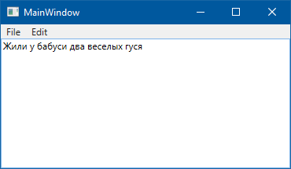

#### Как загрузить меню (целиком или частично) из ресурсов

В App.xaml:

```xml
<Application.Resources>
     <Menu x:Key="MainMenu" IsMainMenu="True">
         <MenuItem Header="_File">
             <MenuItem Header="_New" />
             <MenuItem Header="_Open..." />
             <MenuItem Header="_Save" />
             <MenuItem Header="_Save as..." />
             <MenuItem Header="Close" />
             <Separator />
             <MenuItem Header="E_xit" />
         </MenuItem>
         <MenuItem Header="_Edit">
             <MenuItem Header="_Cut"/>
             <MenuItem Header="C_opy"/>
             <MenuItem Header="_Paste"/>
         </MenuItem>
     </Menu>
</Application.Resources>

```

В MainWindow.xaml:

```xml
<DockPanel>
    <ContentControl DockPanel.Dock="Top" Content="{StaticResource MainMenu}" />
    <TextBox>Жили у бабуси два веселых гуся</TextBox>
</DockPanel>
```



#### Как использовать отрисовку шрифтов из WPF в WinForms:


```csharp
using System;
using System.Collections.Generic;
using System.ComponentModel;
using System.Data;
using System.Drawing;
using System.Drawing.Imaging;
using System.Globalization;
using System.Linq;
using System.Text;
using System.Threading.Tasks;
using System.Windows.Forms;
using System.Windows.Media;
using System.Windows.Media.TextFormatting;
using Color = System.Windows.Media.Color;
using PixelFormat = System.Drawing.Imaging.PixelFormat;

namespace WindowsFormsApp1
{
    public partial class Form1 : Form
    {
        public Form1()
        {
            InitializeComponent();
        }

        private void button1_Click(object sender, EventArgs e)
        {
            Typeface typeface = new Typeface("Arial");
            SolidColorBrush brush = new SolidColorBrush(Colors.BlueViolet);
            CultureInfo culture = CultureInfo.CurrentCulture;
            var direction = System.Windows.FlowDirection.LeftToRight;
            FormattedText formatted = new FormattedText("Hello, world!",
                culture, direction, typeface, 25, brush);
            formatted.MaxTextWidth = 200;
            formatted.MaxTextHeight = 100;
            DrawingVisual visual = new DrawingVisual();
            var origin = new System.Windows.Point(0, 0);
            using (DrawingContext context = visual.RenderOpen())
            {
                context.DrawText(formatted, origin);
            }

            var rtb = new System.Windows.Media.Imaging.RenderTargetBitmap
                (
                    1000, 1000, 96, 96, PixelFormats.Pbgra32
                );
            rtb.Render(visual);
            Bitmap bitmap = new Bitmap(1000, 1000, PixelFormat.Format32bppPArgb);
            BitmapData data = bitmap.LockBits
                (
                    new Rectangle(0, 0, bitmap.Width, bitmap.Height),
                    ImageLockMode.WriteOnly,
                    bitmap.PixelFormat
                );
            rtb.CopyPixels
                (
                    new System.Windows.Int32Rect(0, 0, 1000, 1000),
                    data.Scan0,
                    data.Stride * data.Height,
                    data.Stride
                );
            bitmap.UnlockBits(data);
            pictureBox1.Image = bitmap;
        }
    }
}

```

#### Dependency Property Values Are Stored in the DependencyObject

Standard CLR property values are stored in the instance of the object where the property is defined.  Even if you never change a property from its default value, it still takes up memory in the object.

Values of dependency properties are stored only if a dependency property has been set to a non-default value.  For properties that you haven’t set, the default value for the property is returned whenever a client reads the property.

Values for dependency properties that have been set are stored in an array in the object that inherits from DependencyObject and owns the property.  This array, as well as the GetValue and SetValue methods for reading/writing properties, is part of the implementation of DependencyObject that a derived class inherits. The internal array contains effective values for each dependency property whose value has been set.

#### Don’t Add Code to Dependency Property Getter/Setter

When you implement your own dependency property, you typically include getter/setter methods that just wrap called to DependencyObject.GetValue and DependencyObject.SetValue.  This allows the dependency property to be used like a regular CLR property.  Here’s an example:

```csharp
public int Age
{
    get { return (int)GetValue(AgeProperty); }
    set { SetValue(AgeProperty, value); }
}
```

You should never include any code in these methods other than the calls to GetValue and SetValue.  When you get/set property values from XAML, WPF will end up calling the GetValue and SetValue methods directly, bypassing your getter and setter.  You should include all behavior related to getting/setting the property value in the appropriate callbacks that you specify when you register the property.

#### Read and Write Dependency Property Values from XAML or Code

You can read and write dependency property values in either XAML or code.

For example, if we implement dependency properties FirstName, LastName and Age in our Person class, we can set these properties from XAML:

```xml
<m:Person x:Key="guy" FirstName="Samuel" LastName="Clemens"  Age="75"/>
```

We can also read or write these properties from our code:

```csharp
Person author = (Person)this.Resources["guy"];
string info = string.Format("{0} {1}, aged {2}",
  author.FirstName, author.LastName, author.Age);
```

Because these properties are full-fledged WPF dependency properties, they support the normal range of dependency property functionality including data binding, property inheritance and change notification.

#### Clearing a Dependency Property Value

You can set the value of a dependency property from either code or XAML and that local value will override any inherited or default values.

You can also clear a property value using the DependencyObject.ClearValue method.  This will undo any setting of a local property value, so that the value reverts to the inherited or default value.  (The property value can also come from one of several other sources).

```csharp
Person p = new Person("Samuel", "Clemens");
Console.WriteLine(p.Age);  // 18  (the default)
 
// Setting a property value
p.Age = 70;
Console.WriteLine(p.Age);  // 70
 
// Clear a property value
p.ClearValue(Person.AgeProperty);
Console.WriteLine(p.Age);  // 18 again
```

#### Being Notified When the Value of a Dependency Property Changes

A class that implements a dependency property can optionally ask to be notified when the value of the property changes.  The class specifies a PropertyChangedCallback when registering the property.

```csharp
PropertyMetadata ageMetadata =
    new PropertyMetadata(
        18,     // Default value
        new PropertyChangedCallback(OnAgeChanged),   // ** call when property changes
        new CoerceValueCallback(OnAgeCoerceValue));
 
// Register the property
AgeProperty =
    DependencyProperty.Register(
        "Age",                 // Property's name
        typeof(int),           // Property's type
        typeof(Person),        // Defining class' type
        ageMetadata,           // Defines default value & callbacks  (optional)
        new ValidateValueCallback(OnAgeValidateValue));   // validation (optional)
```

The class can use this callback to perform some logic whenever the property value changes, e.g. automatically setting the value of another property.

```csharp
private static void OnAgeChanged
    (DependencyObject depObj, DependencyPropertyChangedEventArgs e)
{
    Person p = (Person)depObj;
    p.AARPCandidate = (int)e.NewValue > 60 ? true : false;
}
```

#### Validating a Dependency Property

A class that implements a dependency property can optionally provide a validation callback, which it specifies when registering the property.  A validation callback is called when a property is about to be set to a new value and returns true or false, indicating whether the new value is valid.

You specify a validation callback when registering a dependency property.

```csharp
AgeProperty =
    DependencyProperty.Register(
        "Age",                 // Property's name
        typeof(int),           // Property's type
        typeof(Person),        // Defining class' type
        ageMetadata,           // Defines default value & changed/coercion callbacks  (optional)
        new ValidateValueCallback(OnAgeValidateValue));   // *** validation (optional)
```

The validation callback has the new value passed in.

```csharp
private static bool OnAgeValidateValue (object value)
{
    int age = (int) value;
 
    // Only allow reasonable ages
    return (age > 0) && (age < 120);
}
```

If the property is being set to an invalid value, an exception is thrown.

```csharp
Person p = new Person("Samuel", "Clemens");
p.Age = 40;     // ok
p.Age = 300;    // throws System.ArgumentException
```

#### Coercing a Dependency Property

A class that implements a dependency property can optionally provide a coercion callback, which it specifies when registering the property.  A coercion callback is called when a property is about to get a new value and gives the class a chance to coerce the property value to a different value.

You specify a validation callback when registering a dependency property, using the CoerceValueCallback delegate.

```csharp
PropertyMetadata ageMetadata =
    new PropertyMetadata(
        18,     // Default value
        new PropertyChangedCallback(OnAgeChanged),
        new CoerceValueCallback(OnAgeCoerceValue));    // ** allow class to coerce value
 
// Register the property
AgeProperty =
    DependencyProperty.Register(
        "Age",                 // Property's name
        typeof(int),           // Property's type
        typeof(Person),        // Defining class' type
        ageMetadata,           // Defines default value & changed/coercion callbacks  (optional)
        new ValidateValueCallback(OnAgeValidateValue));   // validation (optional)
```

You might use coercion to enforce minimum and maximum values for a property.

```csharp
private static object OnAgeCoerceValue
    (DependencyObject depObj, object baseValue)
{
    int coercedValue = (int)baseValue;
 
    if ((int)baseValue > 120)
        coercedValue = 120;
 
    if ((int)baseValue < 1)
        coercedValue = 1;
 
    return coercedValue;
}
```

#### One Example of WPF’s Use of Dependency Property Callbacks

There are three callbacks related to dependency properties that a class can respond to:

* PropertyChangedCallback – react to a new value
* ValidateValueCallback – determine whether a value is valid
* CoerceValueCallback – coerce a requested value to some different value

The DataGrid.FrozenColumnCount property is an example of a dependency property in a WPF class that implements all three callbacks.

FrozenColumnCount is used to specified the leftmost n columns in a data grid that should not scroll horizontally.  These columns remain fixed while the other columns scroll.

DataGrid uses the dependency property callbacks for this property as follows:

* PropertyChangedCallback – notify constituent controls in the DataGrid of the new value so that they can render properly.  (E.g. the control that renders the column headers).
* ValidateValueCallback – validation fails if a negative value is used for FrozenColumnCount
* CoerceValueCallback – if value greater than the number of columns is specified, coerce FrozenColumnCount to be equal to the number of columns.

#### WPF Supports Three Types of Triggers

WPF supports three different types of triggers:

**Property triggers**
* Fire when the value of a dependency property changes
* Specifies trigger property using property name
* Actions
  * Setter elements set values for one or more dependency properties
  * One or more TriggerAction classes fire, when trigger becomes active or becomes inactive

**Data triggers**
* Fire when the value of a CLR property changes
* Specifies property using Binding keyword
* Actions
  * Setter elements sets values for one or more dependency properties
  * One or more TriggerAction classes fire, when trigger becomes active or becomes inactive

**Event triggers**
* Fire when a routed event is raised
* Action: Class that derives from TriggerAction fires, e.g. BeginStoryboard or SoundPlayerAction
* Often used for animations

#### Dependency Properties Inherit Values from Higher Up in the Logical Tree

The value of a dependency property can come from a number of different sources, but the property often inherits its value from an element further up the logical tree.

This means that when you set a property value in XAML or in code, that value often “trickles down” the element tree and is applied to other elements that have a property of the same name.

Here’s an example.  The value of FontStyle for several controls is inherited from the top-level Window element.

```xml
<Window x:Class="WpfApplication1.MainWindow"
        xmlns="http://schemas.microsoft.com/winfx/2006/xaml/presentation"
        xmlns:x="http://schemas.microsoft.com/winfx/2006/xaml"
        xmlns:m="clr-namespace:PersonLib;assembly=PersonLib"
        Title="MainWindow" Height="350" Width="525" FontStyle="Italic">
    <StackPanel Orientation="Vertical">
        <Button Content="Run" Height="23" Width="75" />
        <Button Content="Skip" Height="23" Width="75" />
        <StackPanel Orientation="Horizontal">
            <Label Content="Inside 2nd StackPanel"/>
            <Label Content="I do my own FontStyle" FontStyle="Normal"/>
        </StackPanel>
    </StackPanel>
</Window>
```

Here’s what the window looks like:


The value for a dependency property will not be inherited if that value is set explicitly (locally) in an element.

#### Inherited Property Values Pass Through All Elements

When an element looks up the element tree for an inherited property value, it doesn’t stop when it hits an element that doesn’t define that particular property.  The element “looks” all of the way up the tree, to the root element.

In the example below, we set a value for the FontStyle in the top-level Window element.  That value is inherited by the Button elements further down the tree, even though their immediate parent–the StackPanel–does not have a FontStyle property.

```xml
<Window x:Class="WpfApplication1.MainWindow"
        xmlns="http://schemas.microsoft.com/winfx/2006/xaml/presentation"
        xmlns:x="http://schemas.microsoft.com/winfx/2006/xaml"
        xmlns:m="clr-namespace:PersonLib;assembly=PersonLib"
        Title="MainWindow" Height="350" Width="525" FontStyle="Italic">
    <StackPanel Orientation="Vertical">
        <Button Content="Run" Height="23" Width="75" />
        <Button Content="Skip" Height="23" Width="75" />
    </StackPanel>
</Window>
```


#### Where a Dependency Property Gets Its Value

Since the value of a dependency property can come from a variety of different sources, WPF uses a predetermined precedence for each possible source of a property value in order to determine the final value.

WPF determines the final value for a dependency property as follows:

* Determine the base value, using the precedence rules listed below
* Evaluate expressions
* Apply animations
* Coerce value  (implementing class might coerce to valid value)
* Validate (implementing class may throw exception if value is invalid)

The base value of a property is obtained from one of the following sources, listed from highest to lowest precedence:

* Local value (set in code or XAML)
* Parent template trigger
* Parent template
* Implicit style (for Style property)
* Style triggers
* Template triggers
* Style setters
* Theme style triggers
* Theme style
* Inheritance
* Default value

WPF works down the list until it finds a source that provides a value for the property.

#### Use GetValueSource Method to Find the Source of a Dependency Property Value


It’s often helpful to determine the source of the current value of a dependency property.  You can use the DependencyPropertyHelper.GetValueSource method to do this.

#### Use SetCurrentValue When You Want to Set A Dependency Property Value from Within a Control

As a control author, you might want to set the value of one of your own dependency properties.  For example, a numeric up/down control might want to change its Value property in response to clicking on the arrows.

The problem with setting the dependency property directly is that you’ve set a local value, which will take precedence over all other possible sources, like data binding.  If you set a local value, you’ll destroy any data binding that the application has set up.

The solution is to use the DependencyObject.SetCurrentValue method to set the current value from within the control.  This is similar to coercion, in that the effective value is changed without affecting the property’s value source.

A control should always use SetCurrentValue to set the value of its own dependency properties, with the exception of the CLR property setter, which should use SetValue.

See also [Vincent Sibal’s blog](http://blogs.msdn.com/b/vinsibal/archive/2009/05/21/the-control-local-values-bug-solution-and-new-wpf-4-0-related-apis.aspx).

#### Property Values Set Using Expressions Overwrite the Base Value

In the list of all possible sources for a dependency property value, we explain that a property’s base value can in turn be overwritten by the result of an expression.  If the property’s value is set using an expression, the value of the expression takes precedence over the property’s base value.

In WPF, if the value of a dependency property is set using an expression, the expression can be one of two types:

* Data binding – set the value of the property by binding it to another property
* Resources – set the value of the property to a resource, loaded from a resource dictionary

#### Use PropertyChanged and Coercion Callbacks to Force Dependencies Between Properties

When implementing dependency properties, you typically use the CoerceValueCallback and PropertyChangedCallbacks to enforce relationships between properties.

For example, assume we have a Person class with BirthYear, DeathYear and MarriageYear properties.  We want to ensure that MarriageYear is never earlier than BirthYear or later than DeathYear.  We want these checks done any time that we change any of the three properties.

The basic plan is:

* Allow setting BirthYear to anything
* When setting DeathYear, don’t let it be earlier than BirthYear
* When setting MarriageYear, don’t let it be earlier than birth or later than death

When registering the dependency properties, we therefore do the following:

* BirthYear
  * In PropertyChangedCallback, force coercion of DeathYear and MarriageYear
* DeathYear
  * In PropertyChangedCallback, force coercion of MarriageYear
  * In CoerceValueCallback, if value earlier than birth, set to BirthYear
* MarriageYear
  *In CoerceValueCallback, if marriage earlier than birth, set to birth year; if later than death, set to death year

Here’s an example.

#### Dependency Properties Remember Non-Coerced Values

When you set a dependency property to some value and it is coerced, the original base value that you set is remembered.  If you remove the conditions that led to the coercion, the property will take on the non-coerced value that you originally set.

Suppose we have a Person class with an Age property and a boolean SuperOld property.  Assume that Age is coerced to a value of 999 if SuperOld is true.

If you set Age to some local value and SuperOld is true, Age will get coerced to 999.  But if you later set SuperOld to false, the Age property will revert to the last local value that you tried to set.

```csharp
Person p = new Person("Methuselah");
 
p.Age = 28;
p.SuperOld = true;    // Age coerced to 999
 
p.Age = 56;           // Age still 999
p.SuperOld = false;   // Age now becomes 56
```

This assumes that the PropertyChanged callback for SuperOld calls CoerceValue on the Age property.  (Likely true).

#### Use ReadLocalValue() to Find the Local Value of a Dependency Property

You can use a DependencyObject‘s ReadLocalValue method to get the local value of a dependency property, rather than its effective value.  Recall that the local value is a value set locally, from XAML or code, which takes precedence over all other sources for the base value of a dependency property.  The local value has lower precedence than any coerced values.

Using ReadLocalValue (assuming that this refers to a DependencyObject that registers AgeProperty):

```csharp
int ageValue = (int)this.GetValue(AgeProperty);         // Effective value
int ageLocal = (int)this.ReadLocalValue(AgeProperty);   // Local value
```

Getting this information for the Age/SuperOld example, we get the following:

```csharp
p.Age = 28;
info = p.AgeInfo();   // Value=28, Local=28
 
p.SuperOld = true;
info = p.AgeInfo();   // Value=999, Local=28
 
p.Age = 56;
info = p.AgeInfo();   // Value=999, Local=56
 
p.SuperOld = false;
info = p.AgeInfo();   // Value=56, Local=56
```

#### You Can Set the Value of any Dependency Property for any Dependency Object

A dependency object will typically use its SetValue method internally, to set dependency property values for dependency properties that the object implements.  (See How Dependency Properties Are Implemented).

A DependencyObject can, however, store the value of any dependency property–not just the properties that it implements.

The DependencyObject.SetValue method takes a dependency property reference and a property value (whose type should match the type of the dependency property).  Using SetValue, you can actually attach any property value you choose to the dependency object.

Here’s an example, where we set various property values on a Person, which is a DependencyObject.  These properties are defined in other WPF classes, but it might be useful to attach these property values to a Person object, if it can make use of them.

```csharp
Person p = new Person("Samuel", "Clemens");
 
// Set some some arbitrary property values
p.SetValue(FrameworkElement.ContextMenuProperty, myMenu);
p.SetValue(UIElement.FocusableProperty, true);
p.SetValue(Control.FontSizeProperty, 12.0);
```

#### Reusing an Existing Dependency Property in Your Class

We saw earlier how to register a new dependency property in a custom class using the DependencyProperty.Register method.  You can also reuse an existing dependency property, using the DependencyProperty.AddOwner method.

When you reuse an existing dependency property, you can optionally specify new metadata that applies to the use of the dependency property in your new type.  You should also define CLR properties in the new type that wrap the GetValue/SetValue calls to read/write dependency property values.

Here’s an example, where we reuse the BirthYearProperty, originally defined in a Person class, in a new Dog class.  Notice that we also provide a new default value.

```csharp
// Dog also has a BirthYear property
public static readonly DependencyProperty BirthYearProperty =
    Person.BirthYearProperty.AddOwner(
        typeof(Dog),
        new PropertyMetadata(2000, new PropertyChangedCallback(OnBirthYearChanged)));
 
public int BirthYear
{
    get { return (int)GetValue(BirthYearProperty); }
    set { SetValue(BirthYearProperty, value); }
}
 
public static void OnBirthYearChanged(DependencyObject d, DependencyPropertyChangedEventArgs e)
{
}
```

#### Implementing an Attached Dependency Property

When you implement a dependency property that will be used as a XAML attached property, you use the DependencyProperty.RegisterAttached method, rather than the DependencyProperty.Register method.  The signature of the RegisterAttached method, as well as all parameters, is identical to Register.

Below is an example, where we register the Person.AgeProperty, which we intend to use as a XAML attached property.

```csharp
static PropertyMetadata ageMetadata =
    new PropertyMetadata(0, null, new CoerceValueCallback(CoerceAge));
 
public static readonly DependencyProperty AgeProperty =
    DependencyProperty.RegisterAttached("Age", typeof(int), typeof(Person), ageMetadata);
 
public static void SetAge(DependencyObject depObj, int value)
{
    depObj.SetValue(AgeProperty, value);
}
```

Note that because we intend to use Age as an attached property, we must also implement the SetAge method.  (Standard CLR property wrapper is also required, but not shown).

#### Using the Tag Property to Store Custom Data with an Element

In WPF, the FrameworkElement class includes a Tag property that allows storing some arbitrary data with an element.

You’d normally use the Tag property to store some custom data on an element that inherits from FrameworkElement.  In the example below, we store some custom data with two different Button objects.

```xml
<Button Tag="Some arbitrary data" Content="Test" Height="23" Width="75" Name="btnTest" Click="btnTest_Click"/>
<Button Tag="{StaticResource greenBrush}" Content="Test 2" Height="23" Width="75" />
```

However, because you can attach a dependency property value to any object deriving from DependencyObject, you can also use the Tag property to attach data to objects that don’t derive from FrameworkElement or to dependency objects that are otherwise sealed.

```csharp
// ListView has a GridView as its view
GridView gv1 = (GridView)listView1.View;
 
// Attach a Tag to the GridView -- a Person object
gv1.SetValue(FrameworkElement.TagProperty, new Person("Herodotus"));
```

#### You Can Set Standard CLR Properties from XAML

If you create a custom class, you can instantiate instances of that class from XAML by adding the object to a resource dictionary.

```xml
<Window.Resources>
    <m:Person x:Key="perBill" FirstName="William" LastName="Shakespeare" />
</Window.Resources>
```

You might wonder whether your properties have to be WPF dependency properties in order to set their values from XAML.  It turns out that the properties on the custom class do not have to be dependency properties in order to be set from XAML.  They can be standard CLR properties.

```csharp
public class Person
{
    public string FirstName { get; set; }
    public string LastName { get; set; }
 
    public Person()
    {
    }
}
```

#### When to Create a Custom Dependency Property

When you’re implementing a new class and creating properties of that class, you need to decide for each property whether to make it a full-fledged WPF dependency property.

If a property is a standard CLR property, rather than a dependency property, you can still set property values from XAML.

But you might want to create a custom dependency property if you want your class to do any of the following:

* Set the property from a style
* Use data binding on the property
* Set property value using DynamicResource
* Get property value through inheritance
* Get property value through animation
* Use PropertyChanged, CoerceValue or ValidateValue callbacks
* You want support for the property in the Visual Studio or Blend designers

#### Creating a Read-Only Dependency Property

Creating a custom dependency property that is read-only is slightly different from creating a standard dependency property.

* Use DependencyProperty.RegisterReadOnly, rather than Register
* Create an internal static copy of a DependencyPropertyKey in addition to a public static DependencyProperty
* Make the CLR property wrapper read-only

For example, assume that we want to add a read-only IQ property to our Person class.

We register the property as read-only and retrieve a DependencyPropertyKey.

```csharp
internal static readonly DependencyPropertyKey IQPropertyKey =
    DependencyProperty.RegisterReadOnly("IQ", typeof(int), typeof(Person), new PropertyMetadata(100));
```

Although the key is private, we make the property public.

```csharp
public static readonly DependencyProperty IQProperty =
    IQPropertyKey.DependencyProperty;
```

We can still set the value internally, by using the key.

```csharp
public Person(string first, string last, int iq)
{
    FirstName = first;
    LastName = last;
    SetValue(IQPropertyKey, 100);
}
```

Finally, we provide a CLR property wrapper.

```csharp
public int IQ
{
    get { return (int)GetValue(IQProperty); }
}
```

#### Be Careful When Setting Dependency Property Values from a DependencyObject Constructor

You should normally avoid calling any virtual methods in a C# class constructor.  Your constructor might get called during construction of a derived class, before the derived class has finished initializing everything that it needs to initialize.  If the derived class also overrides the virtual method that you’re calling, that method could end up getting called before the derived class has finished initializing everything (in its constructor).

If you use FxCop to check your code, this will be caught by the DoNotCallOverridableMethodsInConstructors rule.

This rule applies to WPF.  If you set the value of a dependency property in a constructor, virtual methods or callbacks in the property system may end up getting called.

The best way to avoid the problem is to follow the following rule:

Initialize all objects that might be used by property system callbacks in your default (parameterless) constructor

See also: [Safe Constructor Patterns for DependencyObjects](http://msdn.microsoft.com/en-us/library/ms754149.aspx)

#### Read a Dependency Property’s Metadata

You can read a dependency property’s metadata by using the DependencyProperty.GetMetadata method.

For example, assume that we have a Dog class with a BirthYear dependency property and that the class has exposed BirthYearProperty as a public member.  We can retrieve the property’s metadata as follows:

```csharp
Dog fido = new Dog("Fido");
PropertyMetadata meta = Dog.BirthYearProperty.GetMetadata(fido);
```


#### UIPropertyMetadata and FrameworkPropertyMetadata

Some dependency properties in WPF have metadata deriving from UIPropertyMetadata or FrameworkPropertyMetadata, rather than from PropertyMetadata.

For example, the ComboBox.IsEnabledProperty, which is defined in UIElement has metadata of type UIPropertyMetadata.

```csharp
UIPropertyMetadata meta = (UIPropertyMetadata)ComboBox.IsEnabledProperty.GetMetadata(cboTest);
```

UIPropertyMetadata derives from PropertyMetadata and adds the IsAnimationProhibited property.

The Button.IsEnabledProperty has metadata of type FrameworkPropertyMetadata.

```csharp
FrameworkPropertyMetadata meta = (FrameworkPropertyMetadata)Button.IsEnabledProperty.GetMetadata(btnTest);
```

FrameworkPropertyMetadata derives from UIPropertyMetadata and adds properties related to layout.


#### Overriding Metadata for an Inherited Dependency Property

When deriving a new child class, you inherit the parent’s dependency properties.  You might also want to change the behavior of one or more of the dependency properties.  You can do this to some extent by overriding the metadata for a dependency property.

Overriding the metadata in the child class doesn’t change the behavior of the dependency property in the parent class.

In the example below, we create a new class and override metadata for several properties, changing the default values.

```csharp
public class ThermometerSlider : Slider
{
    static ThermometerSlider()
    {
        // Defaults for standard Slider: Min = 0, Max = 10, Value = 0
        // Defaults for ThermometerSlider: Min = -40, Max = 120, Value = 70
 
        // Change default Minimum to -40.0
        MinimumProperty.OverrideMetadata(typeof(ThermometerSlider), new FrameworkPropertyMetadata(-40.0));
 
        // Change default Maximum to 120
        MaximumProperty.OverrideMetadata(typeof(ThermometerSlider), new FrameworkPropertyMetadata(120.0));
 
        // Change default Value to 70
        ValueProperty.OverrideMetadata(typeof(ThermometerSlider), new FrameworkPropertyMetadata(70.0));
    }
}
```

#### Overriding Metadata Can Result in Merged Metadata

If you override metadata for a dependency property that a class inherits from its parent, you can specify one or more things to override:

* The default value
* The PropertyChangedCallback
* The CoerceValueCallback

Other flags specified for UIPropertyMetadata or FrameworkPropertyMetadata
If you don’t specify all of these things, however, the items that you do not specify will be inherited from the parent.

For example, we created a child class of Slider and overrode metadata to provide a new default value for the Maximum property.  But the coercion behavior of Maximum in our new class behaves as it does for Slider.Maximum.  (Maximum can’t be set below Minimum).

Because we didn’t specify a CoerceValueCallback, the existing coercion logic is used.

When you do specify new metadata:

* New default value replaces the existing one
* PropertyChangedCallback is merged with the existing one  (both are invoked)
* CoerceValueCallback replaces the existing one

#### You Can Override Metadata for Any Dependency Property

Recall that you can set a dependency property value on a DependencyObject for any dependency property, not just the properties that the class implements or inherits.

Since any dependency property can be attached to any dependency object, you can override metadata for any dependency property in a class.

Here’s an example where we override the Grid.Row and Grid.Column properties in a class that derives from Button.  If this ButtonLoner object is defined in a Grid in XAML, it will automatically appear in Row 1, Col 1, rather than Row 0, Col 0.

```csharp
public class ButtonLoner : Button
{
    static ButtonLoner()
    {
        Grid.RowProperty.OverrideMetadata(typeof(ButtonLoner), new FrameworkPropertyMetadata(1));
        Grid.ColumnProperty.OverrideMetadata(typeof(ButtonLoner), new FrameworkPropertyMetadata(1));
    }
}
```

Here’s an example of the button being used:

```xml
<Grid>
    <Grid.RowDefinitions>
        <RowDefinition/>
        <RowDefinition/>
    </Grid.RowDefinitions>
    <Grid.ColumnDefinitions>
        <ColumnDefinition/>
        <ColumnDefinition/>
    </Grid.ColumnDefinitions>
    <app:ButtonLoner x:Name="btnLoner" Content="Loner" Width="100" Height="25"/>
</Grid>
```

#### Implementing a Dependency Property That Is A Collection

When you create a custom dependency property that is based on a collection type, you need to define the default value of the property as a new instance of a collection, rather than as just a static value.

For example, we defined the Person.IQ dependency property, with a default value of 100, as follows:

```csharp
internal static readonly DependencyPropertyKey IQPropertyKey =
    DependencyProperty.RegisterReadOnly("IQ", typeof(int), typeof(Person), new PropertyMetadata(100));
```

If we define a read-only Person.Friends property, whose type is List<Person>, the same call would look like this:

```csharp
internal static readonly DependencyPropertyKey FriendsPropertyKey =
    DependencyProperty.RegisterReadOnly("Friends", typeof(List<Person>), typeof(Person),
      new PropertyMetadata(new List<Person>()));      // Metadata constructor instantiates a new List
```


#### A More Complete Class Hierarchy

Post #27 presented a class hierarchy that shows the most common classes used in WPF.  Here is an updated view, with ContentElement and FrameworkContentElement added.  These two classes are sometimes used as base classes for creating new elements, so it’s important to know where they fit in the class hierarchy.

(Click on the image to see the diagram full-sized).


#### The Base Element Classes

There are four main classes that that serve as base classes for many of the other classes in WPF.  They also often serve as base classes for new custom classes that you write.

The four base element classes are:

* ContentElement
* FrameworkContentElement
* UIElement
* FrameworkElement


#### Functionality That The Base Element Classes Provide

The four main base element classes in WPF each provide slightly different functionality, above and beyond DependencyObject, which they all inherit from, directly or indirectly.

* ContentElement adds (to DependencyObject)
  * Input events and commanding
  * Focus
  * Raise and respond to routed events
  * Animation support
* FrameworkContentElement adds (to ContentElement)
  * Additional input elements (e.g. tooltips, context menus)
  * Storyboards
  * Data binding
  * Styles
  * Property value inheritance
* UIElement adds (to DependencyObject)
  * via Visual
    * Hit testing
    * Clipping and coordinate transformations
    * Participation in visual tree via parent/child relationships
  * Layout behavior (measure/arrange)
  * Input events and commanding
  * Focus
  * Raise and respond to routed Events
  * Animation support
* FrameworkElement adds (to UIElement)
  * Additional input elements (e.g. tooltips, context menus)
  * Storyboards
  * Data binding
  * Styles
  * Property value inheritance
  * Support for the logical tree

#### Other Base Classes – Freezable and Animatable

We can add two other important base classes to our class hierarchy – Freezable and Animatable.


* Freezable – Implements a “freezable” pattern, in that the object can provide a “frozen” read-only copy of itself.
* Animatable – Derives from Freezable and adds the ability to animate properties

#### Changes to a Brush Cascade to Consumers of the Brush

If you create a Brush object, in XAML or code, and use that Brush in some controls, any changes to the original Brush are automatically reflected in controls that use the brush.

For example, assume that we define a teal SolidColorBrush as a resource and use it to render a Label.

```xml
<Window.Resources>
    <SolidColorBrush x:Key="tealBrush" Color="Teal"/>
</Window.Resources>
<StackPanel>
    <Label Content="I'm teal!" Foreground="{StaticResource tealBrush}"/>
</StackPanel>
```

Now assume that we change the brush’s color at runtime:

```csharp
SolidColorBrush theBrush = (SolidColorBrush)this.Resources["tealBrush"];
theBrush.Color = Colors.DarkMagenta;
```

You’ll see that the foreground color of the Label changes immediately, as soon as we change the color of the brush.

This change notification behavior is true not only of the Brush class, but of all other classes used in rendering WPF graphics.

#### You Can Put Freezable Objects Into a Read-Only State

The idea of an object deriving from Freezable is that it normally is in a read/write state, but can be explicitly put into a read-only state using the Freeze method.  A frozen object can be used more efficiently in WPF because it doesn’t need to notify consumers of the object that its value has changed.

Graphical objects in WPF like brushes and 3D geometries derive from Freezable.  Initially unfrozen, a change to one of these objects results in consumers of the objects being notified of the change.

If you have an object deriving from Freezable that you don’t plan to change, you can make the object read-only using the Freeze method.

```csharp
// Freeze this object, making it read-only (since we don't plan on changing it)
if (theBrush.CanFreeze)
    theBrush.Freeze();
```

After freezing the object, if you try modifying it, you’ll get an InvalidOperationException.  But WPF will be more efficient in its use of the object.

#### Predefined Brushes Are Already Frozen

All of the brushes in the predefined Brushes collection are already in a frozen state, meaning that they are read-only.  Being frozen means that they will perform more efficiently when using them to render graphical objects, since WPF doesn’t need to worry about notifying consumers of the brush when the brush changes.

Here’s an example, where we have two different labels, one painted with a brush created in XAML and one painted with a brush from the Brushes collection.

```xml
<Window.Resources>
    <SolidColorBrush x:Key="tealBrush" Color="Teal"/>
</Window.Resources>
<StackPanel>
    <Label Name="lblWithTealBrush" Content="I use a SolidColorBrush created in Window.Resources" Foreground="{StaticResource tealBrush}"/>
    <Label Name="lblWithRedBrush" Content="I use Brushes.Red">
        <Label.Foreground>
            <x:Static Member="Brushes.Red"/>
        </Label.Foreground>
    </Label>
    <Button Content="Click Me" Width="100" Click="btnTest_Click"/>
</StackPanel>
```

We can add code to check the frozen state of these two different brushes.

```csharp
private void btnTest_Click(object sender, RoutedEventArgs e)
{
    SolidColorBrush tealBrush = (SolidColorBrush)lblWithTealBrush.Foreground;
    bool frozen = tealBrush.IsFrozen;    // frozen = false
 
    SolidColorBrush redBrush = (SolidColorBrush)lblWithRedBrush.Foreground;
    frozen = redBrush.IsFrozen;          // frozen = true
}
```

#### Freeze Graphical Objects That You Don’t Intend to Modify

For performance purposes, it’s best to freeze graphical objects (e.g. brushes) if you don’t intend to modify them.  You must also freeze an object if you intend to reference it from a thread other than the thread that created it.

You can freeze an object in code, using the Freeze method.

```csharp
// SolidColorBrush, created in XAML, not frozen
bool frozen = tealBrush.IsFrozen;    // frozen = false
 
if (tealBrush.CanFreeze)
    tealBrush.Freeze();
 
frozen = tealBrush.IsFrozen;         // frozen = true
```

You can also freeze an object in XAML, when it is declared, with the addition of an XML namespace.

```xml
<Window x:Class="WpfApplication4.MainWindow"
        xmlns="http://schemas.microsoft.com/winfx/2006/xaml/presentation"
        xmlns:x="http://schemas.microsoft.com/winfx/2006/xaml"
        xmlns:po="http://schemas.microsoft.com/winfx/2006/xaml/presentation/options"
        Title="MainWindow" Height="350" Width="525" >
    <Window.Resources>
        <SolidColorBrush x:Key="tealBrush" Color="Teal" po:Freeze="True"/>
    </Window.Resources>
    ...
</Window>
```

#### Two Kinds of Templates

In WPF, there are two different kinds of templates—control templates and data templates.

Control templates allow you to exactly specify the visual tree of a control, i.e. its constituent controls.  The example below shows a Button control being constructed out of a Button and two Label controls.

```xml
<Button Name="btnWithTemplate" Content="Recreate Me" Foreground="Blue">
    <Button.Template>
        <ControlTemplate TargetType="{x:Type Button}">
            <StackPanel Orientation="Horizontal">
                <Label Content="**" Foreground="{TemplateBinding Foreground}"/>
                <Button Content="{TemplateBinding Content}" Foreground="{TemplateBinding Foreground}"/>
                <Label Content="**" Foreground="{TemplateBinding Foreground}"/>
            </StackPanel>
        </ControlTemplate>
    </Button.Template>
</Button>
```


Data templates allow you to specify how a bound data object will be mapped to one or more controls.  The example below maps properties of a Person object to several labels.

```xml
<Label Name="lblPerson" Content="{Binding}">
    <Label.ContentTemplate>
        <DataTemplate>
            <Border BorderThickness="2" BorderBrush="DarkBlue">
                <StackPanel Orientation="Vertical">
                    <StackPanel Orientation="Horizontal">
                        <Label Content="{Binding Path=FirstName}"/>
                        <Label Content="{Binding Path=LastName}" FontWeight="Bold"/>
                    </StackPanel>
                    <Label Content="{Binding Path=BirthYear}" FontStyle="Italic"/>
                </StackPanel>
            </Border>
        </DataTemplate>
    </Label.ContentTemplate>
</Label>
```


#### A Content Presenter Is a Placeholder for a Content Control’s Content


A content control (ContentControl) in WPF is a control that displays a single piece of content.  The control will have a control template (Template property) that describes the specific visual elements that make up the control.  Somewhere in that control template will be a content presenter (ContentPresenter), which indicates the spot in the control to display the actual content.

You can think of the ContentPresenter as a little pointer that says “put your content here”.

Below is the default control template for a Label control as an example.  The control template includes a ContentPresenter inside a Border.

```xml
<ControlTemplate TargetType="{x:Type Label}">
    <Border BorderBrush="{TemplateBinding BorderBrush}" BorderThickness="{TemplateBinding BorderThickness}" Background="{TemplateBinding Background}" Padding="{TemplateBinding Padding}" SnapsToDevicePixels="true">
        <ContentPresenter HorizontalAlignment="{TemplateBinding HorizontalContentAlignment}" RecognizesAccessKey="True" SnapsToDevicePixels="{TemplateBinding SnapsToDevicePixels}" VerticalAlignment="{TemplateBinding VerticalContentAlignment}"/>
    </Border>
    <ControlTemplate.Triggers>
        <Trigger Property="IsEnabled" Value="false">
            <Setter Property="Foreground" Value="{DynamicResource {x:Static SystemColors.GrayTextBrushKey}}"/>
        </Trigger>
    </ControlTemplate.Triggers>
</ControlTemplate>
```

#### A Control Can Have Both a Control Template and A Data Template

A control template dictates a control’s constituent controls, while a data template dictates how bound data will be rendered.  A control can actually have both types of templates at the same time.

In the XAML fragment below, we specify a Label‘s Template property, setting it to a ControlTemplate.  (This is actually the default control template for a Label).

We also specify the label’s ContentTemplate as a DataTemplate.  This template dictates how we’ll render the actual data (content) bound to the Label.

```xml
<Label Name="lblPerson" Content="{Binding}">
    <Label.Template>
        <ControlTemplate TargetType="{x:Type Label}">
            <Border BorderBrush="{TemplateBinding BorderBrush}" BorderThickness="{TemplateBinding BorderThickness}" Background="{TemplateBinding Background}" Padding="{TemplateBinding Padding}" SnapsToDevicePixels="true">
                <ContentPresenter HorizontalAlignment="{TemplateBinding HorizontalContentAlignment}" RecognizesAccessKey="True" SnapsToDevicePixels="{TemplateBinding SnapsToDevicePixels}" VerticalAlignment="{TemplateBinding VerticalContentAlignment}"/>
            </Border>
            <ControlTemplate.Triggers>
                <Trigger Property="IsEnabled" Value="false">
                    <Setter Property="Foreground" Value="{DynamicResource {x:Static SystemColors.GrayTextBrushKey}}"/>
                </Trigger>
            </ControlTemplate.Triggers>
        </ControlTemplate>
    </Label.Template>
    <Label.ContentTemplate>
        <DataTemplate>
            <Border BorderThickness="2" BorderBrush="DarkBlue">
                <StackPanel Orientation="Vertical">
                    <StackPanel Orientation="Horizontal">
                        <Label Content="{Binding Path=FirstName}"/>
                        <Label Content="{Binding Path=LastName}" FontWeight="Bold"/>
                    </StackPanel>
                    <Label Content="{Binding Path=BirthYear}" FontStyle="Italic"/>
                </StackPanel>
            </Border>
        </DataTemplate>
    </Label.ContentTemplate>
</Label>
```

#### Panel Controls Contain UIElement Children

Elements that act as containers for multiple controls are known as panels, inheriting from Panel.  A panel can contain one or more children, each deriving from UIElement.

Some examples of classes deriving from Panel include:

* Canvas
* DockPanel
* Grid
* TabPanel
* UniformGrid
* StackPanel
* DataGridCellsPanel
* VirtualizingStackPanel
* WrapPanel

Any object that inherits from UIElement, directly or indirectly, can be hosted in a panel.

Examples of objects that can be hosted in a panel include (indentation indicates inheritance):

* A ContentPresenter
* Subclasses of Control
  * Calendar
  * Subclasses of ContentControl
    * Label
    * ListBoxItem
    * Subclasses of ButtonBase
      * Button
      * RepeatButton
      * ToggleButton
    * ScrollViewer
    * UserControl
  * DatePicker
    * Subclasses of ItemsControl
      * Subclasses of HeaderedItemsControl
        * MenuItem
        * Toolbar
      * Subclasses of MenuBase
        * ContextMenu
        * Menu
      * Subclasses of Selector
        * ComboBox
        * ListBox
        * Subclasses of MultiSelector
          * DataGrid
        * TabControl
    * StatusBar
    * TreeView
  * PasswordBox
  * Subclasses of RangeBase
    * ScrollBar
    * ProgressBar
    * Slider
  * Subclasses of TextBoxBase
    * RichTextBox
    * TextBox
  * Separator
* Image
* InkCanvas
* An ItemsPresenter
* MediaElement
* Page
* Another Panel
* TextBlock
* Viewport3D
* Subclasses of Shape
  * Ellipse
  * Line
  * Path
  * Polygon
  * Polyline
  * Rectangle

#### How Layout Works

Layout in WPF is the process by which a container (e.g. Grid, StackPanel) arranges its child elements (e.g. Button, Label).  The container figures out the final size and position of each child element, which dictates how the container’s children will be rendered.

The layout process is triggered when a container is first being rendered or when a property on a child control changes (if that property can affect layout).

Layout is basically a conversation between the container and its children.  This conversation consists of two phases:

* Measure – Container asks each child what its desired size is
* Arrange – Container figures out how to arrange its children and decides on final position and size of each child

How a container arranges its children is dependent on the specific class.  E.g. A Grid puts its children in rows and columns, while a StackPanel stacks children horizontally or vertically.

#### Parent/Child Relationships Between Windows

Creating a new Window object and displaying it using the Show method results in a new window in your application that is independent from any existing windows.  The new window can be minimized and maximized independently and gets its own icon on the taskbar.

Creating a new (independent) window:

```csharp
Window w = new Window();
w.Title = DateTime.Now.ToLongTimeString();
w.Show();
```

WPF supports the notion of parent/child relationships between windows.  You set up the relationship by setting the Owner property of the child window to point to the parent.

```csharp
Window w = new Window();
w.Title = string.Format("Child #{0}", this.OwnedWindows.Count + 1);
w.Owner = this;
w.Show();
```

When you make one window the child of another:

* When a parent is minimized, all the child windows are minimized
* When child is minimized, parent is not minimized
* You can interact with either window
* The parent can’t cover a child window
* Closing a parent closes all the child windows

#### Showing a Modal Dialog Using ShowDialog

Rather than using the Window.Show method to show a modeless window, you can use the ShowDialog method to show the window as a modal dialog.

A modal dialog is one that appears in front of all other windows in the application and blocks interaction with all the other windows until the modal dialog is closed.

A modeless window, on the other hand, is one that you can interact with along with other windows in the application.

In the example below, we use the same child window class, but display one window as modeless (using Show) and one as modal (using ShowDialog).

```csharp
private void btnModal_Click(object sender, RoutedEventArgs e)
{
    ChildWindow win = new ChildWindow();
    win.Title = "Modal child - " + DateTime.Now.ToLongTimeString();
    win.ShowDialog();
}
 
private void btnModeless_Click(object sender, RoutedEventArgs e)
{
    ChildWindow win = new ChildWindow();
    win.Title = "Modeless window - " + DateTime.Now.ToLongTimeString();
    win.Show();
}
```

#### Window Size and Location Are Specified in Device Independent Units

The Window class has Left and Top properties that specify the location on the screen of the left and top sides of the window.  It also has Width and Height properties that specify the window’s size.  All of these are expressing in device independent units.

If the current DPI setting is 96 dpi (dots per inch), the WPF units are equivalent to pixels.  I.e. A window specified as 96 units high would appear as 1 inch high.  If the DPI setting is different, the specified WPF units are scaled by dpi/96 to get the resulting pixel value.

In other words:    # pixels = (# WPF Units) * (DPI / 96)

The reason for this is so that WPF applications will appear at roughly the same dimensions on various monitors, regardless of the pixel density.

#### Detecting Key Presses in a WPF Window


You can detect key presses in a class that derives from Window by overriding the OnKeyDown and OnKeyUp methods (which in turn fire the KeyDown and KeyUp events).  

These key down/up methods are invoked in addition to any control that has focus and might also provide key down/up methods.

For example, a TextBox also has KeyDown and KeyUp events that are fired.  If a user presses a key while a TextBox has focus, the sequence of events is:

KeyDown in TextBox
KeyDown in Window
KeyUp in TextBox
KeyUp in Window
Here’s an example:

```csharp
public partial class MainWindow : Window
{
    private static Key[] vowels = { Key.A, Key.E, Key.I, Key.O, Key.U };
 
    protected override void OnKeyDown(KeyEventArgs e)
    {
        base.OnKeyDown(e);
 
        if ((vowels.Contains(e.Key)) && (!e.IsRepeat))
            lblVowels.Content = lblVowels.Content + e.Key.ToString();
    }
 
    protected override void OnKeyUp(KeyEventArgs e)
    {
        base.OnKeyUp(e);
 
        if (vowels.Contains(e.Key))
            lblVowels.Content = lblVowels.Content + ",";
    }
```

#### The WPF GUI Pipeline

In WPF, there are a number of different actors or elements that impact how data (or content) will be presented to the user.  The various elements can be thought of a “pipeline”, with data flowing in at one end and final GUI elements coming out of the other end.


The different elements in the GUI pipeline are:

* **Data binding** – Data from some object is bound to one or more controls
* **Value Converters** – Bound data may be converted to another format
* **Templates** – Control and data templates specify constituent elements for a control
* **Presenters** – ContentPresenter and ItemsPresenter act as placeholders within a template, indicating where the content goes
* **Layout** – Determine position and size of all elements
* **Style** – Apply a predefined style, which specifies one or more property values.

#### Color Values Are Stored as RGB Values


Although we can specify colors for brushes in WPF using predefined names, e.g. “DarkBlue”, each color is actually stored as an RGB (Red/Green/Blue) value.

For example, if we specify a color as “Lavender” and then look at the Color property of the SolidColorBrush at runtime, we see that the color is actually a structure containing a number of fields.


The main fields in this structure are the R, G, and B fields, which specify Red, Green and Blue values that make up the resulting color.  Each value has a range from 0-255.  So “Lavender” is: R=230, G=230, B=250.

The A field represents the alpha channel (also 0-255), which dictates that transparency of the object (0 = fully transparent, 255 = fully opaque).

The ScA, ScR, ScG, and ScB properties allowing reading or writing the color in the [scRGB format](http://en.wikipedia.org/wiki/ScRGB).

#### Specifying Colors in XAML As RGB Values


The type converter that converters names of colors to a SolidColorBrush of the specified color will also create a brush of a specified RGB color.  You can specify RGB color values in XAML in one of several ways.

In the example below, we specify each of the R, G and B values as a 2 hex-digit number (00-FF), representing the range 0-255.  The digits are ordered RRGGBB, so the value #FF0000 is solid red.

```xml
<Button Height="25" Width="100" Content="A button" Background="#FF0000"/>
```

Here are some other formats that you can use:

* #rgb – RGB value with only 1 digit per color (0-F).  E.g. #FF0 (Red+Green = Yellow)
* #argb – single-digit RGB + alpha value (0-F)
* #aarrggbb – 2 digits for R, G, B + 2 digits for alpha channel (transparency)
* sc#scA,scR,scG,scB – scRGB formatted number, each value ranging from 0.0 to 1.0


