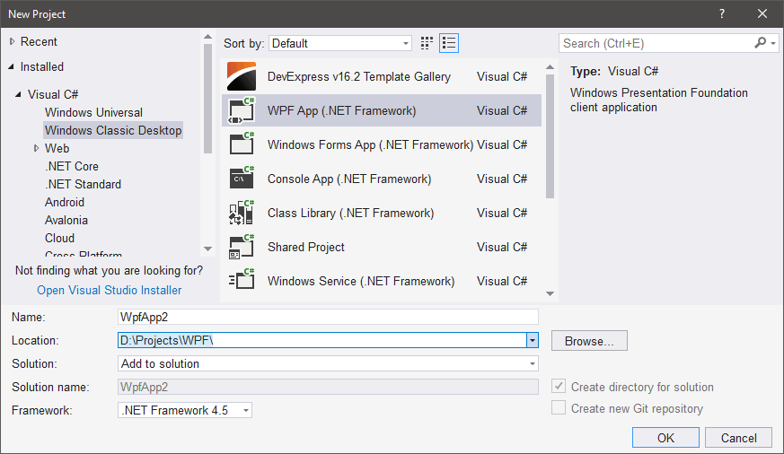
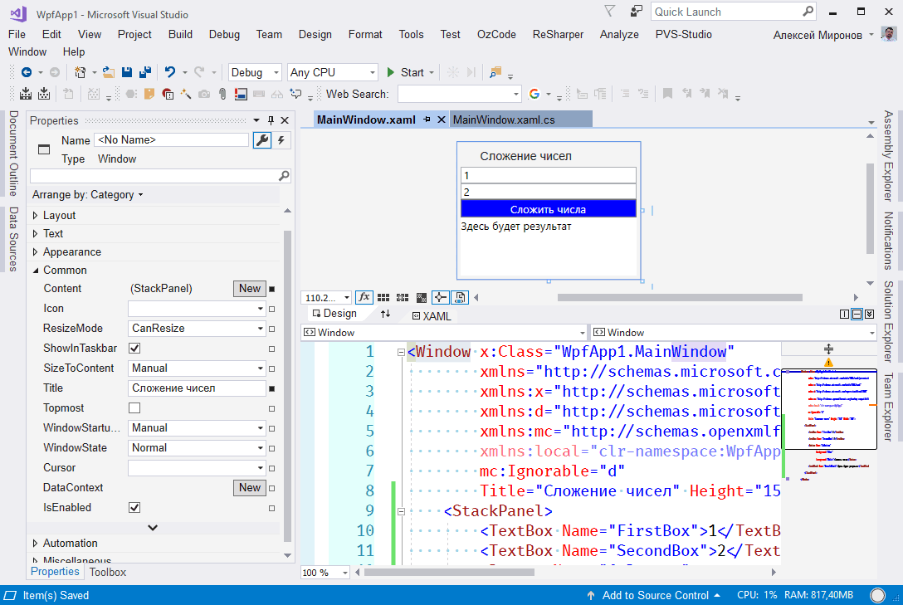
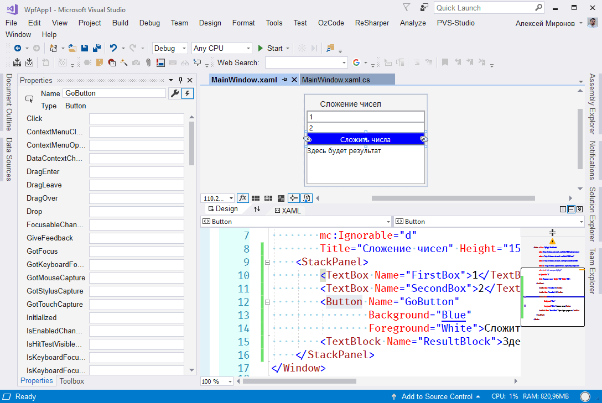
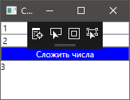
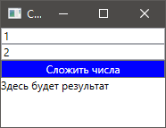
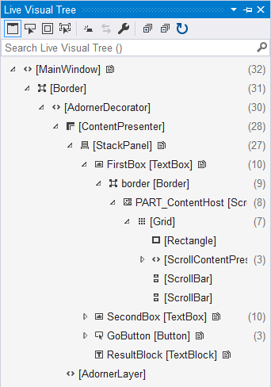

### Быстрый старт с WPF

Visual Studio по умолчанию готова к созданию WPF-приложений. Все, что от нас требуется — выбрать пункт «WPF App (.NET Framework)» в Мастере новых проектов.



Перед нами открывается дизайнер главного окна приложения.



Сделаем простое, но очень нужное приложение для сложения двух целых чисел.

Сначала дополним XAML своими контролами:

```xml
<Window x:Class="WpfApp1.MainWindow"
        xmlns="http://schemas.microsoft.com/winfx/2006/xaml/presentation"
        xmlns:x="http://schemas.microsoft.com/winfx/2006/xaml"
        xmlns:d="http://schemas.microsoft.com/expression/blend/2008"
        xmlns:mc="http://schemas.openxmlformats.org/markup-compatibility/2006"
        xmlns:local="clr-namespace:WpfApp1"
        mc:Ignorable="d"
        Title="Сложение чисел" Height="150" Width="200">
    <StackPanel>
        <TextBox Name="FirstBox">1</TextBox>
        <TextBox Name="SecondBox">2</TextBox>
        <Button Name="GoButton"
                Background="Blue"
                Foreground="White">Сложить числа</Button>
        <TextBlock Name="ResultBlock">Здесь будет результат</TextBlock>
    </StackPanel>
</Window>

```

Теперь нужно добавить обработчик нажатия на кнопку. Для этого переключимся на обработчики событий в панели Properties:



Код обработчика простейший:

```csharp
using System;
using System.Collections.Generic;
using System.Linq;
using System.Text;
using System.Threading.Tasks;
using System.Windows;
using System.Windows.Controls;
using System.Windows.Data;
using System.Windows.Documents;
using System.Windows.Input;
using System.Windows.Media;
using System.Windows.Media.Imaging;
using System.Windows.Navigation;
using System.Windows.Shapes;

namespace WpfApp1
{
    /// <summary>
    /// Interaction logic for MainWindow.xaml
    /// </summary>
    public partial class MainWindow : Window
    {
        public MainWindow()
        {
            InitializeComponent();
        }

        private void GoButton_Click(object sender, RoutedEventArgs e)
        {
            int firstNumber = int.Parse(FirstBox.Text);
            int secondNumber = int.Parse(SecondBox.Text);
            int resultNumber = firstNumber + secondNumber;
            ResultBlock.Text = resultNumber.ToString();
        }
    }
}

```

Вот как выглядит запущенное приложение:



Странные значки в верхней части окна — инструменты отладки, появляющиеся, если запустить WPF-приложение под отладчиком. Без отладчика приложение выглядит более привычно:



Отладочные инструменты позволяют изучить «живое» дерево визуальных элементов:


