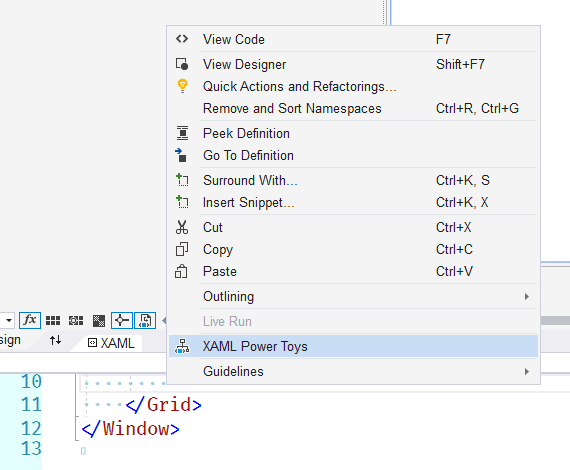
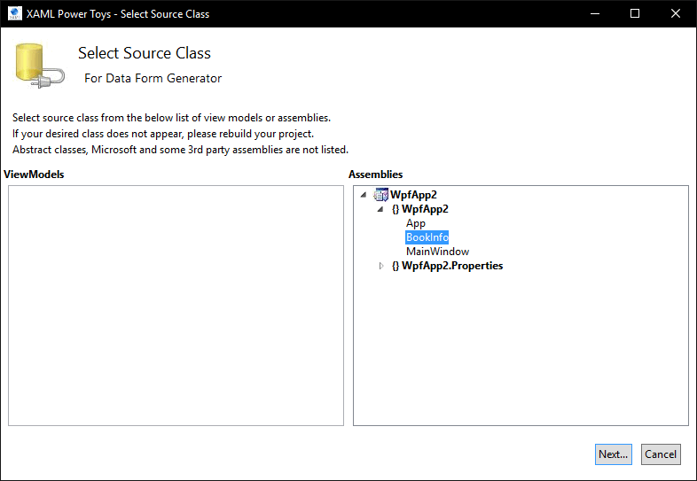
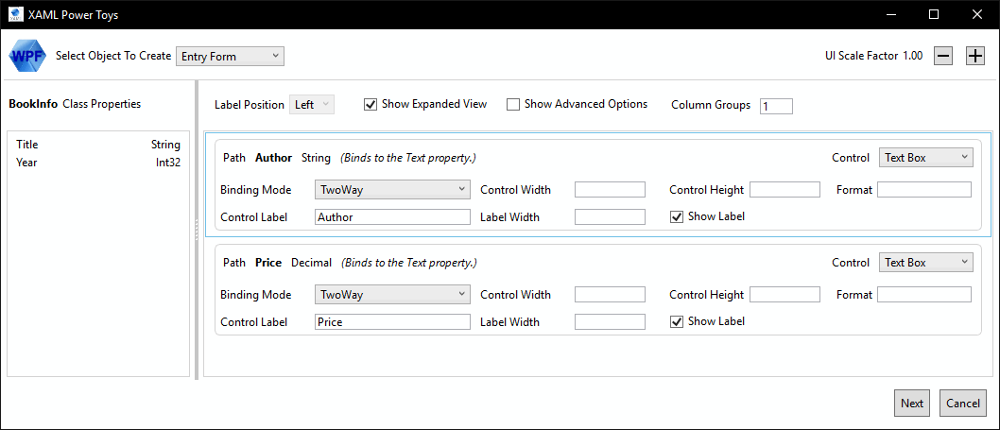
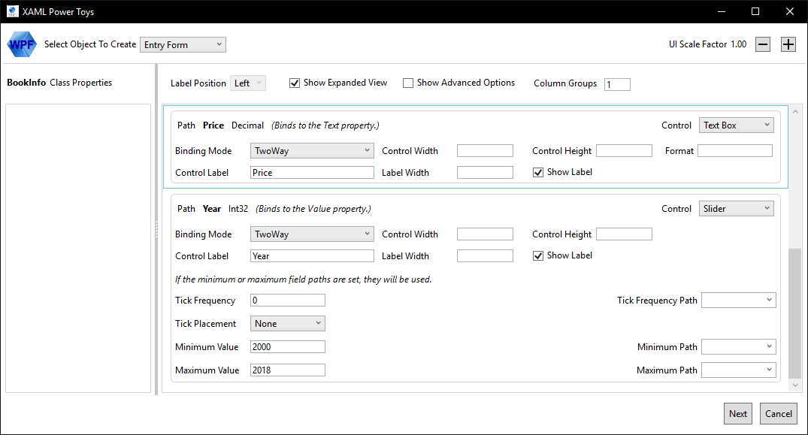
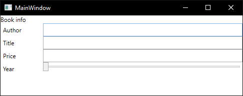

### XAML Power Toys for Visual Studio 2015-2017

Marketplace: https://marketplace.visualstudio.com/items?itemName=KarlShifflettkdawg.XAMLPowerToysforVisualStudio2015, 
GitHub: https://github.com/Oceanware/XAMLPowerToys2015, видео в блоге: https://oceanware.wordpress.com/xaml-power-toys/

Допустим, у нас есть следующий класс с данными

```csharp
public class BookInfo
{
    public string Author { get; set; }

    public string Title { get; set; }

    public int Year { get; set; }

    public decimal Price { get; set; }
}
```

и мы хотим создать форму для ввода свойств этого класса. С помощью XAML Power Toys можно немного автоматизировать этот процесс. Создаём пустой XAML-документ, например, Page, и в контекстном меню выбираем "XAML Power Toys"



В появившемся окне выбираем наш класс



Перетаскиваем в правую часть нужные нам свойства класса



и настраиваем их, если необходимо



Вот какой XAML сгенерировало расширение

```xml
<Grid>
    <Grid.ColumnDefinitions>
        <ColumnDefinition Width="*"/>
    </Grid.ColumnDefinitions>
    <Grid.RowDefinitions>
        <RowDefinition Height="Auto"/>
        <RowDefinition Height="*"/>
    </Grid.RowDefinitions>

    <TextBlock Text="Book info" />
    <Grid Grid.Row="1">
        <Grid.ColumnDefinitions>
            <ColumnDefinition Width="85"/>
            <ColumnDefinition Width="*"/>
        </Grid.ColumnDefinitions>
        <Grid.RowDefinitions>
            <RowDefinition Height="Auto"/>
            <RowDefinition Height="Auto"/>
            <RowDefinition Height="Auto"/>
            <RowDefinition Height="Auto"/>
        </Grid.RowDefinitions>

        <Label Content="Author" />
        <TextBox Text="{Binding Path=Author, Mode=TwoWay, ValidatesOnDataErrors=True, ValidatesOnNotifyDataErrors=True, ValidatesOnExceptions=True}"
          Grid.Column="1" Grid.Row="0" x:Name="author" />
        <Label Content="Title" Grid.Row="1" />
        <TextBox Text="{Binding Path=Title, Mode=TwoWay, ValidatesOnDataErrors=True, ValidatesOnNotifyDataErrors=True, ValidatesOnExceptions=True}"
          Grid.Column="1" Grid.Row="1" x:Name="title" />
        <Label Content="Price" Grid.Row="2" />
        <TextBox Text="{Binding Path=Price, Mode=TwoWay, ValidatesOnDataErrors=True, ValidatesOnNotifyDataErrors=True, ValidatesOnExceptions=True}"
          Grid.Column="1" Grid.Row="2" x:Name="price" />
        <Label Content="Year" Grid.Row="3" />
        <Slider Value="{Binding Path=Year, Mode=TwoWay}" Minimum="2000" Maximum="2018" TickFrequency="0"
          Grid.Column="1" Grid.Row="3" TickPlacement="None" x:Name="year" />
    </Grid>
</Grid>
```

и вот как выглядить результат


