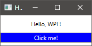

### Окна без XAML

XAML, строго говоря, не догма. Вполне возможно создавать окна в чистом C#-коде.

```csharp
using System;
using System.Windows;
using System.Windows.Controls;
using System.Windows.Media;

public class MyWindow : Window
{
    public MyWindow()
    {
        Title = "Hello, WPF!";
        Width = 200;
        Height = 100;

        var panel = new StackPanel();
        Content = panel;

        var label = new Label
        {
            Content = "Hello, WPF!",
            HorizontalAlignment = HorizontalAlignment.Center,
            VerticalContentAlignment = VerticalAlignment.Center,
            Height = 35
        };
        panel.Children.Add(label);

        var button = new Button
        {
            Content = "Click me!",
            Background = Brushes.Blue,
            Foreground = Brushes.White,
        };
        panel.Children.Add(button);
        button.Click += (sender, args) => MessageBox.Show("Clicked!");
    }
}

class Program
{
    [STAThread]
    public static void Main()
    {
        var application = new Application();
        application.Run(new MyWindow());
    }
}
```




